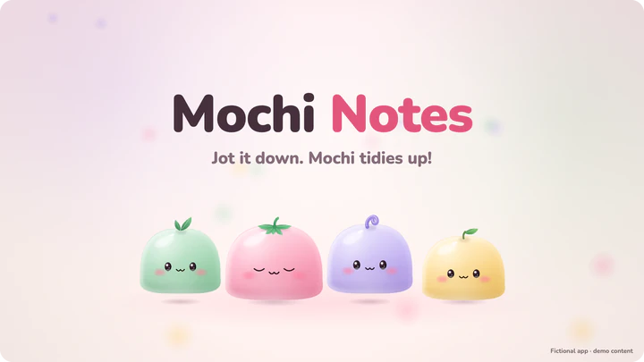
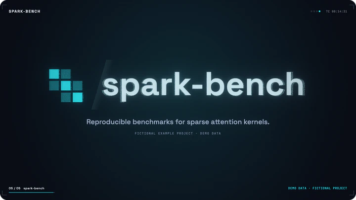
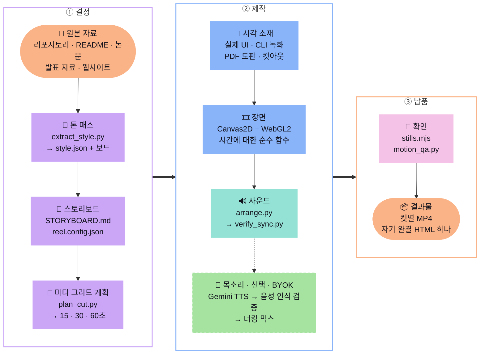

<div align="center">


# Awesome Showreels

### 리포지토리를 넣으면, 박자에 맞춘 쇼릴이 나옵니다.

리포지토리, README, 논문, 발표 자료, 웹사이트를 2D 모션그래픽 쇼릴로 바꿔 주는 [Claude Code](https://claude.com/claude-code) 스킬입니다.<br/>
**스타일은 원본에서 측정하고, 증거는 실제 화면에서 캡처하고, 모든 장면 전환과 효과음은 박자에 맞춥니다.**

**이 페이지 자체가 데모입니다.** 이 페이지를 위해 만든 애니메이션은 모두 이 스킬이 [`docs/readme-reel/`](docs/readme-reel/)에서 렌더링했습니다.

<a href="LICENSE"></a>
<a href="#설치"></a>


<a href="#본인-키-사용-byok"></a>

**[설치](#설치) · [예제](#같은-스킬-다른-원본-다른-쇼릴) · [명장면](#명장면-모음) · [기능](#스킬-하나에-담은-모션-스튜디오) · [작동 방식](#claude가-생각하는-순서) · [🇺🇸 English](README.md)**

</div>

```
/plugin marketplace add AwesomeZun/Awesome-Showreels
/plugin install awesome-showreels@awesome-showreels
```

<p align="center">그다음 Claude에게 이렇게 말해 보세요: <b><i>"이 리포지토리로 30초 쇼릴을 만들어 주세요."</i></b></p>
<p align="center">이 페이지의 미리보기는 소리 없는 루프입니다. <b>⬇ 소리가 있는 1080p60 MP4:</b> <a href="assets/demo-playful-app-v1.1.0.mp4">Mochi Notes · 14초</a> · <a href="assets/demo-research-cli-v1.1.0.mp4">spark-bench · 15초</a><br/>
<sub>파일이 커서 GitHub에서는 미리 볼 수 없으니 “Download raw file”로 내려받아 주세요.</sub></p>

---

## 같은 스킬, 다른 원본, 다른 쇼릴

한쪽 원본에는 1,000단어마다 이모지가 104개 들어 있습니다. 다른 쪽 원본에는 1,000단어마다 숫자 129개와 인용 7개가 있고, 이모지는 하나도 없습니다. 테마 목록에서 고른 사람은 없습니다. 스킬이 두 원본을 각각 측정하고 Claude가 디자이너처럼 초안을 검토했으며, 팔레트와 서체, 모션, 음악은 원본의 근거가 정했습니다.

<table>
<tr>
<td align="center" valign="top" width="50%">
<a href="assets/demo-playful-app-v1.1.0.mp4"></a>
<br/><b>Mochi Notes</b> · <code>playful-app</code>
<br/><sub>발랄한 앱 README, 파스텔 로고, 작은 웹 앱<br/>→ 통통 튀는 파스텔 쇼릴 · 코드로 그린 봉제 마스코트 · 폰 속 실제 앱 화면 · 120 BPM bright-pop</sub>
<br/><sub><a href="assets/demo-playful-app-v1.1.0.mp4">⬇ 소리 있는 MP4</a> · <a href="skills/motion-showreel/examples/playful-app/dist/mochi-notes-v1.1.0.html">⬇ HTML 플레이어</a> · <a href="skills/motion-showreel/examples/playful-app/README.md">제작 과정(영문)</a></sub>
</td>
<td align="center" valign="top" width="50%">
<a href="assets/demo-research-cli-v1.1.0.mp4"></a>
<br/><b>spark-bench</b> · <code>research-cli</code>
<br/><sub>간결한 연구용 README, 어두운 문서 페이지, 실제 CLI<br/>→ 어두운 데이터 중심 쇼릴 · GPU 포인트 4,096개 · 3D로 기울인 실제 터미널 캡처 · 128 BPM dark-synth</sub>
<br/><sub><a href="assets/demo-research-cli-v1.1.0.mp4">⬇ 소리 있는 MP4</a> · <a href="skills/motion-showreel/examples/research-cli/dist/spark-bench-v1.1.0.html">⬇ HTML 플레이어</a> · <a href="skills/motion-showreel/examples/research-cli/README.md">제작 과정(영문)</a></sub>
</td>
</tr>
</table>

플레이어는 모든 컷(15초/short, 30초, 60초)과 음악이 들어 있는 HTML 파일 하나입니다. GitHub에서는 소스 코드로 보이므로 “Download raw file”로 내려받은 뒤 아무 브라우저에서나 여시면 오프라인으로 재생됩니다. 두 프로젝트는 이 리포지토리를 위해 만든 가상의 프로젝트이고 숫자는 데모 데이터이며, 쇼릴 화면에도 그렇게 밝혀 두었습니다.

<details>
<summary><b>스타일 결정을 나란히 보기</b></summary>

`tools/extract_style.py`는 주어진 자료(README, 문서 사이트, CSS 토큰, Tailwind 설정, PDF, pptx 테마, 터미널 테마, 로고, 스크린샷)를 읽고 `style.json` 초안을 씁니다. 초안에는 대비 검사를 거친 팔레트 역할, 폰트 스택, 타입 스케일, 모션 어휘, 후처리, 사운드 팔레트, 내레이션 권장 여부가 들어갑니다. 모든 결정은 자료 속 근거를 인용합니다. Claude는 디자이너처럼 초안을 검토하고, 자료가 다르게 말하는 부분은 직접 고칩니다. 장면을 만들기 전에 한 장짜리 스타일 보드를 먼저 보여 드립니다.

| | `playful-app` (Mochi Notes) | `research-cli` (spark-bench) |
|---|---|---|
| 원본 | 이모지가 많은 README, 파스텔 로고, 작은 웹 앱 | 인용이 달린 간결한 README, 어두운 문서 페이지, 실제 CLI |
| 측정값 | 1,000단어당 '!' 39개와 이모지 104개, 문장당 6단어, 2인칭 | '!'·이모지·홍보 문구 없음, 1,000단어당 숫자 129개와 인용 7개 |
| 무드 | playful, bouncy, friendly, energetic, warm | technical, data-driven, cool, precise, nocturnal |
| 무대와 강조색 | 밝은 `#FFF7F2` · 핑크 `#FF8FAF`, 라일락 `#B9A3F3`, 민트 `#92D2A6` | 어두운 `#0A0E17` · 시안 `#2FE4F0`, 바이올렛 `#8B7CFF`, 앰버 `#FFB547` |
| 서체 | Nunito (앱의 둥근 서체) | Space Grotesk + JetBrains Mono (문서의 서체) |
| 모션 | 활기차고 탄력 있는 `outBack`, 오버슈트 1.8, 블롭 와이프·줌·휩 전환 | 중간 속도, 감쇠가 강한 `outExpo`, 글리치·매치·줌·임팩트 전환 |
| 시각 소재 | 코드로 그린 봉제 마스코트, 폰 속 실제 앱 화면 | GPU 포인트 4,096개, 3D로 기울인 실제 터미널 캡처, 데이터 시각화 |
| 사운드 | bright-pop, 120 BPM, C 장조, glassy 효과음 | dark-synth, 128 BPM, B 단조, digital 효과음 |
| 목소리 | 음악 중심 | 내레이션 권장(Charon): 원고와 타이밍은 오프라인으로 준비했고, 실제 목소리를 합성하기 전까지는 음악 중심으로 배포합니다 |

예제마다 README에서 원본, 톤 패스의 결정, 캡처, 전체 빌드 과정을 설명합니다(영문): [playful-app](skills/motion-showreel/examples/playful-app/README.md) · [research-cli](skills/motion-showreel/examples/research-cli/README.md)

</details>

---

## 원본 열네 개, 스타일 열네 개, 프리셋은 0개

위의 두 쇼릴은 고르는 스타일 두 가지가 아닙니다. 아래 열두 개도 각자 자기 원본에서 나왔습니다. 보도자료, 공모 브리프, 진(zine), 게임잼, 차밭, 싱글셀 논문, 워크숍 핸드아웃, 랜딩 페이지, 료칸, 재즈 시대 초대장, 작은 마을 신문, 레이스 타이밍 앱입니다. 팔레트, 서체, 모션 문법, 음악이 모두 원본에서 나왔습니다. 같은 모양은 하나도 없고, 템플릿도 없습니다.

<table>
<tr>
<td align="center" valign="top" width="33%">
<a href="skills/motion-showreel/examples/editorial-luxe"></a>
<br/><b>Maison Veyrande</b> · <code>editorial-luxe</code>
<br/><sub>패션 하우스 보도자료와 룩북 노트<br/>→ 보도니 헤어라인, 느린 리빌, 아이보리와 블랙 · 80 BPM 피아노와 현악</sub>
</td>
<td align="center" valign="top" width="33%">
<a href="skills/motion-showreel/examples/swiss-grid"></a>
<br/><b>Haus für Musik</b> · <code>swiss-grid</code>
<br/><sub>건축 공모 브리프와 CSS 토큰<br/>→ 12단 그리드, 빨강 하나, 포스터 크기 숫자 · 124 BPM</sub>
</td>
<td align="center" valign="top" width="33%">
<a href="skills/motion-showreel/examples/riso-zine"></a>
<br/><b>PAPER JAM #07</b> · <code>riso-zine</code>
<br/><sub>진(zine) README와 하우스 스타일<br/>→ 어긋난 리소 잉크, 도장, 튀는 컷 · 160 BPM</sub>
</td>
</tr>
<tr>
<td align="center" valign="top" width="33%">
<a href="skills/motion-showreel/examples/pixel-arcade"></a>
<br/><b>ONE CREDIT JAM</b> · <code>pixel-arcade</code>
<br/><sub>게임잼 README와 16색 팔레트<br/>→ 픽셀 아트, CRT 글로, 하이스코어 엔드카드 · 144 BPM 칩튠</sub>
</td>
<td align="center" valign="top" width="33%">
<a href="skills/motion-showreel/examples/botanical-organic"></a>
<br/><b>Mistfold</b> · <code>botanical-organic</code>
<br/><sub>차밭 이야기와 브랜드 노트<br/>→ 수채화, 식물학적으로 맞는 차 새순 타임랩스 · 96 BPM 나일론 기타와 마림바</sub>
</td>
<td align="center" valign="top" width="33%">
<a href="skills/motion-showreel/examples/academic-paper"></a>
<br/><b>Alveolar repair atlas</b> · <code>academic-paper</code>
<br/><sub>싱글셀·공간 오믹스 원고와 데이터<br/>→ 세포 4,900개가 UMAP, 조직, 점도표를 오가며 정체를 유지 · 100 BPM D 도리안</sub>
</td>
</tr>
<tr>
<td align="center" valign="top" width="33%">
<a href="skills/motion-showreel/examples/sketchnote"></a>
<br/><b>Visual Notes Lab</b> · <code>sketchnote</code>
<br/><sub>진행자 노트와 핸드아웃<br/>→ 한 화이트보드 위에 마커가 스스로 써 내려가는 원테이크 · 104 BPM</sub>
</td>
<td align="center" valign="top" width="33%">
<a href="skills/motion-showreel/examples/neo-brutal"></a>
<br/><b>kablok</b> · <code>neo-brutal</code>
<br/><sub>랜딩 페이지 CSS와 BRAND.md<br/>→ 하드 섀도, 슬래브, 눌러 대는 커서 · 112 BPM 펑크</sub>
</td>
<td align="center" valign="top" width="33%">
<a href="skills/motion-showreel/examples/sumi-wabi"></a>
<br/><b>余白庵</b> · <code>sumi-wabi</code>
<br/><sub>료칸 사이트와 시츠라에 노트<br/>→ 화지에 번지는 먹, 세로쓰기, 붉은 낙관 하나 · 72 BPM 고토, 평조자</sub>
</td>
</tr>
<tr>
<td align="center" valign="top" width="33%">
<a href="skills/motion-showreel/examples/art-deco"></a>
<br/><b>THE EMERALD FAN</b> · <code>art-deco</code>
<br/><sub>초대장, 메뉴, 하우스 스타일<br/>→ 금박 계단 프레임, 부채, 선버스트 · 112 BPM 스윙: 워킹 베이스, 라이드, 클라리넷</sub>
</td>
<td align="center" valign="top" width="33%">
<a href="skills/motion-showreel/examples/newsprint"></a>
<br/><b>The Tamsin Valley Courier</b> · <code>newsprint</code>
<br/><sub>1면 원고와 스타일북<br/>→ 인쇄기, 망점, 주조 활자, 빨간 판 · 96 BPM</sub>
</td>
<td align="center" valign="top" width="33%">
<a href="skills/motion-showreel/examples/sports-kinetic"></a>
<br/><b>VELMORA 42</b> · <code>sports-kinetic</code>
<br/><sub>레이스 타이밍 앱 README와 BRAND.md<br/>→ 중계 그래픽 타이포, 실제 구간 기록 막대, 레이싱 스트라이프 · 176 BPM 드럼앤베이스</sub>
</td>
</tr>
</table>

<sub>각 루프는 해당 예제의 짧은 컷을 2배속으로 재생한 무음 영상입니다. 모든 프로젝트, 브랜드, 데이터는 이 리포지토리를 위해 지어낸 가상의 것이며, 화면에도 그렇게 표시됩니다. 폴더를 열면 원본, 모든 결정의 근거가 적힌 <code>style.json</code>, 장면 코드를 볼 수 있습니다.</sub>

---

## 명장면 모음

두 예제 쇼릴에서 고른 여덟 장면입니다. 왼쪽은 Mochi Notes, 오른쪽은 spark-bench입니다.

<p align="center">
 
<br/><sub><b>Too many thoughts?</b> 종이 메모가 휘몰아치는 키네틱 타이포그래피&emsp;·&emsp;<b>4,096 → 674</b> GPU 포인트로 그린 어텐션 행렬, 건너뛰는 블록은 가라앉습니다</sub>
</p>
<p align="center">
 
<br/><sub><b>Meet Mochi</b> 코드로 그린 마스코트가 튀어 올라 눈을 깜빡입니다&emsp;·&emsp;<b>RUN</b> 실제 <code>spark-bench run</code> 캡처를 기울이고 4.1× 행으로 줌인합니다</sub>
</p>
<p align="center">
 
<br/><sub><b>Jot it down.</b> 실제 앱 화면에 글자가 입력되고 Mochi가 정리합니다&emsp;·&emsp;<b>4.1×</b> CLI가 출력한 JSON으로 막대가 자라고 숫자가 내리꽂힙니다(데모 데이터)</sub>
</p>
<p align="center">
 
<br/><sub><b>Pick a flavor!</b> 카메라가 폰 속으로 들어갔다가 실제 앱 테마 네 가지로 빠져나옵니다&emsp;·&emsp;<b>60초 컷에만 있는 장면</b> 같은 패턴을 네 길이에서 보여 주며 이득이 커집니다</sub>
</p>

<p align="center"><sub>Mochi Notes와 spark-bench는 이 리포지토리를 위해 만든 가상의 프로젝트이며, 쇼릴 화면에도 그렇게 밝혀 두었습니다. 명장면과 두 예제 루프, 맨 위의 하이라이트 영상은 예제의 실제 컷 계획에서 구간을 잘라 한 프레임씩 렌더링했고(<a href="docs/readme-reel/sizzle/"><code>docs/readme-reel/sizzle/</code></a>), 파일을 가볍게 하려고 필름 그레인은 껐습니다.</sub></p>

---

## 스킬 하나에 담은 모션 스튜디오

스킬이 하는 일 여섯 가지를, 스킬이 직접 렌더링한 루프로 보여 드립니다.

<p align="center"><b>원본이 정하는 스타일</b><br/>팔레트, 서체, 속도감, 음악을 자료에서 끌어내고, 결정마다 근거를 남깁니다. 테마 프리셋은 없습니다. 음악 장르도 원본을 채점해서 고릅니다.</p>
<p align="center"></p>

<p align="center"><b>이야기에 필요한 모든 시각 도구</b><br/>코드로 그린 2D부터 마스코트 컷아웃, 실제 앱 화면, 실제 터미널 녹화, PDF 도판, GPU 파티클까지 씁니다. 장식이 아니라 증거입니다.</p>
<p align="center"></p>

<p align="center"><b>어떤 길이든 같은 BPM</b><br/>15초, 30초, 60초를 마디 그리드 하나에 놓습니다. 긴 컷은 장면을 더하고 홀드를 늘리되 홀드에서도 계속 움직이며, 슬로 모션은 쓰지 않습니다.</p>
<p align="center"></p>

<p align="center"><b>박자에 맞춘 사운드</b><br/>화면이 읽는 큐 목록 그대로 음악과 효과음을 합성합니다. 모든 큐는 한 프레임 안에 맞고, 라우드니스는 -14 LUFS입니다.</p>
<p align="center"></p>

<p align="center"><b>내레이션은 본인 키로(BYOK)</b><br/>선택형 Gemini TTS입니다. 모든 클립을 음성 인식으로 검증하고, 문장마다 음악을 낮춰 섞고, 자막을 입힙니다.</p>
<p align="center"></p>

<p align="center"><b>검증까지 끝낸 납품</b><br/>컷마다 1080p60 MP4 한 편, 그리고 모든 컷이 든 HTML 플레이어 하나를 만듭니다. 어느 폴더에서든 오프라인으로 재생됩니다.</p>
<p align="center"></p>

<p align="center"><sub>마스코트 타일은 Mochi Notes 로고를 macOS Vision으로 오려 낸 컷아웃이고, PDF 타일은 spark-bench의 README와 데모 데이터로 만든 데모 문서에서 <code>pdf_figures.py</code>가 그림을 추출한 것입니다. 플레이어 창은 예제의 실제 플레이어를 자체 키로 컷을 바꿔 가며 캡처한 화면입니다. 내레이션 루프는 드라이런 타이밍을 보여 주며, 이 페이지를 위해 합성한 목소리는 없습니다.</sub></p>

---

## Claude가 생각하는 순서

원본과 길이만 알려 주시면, 그다음은 이렇게 한 박자씩 진행됩니다.

1. **분위기를 읽습니다.** 자료에 톤 패스를 돌려 팔레트, 서체, 밀도, 말투, 속도감을 살피고, 결정마다 근거를 붙인 `style.json` 초안을 씁니다. 자료가 다르게 말하는 부분은 직접 고치고, 장면을 하나도 만들기 전에 한 장짜리 스타일 보드를 먼저 보여 드립니다.
2. **한 문장, 한 장면, 한 메시지를 정합니다.** 정확한 문구, 금지 표현, 고지 문구는 `STORYBOARD.md`에, 마디 단위 장면과 박 단위 큐는 `reel.config.json`에 적습니다.
3. **증거를 고릅니다.** 장면마다 주인공 소재를 하나씩 정합니다. 의심 많은 관객이 꼭 봐야 하는 것, 곧 앱의 실제 화면, 명령의 실제 출력, 논문의 실제 그림, 실행 결과의 실제 숫자입니다.
4. **그리드를 고정합니다.** 프로젝트마다 BPM은 하나입니다. `plan_cut.py`가 모든 컷을 같은 마디 그리드 위에 놓고, 긴 컷에는 계속 움직이는 홀드와 선택 장면을 더합니다. 슬로 모션은 쓰지 않습니다.
5. **만들고, 음악을 입힙니다.** 장면은 Canvas2D + WebGL2 런타임 위에서 시간에 대한 순수 함수로 그립니다. 음악과 효과음은 같은 큐 목록에서 합성하고, `verify_sync.py`가 모든 큐가 한 프레임 안에 맞는지 증명합니다.
6. **확인하고, 납품합니다.** 모든 경계에서 원본 해상도 스틸을 확인하고, 멈춘 홀드와 튀는 프레임은 모션 QA로 잡고, 라우드니스는 -14 LUFS로 맞춥니다. 그다음 컷마다 MP4를, 그리고 빈 폴더에서 검증한 HTML 플레이어 하나를 만듭니다.



모든 프레임이 시간에 대한 순수 함수이므로 스틸, MP4 프레임, HTML 플레이어가 같은 픽셀을 보여 줍니다. 병렬 렌더 워커는 어느 구간이든 나눠 맡을 수 있고, 화면과 사운드트랙은 같은 큐 목록을 읽습니다.

---

## 설치

**Claude Code 플러그인으로 설치**

```
/plugin marketplace add AwesomeZun/Awesome-Showreels
/plugin install awesome-showreels@awesome-showreels
```

**또는 개인 스킬로 복사**

```bash
git clone https://github.com/AwesomeZun/Awesome-Showreels.git
cp -r Awesome-Showreels/skills/motion-showreel ~/.claude/skills/
```

**렌더 런타임과 Python 도구의 1회 설정** (처음 쓸 때 Claude가 대신 실행합니다. 플러그인을 업데이트하면 스킬 폴더가 바뀌므로 다시 실행해 주세요):

```bash
cd ~/.claude/skills/motion-showreel/runtime && npm install     # 개인 스킬
# 플러그인 설치: 플러그인 안에 있는 같은 폴더에서 실행합니다. 폴더는 다음 명령으로 찾을 수 있습니다
#   find ~/.claude/plugins -type d -path '*motion-showreel/runtime' -not -path '*/node_modules/*'
python3 -m pip install numpy scipy pillow opencv-python pymupdf fonttools brotli   # pip가 거부하면 venv 안에서 설치합니다
```

---

## 이렇게 요청해 보세요

| | Claude에게 이렇게 말해 보세요 |
|---|---|
| 📦 **리포지토리** | *이 리포지토리로 30초 쇼릴을 만들어 주세요. SNS용 15초 컷도 함께 부탁드립니다.* |
| 📄 **논문** | *`paper.pdf`의 그림을 그대로 살려서 45초 설명 쇼릴을 만들어 주세요.* |
| 🖼️ **발표 자료** | *`pitch.pptx`의 색과 서체 그대로 출시 티저를 만들어 주세요.* |
| ⌨️ **CLI** | *`mytool demo`를 실제 터미널로 캡처해서 이 CLI의 15초 쇼릴을 만들어 주세요.* |
| 🎤 **내레이션 (BYOK)** | *30초 컷에 내레이션을 넣어 주세요. 제 Gemini 키는 `key save`로 저장해 두었습니다.* |
| 🥁 **60초, 같은 BPM** | *같은 BPM 그대로 60초 컷으로 늘려 주세요. 느려지는 장면 없이요.* |

---

## 사례

이 방법은 이 리포지토리를 위해 새로 지어낸 것이 아닙니다. 먼저 있었던 실제 제작 네 건에서 정리해 낸 것이고, 네 건의 쇼릴 모두 아래에서 바로 재생됩니다.

<table>
<tr>
<td align="center" valign="top" width="50%">
<a href="https://github.com/AwesomeZun/FDDD"></a>
<br/><b><a href="https://github.com/AwesomeZun/FDDD">FDDD</a></b> · 연구 데이터 쇼릴
<br/><sub>128 BPM: 16마디 30초 컷과, 따로 편집한 8마디 15초 컷입니다. 실제 포인트 클라우드와 커넥톰 선, 임팩트 숫자로 내리꽂히는 도킹 점수, 조각나는 포스터 프레임, 계산한 것과 연출한 것을 나눈 크레딧이 들어갔고, <i>“Real docking scores. Real spikes. Nothing faked.”</i>로 끝납니다.</sub>
</td>
<td align="center" valign="top" width="50%">
<a href="https://github.com/AwesomeZun/CC-statusline"></a>
<br/><b><a href="https://github.com/AwesomeZun/CC-statusline">CC-statusline</a></b> · 터미널 도구 쇼릴
<br/><sub>도구의 Catppuccin 팔레트, 명령마다 거대한 단어 하나, 3D로 기울인 실제 터미널 캡처와 핵심 줄 줌인, 글리치와 타이핑 전환을 썼습니다.</sub>
</td>
</tr>
<tr>
<td align="center" valign="top" width="50%">

<br/><b>K-BeautyGate</b> · 해커톤 피치 쇼릴
<br/><sub>120 BPM, 30초: 화장품 광고 × AI 에이전트 제품 투어입니다. macOS Vision으로 배경을 걷어 낸 마스코트 포즈, 눈 깜박임과 젤리처럼 출렁이는 캐릭터 모션, 폰 속에서 레이어로 움직이는 실제 앱 화면, 비트에 맞춰 튀는 마스코트 라인업이 들어갔습니다.</sub>
</td>
<td align="center" valign="top" width="50%">
<a href="https://github.com/AwesomeZun/Project-FlyGate"></a>
<br/><b><a href="https://github.com/AwesomeZun/Project-FlyGate">FlyGate</a></b> · 내레이션 연구 쇼릴
<br/><sub>인트로, 장면 28개·250초 분량의 전체 내레이션 영상, 15초·30초 숏폼과 세로 버전을 만들었습니다. 장면 길이는 목소리를 따르고, 자막은 번인했으며, Gemini 내레이션은 음성 인식으로 검증했습니다.</sub>
</td>
</tr>
</table>

<details>
<summary><b>K-BeautyGate와 FlyGate 더 보기</b></summary>

- **K-BeautyGate (해커톤 피치).** 화장품 광고 × AI 에이전트 투어입니다. 고객의 마스코트를 바탕으로 생성하고 macOS Vision으로 배경을 걷어 낸 파스텔 봉제 마스코트 포즈, 눈 깜빡임과 젤리 효과가 들어간 탄력 있는 캐릭터 모션, 폰 안에서 레이어로 움직이는 실제 앱 화면, 어두운 클라이맥스, 박자에 맞춰 통통 튀는 마스코트 라인업이 들어갔습니다. 45초, 53초, 60초의 천천히 보여 주는 이해용 변형(지금의 `--scale`, `--warp`)은 음악을 늘이지 않고 다시 합성했습니다. 직접 만든 하네스 위에서 에이전트 24개(제작, 검토, 수정)가 첫 전체 렌더까지 약 25분 만에 마쳤습니다.
- **[FlyGate](https://github.com/AwesomeZun/Project-FlyGate) (내레이션 쇼릴).** 목소리에 맞춘 장면 길이, 번인 자막, CC-statusline 문법을 따른 터미널 장면이 들어갔습니다.

</details>

---

## 내부 구조

<details>
<summary><b>이야기에 필요한 시각 도구</b></summary>

모든 쇼릴은 코드로 그린 벡터와 키네틱 타이포그래피가 이끕니다. 장면마다 주인공 소재를 하나씩 정하는데, 의심 많은 관객이 꼭 봐야 하는 바로 그것을 고릅니다.

| 소재 | 스킬 안의 도구 | 모션에 주는 것 |
|---|---|---|
| **코드로 그린 2D** (항상) | `runtime/`의 Canvas2D 엔진 + WebGL2 레이어 | 키네틱 타입, 스프링, 스쿼시와 젤리, 컴포지터 전환 12종, HUD, 포인트 클라우드와 네트워크. 모두 시간에 대한 순수 함수입니다 |
| **마스코트 컷아웃** | `tools/imagegen.md`(Codex CLI로 GPT-image-2 생성, 동의 시에만) → `tools/lift.swift`(macOS Vision) → `tools/prep_assets.py` | 기존 마스코트의 추가 포즈, 깨끗한 알파, 눈 깜빡임 짝 이미지, 발 기준점, QA 시트 |
| **OpenCV** | `tools/prep_assets.py`, `tools/capture_ui.mjs --textfree` | 모든 OS에서 쓰는 GrabCut 컷아웃, 매트 다듬기, 시트 분할, 2.5D 사진 패럴랙스와 텍스트 없는 UI 판을 위한 Telea 인페인팅 |
| **실제 앱 화면** | `tools/capture_ui.mjs`(Playwright) | 스크린샷 대신 레이어, 정적 복제본에서 만든 컴포넌트 상태, 타이핑 효과를 위한 글자 단위 행 정보 |
| **터미널 / CLI** | `tools/capture_cli.py` → `runtime/term.js` + `runtime/quad.js` | 비밀값을 가린 실제 PTY 녹화를 3D로 기울인 창에서 재생하고, 핵심 줄로 줌인합니다 |
| **PDF 도판** | `tools/pdf_figures.py` | 논문의 실제 그림과 표, 캡션, 어두운 무대용 다크 버전 |
| **웹 화면, 네이티브 앱** | `tools/capture_ui.mjs`, `tools/capture_native.md` | 브라우저 프레임 속 문서와 랜딩 페이지, macOS 창, iOS 시뮬레이터, Android |
| **실제 데이터** | 가지고 계신 JSON, CSV, 실행 로그 | 카운터, 막대, 임팩트 숫자, 포인트 클라우드. 값마다 출처를 남깁니다 |

정직성 규칙도 도구와 함께 제공됩니다. 실제 캡처는 실제 그대로 두고, 연출한 데이터에는 화면에 표시를 달며, 크레딧에서 계산한 것과 연출한 것을 나눠 밝힙니다.

</details>

<details>
<summary><b>어떤 길이든 같은 BPM: 마디 계산</b></summary>

모든 쇼릴은 마디 그리드 하나 위에서 움직입니다(128 BPM에서 한 마디는 1.875초라서 8마디가 15초, 16마디가 30초, 32마디가 60초입니다). 장면은 탄력적으로 늘어납니다. 고정된 등장 구간, 늘어나는 홀드, 고정된 퇴장 구간으로 이루어집니다. `timing/plan_cut.py`는 남는 마디를 보조 비트가 있는 홀드와 선택 장면에 배분하고, 모든 경계를 마디선에 맞춥니다. 음악 편곡기는 같은 곡을 마디만 늘려 다시 만듭니다.

| 장면 (research-cli) | 15초 컷 | 30초 컷 | 60초 컷 | 늘어난 시간에 들어가는 것 |
|---|---|---|---|---|
| matrix | 2마디 | 2마디 | 2마디 | (훅은 늘리지 않습니다) |
| problem | (빠짐) | 2마디 | 2마디 | 선택 장면이 들어옵니다 |
| cli | 3마디 | 3마디 | 5마디 | 실행 기록의 출처 줄을 카메라가 차례로 비춥니다 |
| results | 1마디 | 3마디 | 5마디 | 추세선, p50 값과 함께 64k 강조, 길이별 spark의 우위 |
| scaling | (빠짐) | (빠짐) | 5마디 | 선택 장면: 같은 패턴을 네 길이에서 보여 주며 이득이 커집니다 |
| repeats | (빠짐) | (빠짐) | 5마디 | 선택 장면: 모든 숫자 뒤에 있는 시드 고정 반복 다섯 번 |
| impact | 1마디 | 3마디 | 4마디 | 편차가 붙은 순위표, 마디마다 스캔 |
| logo | 1마디 | 3마디 | 4마디 | 설치 명령과 크레딧 |

장면의 등장 구간은 모든 컷에서 같게 렌더링됩니다. 장면만 따로 렌더링하면 프레임이 일치하고(GPU 블렌딩을 쓰는 장면은 반올림 오차 수준까지), 전체 프레임은 필름 그레인과 HUD 타임코드만 다릅니다. 달라지는 것은 홀드뿐입니다. 전체를 균일하게 늦추거나 구간별로 늦추는 변형(`--scale`, `--warp`)은 빽빽한 내용을 읽어야 하는 관객을 위해서만 씁니다.

</details>

<details>
<summary><b>음악과 효과음: 합성한 뒤 측정합니다</b></summary>

`audio/synth.py`, `arrange.py`, `verify_sync.py`는 numpy와 scipy로 동작하며 샘플을 쓰지 않습니다. 모든 히트는 화면이 읽는 바로 그 계획의 큐이며, 렌더 뒤에 측정합니다. 모든 큐는 한 프레임 안에 맞고, 라우드니스는 -14 LUFS, 트루 피크는 -1 dBTP 이하입니다. 긴 컷은 늘인 음악이 아니라 마디를 더한 같은 곡을 받습니다. Mochi Notes 예제에서는 short 컷과 30초 컷 모두 음악이 120.0 BPM으로 측정되었고, 모든 큐가 한 프레임 안에 맞았습니다(18/18, 28/28).

</details>

<details>
<summary><b>내레이션: 검증된 Gemini TTS</b></summary>

내레이션은 **Gemini TTS**를 씁니다. 자료가 내레이션을 필요로 하고(논문, 문서, 설명 영상, 피치) 동의하실 때만 켭니다.

- 문장을 묶음으로 합성하고 긴 쉼에서 나눈 뒤, **음성 인식으로 모든 클립을 검증합니다.** 스타일 태그가 읽혀 들어갔거나 단어가 빠진 클립은 다시 만듭니다.
- 목소리에 맞춰 장면 길이를 **마디 단위로** 늘리므로, 내레이션 때문에 템포가 바뀌거나 프레임이 느려지지 않습니다.
- 목소리가 나오는 동안 음악과 효과음을 줄여 섞고, 같은 타임라인에서 SRT/VTT 자막과 번인 자막을 만듭니다.
- `--dry-run`을 쓰면 키 없이 자리 표시자(placeholder) 클립으로 전체 과정을 오프라인에서 만들고 시험할 수 있습니다. 자리 표시자 클립은 렌더·빌드 도구가 배포용으로 받지 않습니다.

연구 예제의 내레이션은 원고와 타이밍을 오프라인(`tts_gemini.py batch --dry-run`)으로 준비해 두었지만, 자리 표시자 클립은 배포하지 않습니다. 도구가 자리 표시자 클립으로 만든 믹스는 건너뛰고, 그 타이밍으로 만든 자막은 거부합니다. 두 경로 모두 해당 예제의 README에 정리해 두었습니다. 키 설정은 [본인 키 사용](#본인-키-사용-byok)을 참고해 주세요.

</details>

<details>
<summary><b>큰 쇼릴을 위한 에이전트 팀</b></summary>

규모가 큰 쇼릴은 `templates/showreel-workflow.js`가 Claude Code Workflow로 에이전트 팀을 꾸려 제작합니다. 톤, 스토리보드, 에셋, 내레이션을 거쳐 장면마다 제작, 독립 검토, 수정을 진행하고 통합 담당이 최종 확인합니다(에이전트 약 25~40개). 승인하실 때만 실행하며, 톤 패스나 스토리보드 뒤에 멈춰 승인을 받을 수 있습니다. K-BeautyGate 쇼릴이 이 방식으로 만들어졌습니다.

</details>

<details>
<summary><b>예제를 직접 다시 만들기</b></summary>

클론한 폴더에서 직접 다시 만들 수 있습니다.

```bash
(cd skills/motion-showreel/runtime && npm install)      # 처음 한 번, 그리고 업데이트할 때마다 실행합니다
S=skills/motion-showreel; mkdir -p out                  # 렌더 결과는 out/에 둡니다(git에서 제외됩니다)

# Mochi Notes: 모든 컷을 계획하고 음악을 만든 뒤, 싱크를 확인하고 짧은 컷을 렌더링한 다음 플레이어를 빌드합니다
P=$S/examples/playful-app
python3 $S/timing/plan_cut.py --project $P --cut short,30,60
for c in short 30 60; do python3 $S/audio/arrange.py --project $P --cut $c; done
python3 $S/audio/verify_sync.py --wav $P/build/music-short.wav --cut $P/build/cut-short.json
node $S/runtime/render.mjs --project $P --cut short --out out/mochi-notes-short.mp4 --poster 3
node $S/runtime/build.mjs --project $P --cuts short,30,60 --out out/mochi-notes.html --verify

# spark-bench: 같은 단계를 실행합니다(컷마다 build/의 음악을 자동으로 고릅니다). 마지막은 라이브 플레이어입니다
P=$S/examples/research-cli
python3 $S/timing/plan_cut.py --project $P --cut 15,30,60
for c in 15 30 60; do python3 $S/audio/arrange.py --project $P --cut $c; done
node $S/runtime/render.mjs --project $P --cut 15 --out out/spark-bench-15.mp4 --poster 3.3
node $S/runtime/stills.mjs --project $P --serve        # 라이브 플레이어: Space 재생/정지, 방향키 프레임 이동, 1/2/3 컷 전환

# 이 페이지의 미리보기(libwebp의 cwebp와 webpmux도 필요합니다)
node docs/readme-reel/tools/make_webp.mjs --out out/previews       # 기능 루프 여섯 개와 소셜 카드
python3 docs/readme-reel/sizzle/build.py --out out/previews        # 하이라이트 영상, 예제 루프 두 개, 명장면
```

</details>

<details>
<summary><b>구성</b></summary>

```
.claude-plugin/              plugin.json, marketplace.json
assets/                      소리가 있는 데모 MP4, readme/: 이 페이지의 애니메이션 WebP 미리보기와 소셜 카드
docs/readme-reel/            이 페이지의 미리보기와 소셜 카드를 렌더링한 motion-showreel 프로젝트
skills/motion-showreel/
  SKILL.md                   Claude가 따르는 디자이너의 작업 절차
  references/                톤 앤 매너, 시각 소재, 스토리보드, 타이밍, 엔진 API, 모션 레시피 36종,
                             캡처, 이미지, 오디오, 내레이션, 렌더 파이프라인, 멀티 에이전트 제작
  runtime/                   engine.js, gl.js, quad.js, term.js, compositor.js, template.html,
                             stills.mjs (스틸, 시트, 라이브 플레이어), render.mjs (MP4), build.mjs (단일 HTML)
  timing/plan_cut.py         한 BPM으로 어떤 길이든 계획하는 마디 그리드 플래너
  tools/                     extract_style.py, source_snapshot.mjs, capture_ui.mjs, capture_cli.py,
                             pdf_figures.py, prep_assets.py, motion_qa.py, lift.swift, imagegen.md, capture_native.md
  audio/                     synth.py, arrange.py, verify_sync.py (numpy/scipy, 샘플 없음)
  narration/                 tts_gemini.py, vo_timeline.py, mix_vo.py, captions.py
  templates/                 style.schema.json, STORYBOARD, reel.config, narration, showreel-workflow.js
  examples/                  playful-app, research-cli (원본, 스타일, 스토리보드, 장면, dist/ 플레이어)
tests/                       플래너, 오디오 싱크, CLI 캡처, 도구, BYOK 키 처리, 런타임 회귀 테스트
```

</details>

---

## 자주 묻는 질문

<details>
<summary><b>API 키가 필요한가요?</b></summary>

쇼릴을 만드는 데에는 필요하지 않습니다. 음악은 로컬 컴퓨터에서 합성하고, 캡처와 렌더링도 로컬에서 진행합니다. 키가 필요한 기능은 내레이션 하나뿐이며, 선택 사항이고 BYOK 방식입니다. 본인의 Gemini API 키를 쓰고, 요금은 본인의 Google 계정에 청구됩니다. [본인 키 사용](#본인-키-사용-byok)을 참고해 주세요.

</details>

<details>
<summary><b>비용이 드나요?</b></summary>

스킬은 MIT 라이선스이며 렌더링은 로컬에서 진행합니다. 쇼릴 제작은 Claude Code 작업이므로 다른 세션처럼 Claude 사용량을 씁니다(큰 쇼릴용 멀티 에이전트 워크플로는 에이전트 약 25~40개를 띄우므로 더 많이 씁니다). 다음 두 가지 부가 기능은 본인 계정을 쓰며, 승인하실 때만 실행합니다. 내레이션(Gemini TTS, 본인의 Google 계정에 청구)과 마스코트 추가 포즈(Codex CLI를 통한 GPT-image-2, 본인의 ChatGPT 사용량 차감)입니다.

</details>

<details>
<summary><b>예제에 꾸며 낸 것이 있나요?</b></summary>

프로젝트 자체는 가상이며, 쇼릴 화면에서도 그렇게 밝힙니다("Fictional app · demo content", "DEMO DATA · FICTIONAL PROJECT"). 대신 쇼릴이 보여 주는 내용은 실제입니다. 폰에는 데모 앱에서 직접 캡처한 화면이 나오고, 터미널은 `spark-bench run`의 실제 녹화(exit 0, 1.8초)이며, 벤치마크 숫자는 CLI가 데모 실행에서 직접 출력한 JSON에서 가져오고, 블록 개수는 README의 패턴으로 계산합니다. 실제 캡처는 실제 그대로 두고, 연출한 데이터에는 화면에 표시를 달며, 크레딧에서 계산한 것과 연출한 것을 나눠 밝힙니다.

</details>

<details>
<summary><b>나중에 더 긴 컷을 만들 수 있나요?</b></summary>

네, 같은 BPM으로 만들 수 있습니다. `reel.config.json`에 컷을 추가하고 그 컷을 위한 선택 장면과 홀드 비트를 쓰면, `plan_cut.py`가 늘어난 마디를 배분하고 편곡기가 같은 곡을 마디만 늘려 다시 만듭니다. 프로젝트 폴더는 꼭 보관해 주세요. MP4만으로는 같은 속도감을 유지하며 늘릴 수 없고, 스킬은 영상이나 음악을 타임 스트레치하지 않습니다.

</details>

<details>
<summary><b>세로나 정사각형 영상도 되나요?</b></summary>

네, 잘라 내는 대신 다시 배치하는 방식으로 만듭니다. `"size": [1080, 1920]`(또는 `[1080, 1080]`)로 설정한 형제 프로젝트가 스타일, 에셋, 내레이션을 함께 씁니다. 플래너, 음악, 컴포지터, HUD, 자막, HTML 플레이어는 화면 크기를 따라가고, 장면은 레이아웃을 `W`, `H`, `UNIT`로 써 주어야 합니다.

</details>

<details>
<summary><b>제 마스코트를 쓸 수 있나요?</b></summary>

네. 마스코트 이미지를 macOS Vision(또는 모든 OS에서 쓰는 OpenCV GrabCut)으로 깨끗한 컷아웃으로 만들고, 눈 깜빡임 짝 이미지와 발 기준점을 붙인 뒤, 박자에 맞춰 스프링, 스쿼시, 젤리, 눈 깜빡임으로 움직입니다. 추가 포즈는 본인의 마스코트를 바탕으로, 동의하실 때만 GPT-image-2로 만듭니다. Mochi Notes 예제처럼 캐릭터를 코드로 그릴 수도 있습니다.

</details>

<details>
<summary><b>얼마나 빠른가요?</b></summary>

Apple Silicon에서 Mochi Notes 예제로 측정한 결과입니다. 스타일 패스는 약 12초, UI 캡처는 14초, 57프레임 스틸 시트는 7초, 짧은 컷 MP4는 약 55초, `--verify`를 포함한 HTML 빌드는 몇 초가 걸립니다. 마감이 급한 큰 쇼릴은 [내부 구조](#내부-구조)의 "큰 쇼릴을 위한 에이전트 팀"을 참고해 주세요.

</details>

<details>
<summary><b>HTML 플레이어로 무엇을 할 수 있나요?</b></summary>

모든 컷과 음악이 파일 하나에 들어 있어서 어느 폴더에서든 오프라인으로 재생됩니다. Space로 재생과 일시 정지를 하고, ←와 →로 한 프레임씩(Shift를 함께 누르면 1초씩) 이동하며, Home과 End로 처음과 끝으로 가고, 숫자 키로 컷을 바꾸고, F로 전체 화면을 켭니다.

</details>

---

## 요구 사항

| 의존성 | 용도 | 비고 |
|---|---|---|
| Node.js 20+ | 런타임: 스틸, MP4 렌더, HTML 빌드, UI 캡처 | `skills/motion-showreel/runtime`에서 `npm install` (playwright-core만 설치) |
| Chromium 또는 Chrome | 헤드리스 렌더링 | 자동 탐지: `CHROME_PATH`, Playwright의 Chromium, 시스템 Chrome/Chromium/Edge |
| libx264가 들어간 ffmpeg | MP4 인코딩, AAC, 미리보기 | macOS에서는 AudioToolbox AAC 인코더가 있으면 그것을 씁니다 |
| numpy, scipy, Pillow, opencv-python이 설치된 Python 3.9+ | 톤 패스, 플래너, 음악, 내레이션, 컷아웃, 텍스트 없는 UI 판 | 선택: `pymupdf`(PDF), `fonttools` + `brotli`(HTML 폰트 서브셋) |
| macOS 14+와 `swiftc` *(선택)* | Vision 피사체 분리 | 다른 OS에서는 OpenCV 경로를 씁니다 |
| ChatGPT 로그인이 된 Codex CLI *(선택)* | GPT-image-2 마스코트 포즈 | 동의하실 때만 씁니다. ChatGPT 사용량이 차감됩니다 |
| 본인의 Gemini API 키 *(선택, BYOK)* | 내레이션 | 환경 변수, macOS 키체인(`key save`), `--env-file` 중 하나로 넘깁니다. `--dry-run`은 키 없이 동작합니다 |
| LibreOffice, poppler *(선택)* | 발표 자료, PDF 대체 경로 | |

---

## 본인 키 사용 (BYOK)

API 키가 필요한 기능은 내레이션 하나뿐이며, 동의하시기 전까지는 꺼져 있습니다. 스킬에는 키가 들어 있지 않고, 스킬이 키를 찾아다니지도 않습니다. 요금은 본인의 Google 계정에 청구됩니다.

- **macOS 키체인.** 직접 연 터미널 창에서 본인의 Gemini API 키를 한 번 저장하시면 됩니다(입력이 화면에 보이지 않습니다). Claude Code의 `!` 명령에는 숨김 입력을 받을 터미널이 없으므로 이 방법을 쓸 수 없습니다.<br/>`python3 ~/.claude/skills/motion-showreel/narration/tts_gemini.py key save`<br/>위 경로는 개인 스킬 기준입니다. 플러그인으로 설치하셨다면 설정 절의 `find` 명령이 보여 주는 플러그인 안 `motion-showreel` 폴더의 같은 파일을, 리포지토리를 클론하셨다면 `skills/motion-showreel/narration/tts_gemini.py`를 쓰시면 됩니다.
- **또는 환경 변수.** Claude Code를 시작할 터미널에서 시작하기 전에 `export GEMINI_API_KEY=...`(또는 `GOOGLE_API_KEY`)를 실행하시거나, 직접 고른 파일이나 변수를 `--env-file` / `--api-key-env 변수명`으로 지정하셔도 됩니다.
- **확인하기.** `key status`는 어느 경로의 키를 쓰는지만 보여 주고(키 자체는 보여 주지 않습니다), `key check`는 쿼터를 쓰지 않고 키를 확인합니다.
- **키를 채팅창에 붙여 넣지 마세요.**
- **아직 키가 없으신가요?** `--dry-run`을 쓰면 키 없이 자리 표시자 클립으로 전체 과정을 오프라인에서 만들고 시험할 수 있습니다. 자리 표시자 클립은 렌더·빌드 도구가 배포용으로 받지 않습니다.

---

## 테스트

```bash
python3 -B -m unittest discover -s tests        # 플래너, 오디오 싱크, CLI 캡처와 마스킹, 도구, BYOK 키 처리
node --test tests/*.test.mjs                    # 런타임: 오디오 선택 순서, 자리 표시자 차단
```

---

## 라이선스

[MIT](LICENSE)입니다. 예제 폰트(Nunito, Space Grotesk, JetBrains Mono)는 SIL Open Font License 1.1을 따르며, 라이선스 파일과 함께 들어 있습니다. 음악과 효과음은 모두 스킬이 합성하며, 샘플은 들어 있지 않습니다.

## 크레딧

[Claude Code](https://claude.com/claude-code)로 만들었습니다. 이 스킬은 Playwright와 Chromium, FFmpeg, OpenCV, Apple Vision, PyMuPDF, fontTools, Gemini TTS, Codex CLI를 통한 GPT-image-2를 호출해서 쓰며, 이들을 포함해 배포하지는 않습니다. 예제 프로젝트(Mochi Notes, spark-bench)와 그 데이터는 이 리포지토리를 위해 쓴 가상의 것입니다. 사례 미리보기는 [FDDD](https://github.com/AwesomeZun/FDDD)와 [CC-statusline](https://github.com/AwesomeZun/CC-statusline)에서 직접 불러옵니다.

<div align="center">

⭐ **프로젝트의 진짜 매력을 잘 보여 드렸다면 별을 눌러 주세요.**

Claude Code 커뮤니티를 위해 만들었습니다 🎬 · MIT License

**이 페이지를 위해 만든 미리보기는 모두 motion-showreel로 만들었습니다.**

</div>
