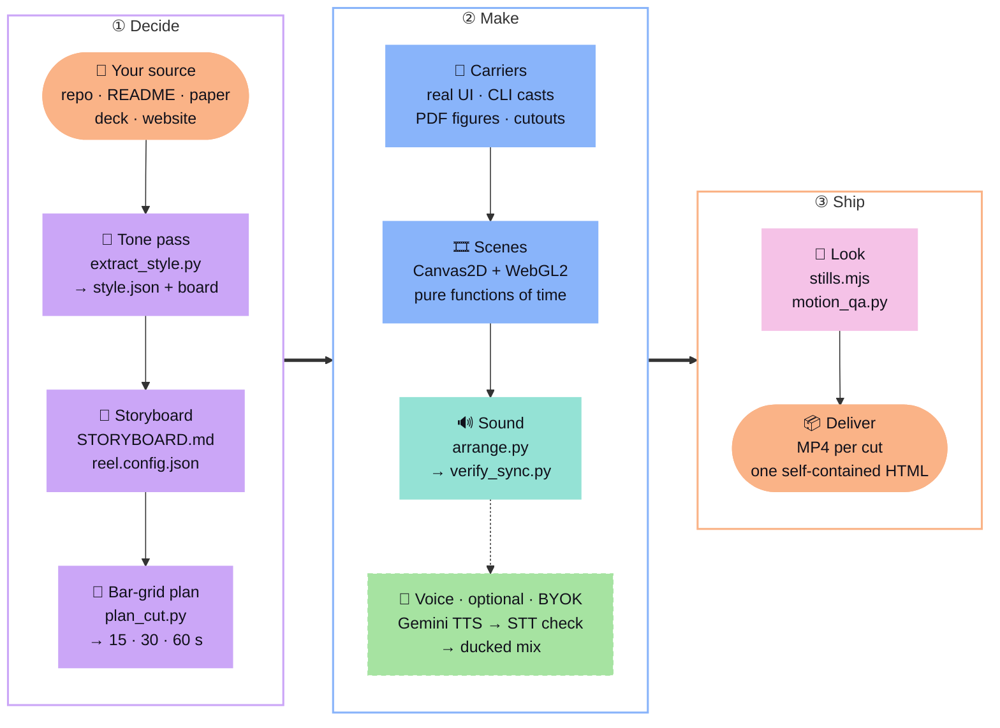

<div align="center">


# Awesome Showreels

### 레포, 논문, 발표 자료를 그 자료다운 모션그래픽 쇼릴로 만듭니다.

Claude Code, Codex CLI, Gemini CLI 등 어떤 코딩 에이전트에서도 쓰는 스킬입니다.<br/>
자료를 읽고, 스타일을 거기서 정하고, 실제 화면을 담아 MP4와 HTML 파일 하나로 렌더링합니다.

<a href="LICENSE"></a>
<a href="#install"></a>


<a href="#bring-your-own-key"></a>

**[예제](#예제) · [실제 제작물](#실제-제작물) · [명장면](#명장면) · [기능](#기능) · [설치](#설치) · [FAQ](#자주-묻는-질문) · [🇺🇸 English](README.md)**

</div>

---

## 예제

서로 다른 원본으로 만든 예제 열네 개입니다. 쇼릴마다 팔레트, 서체, 모션, 음악을 테마 목록이 아니라 원본에서 가져왔습니다.

<table>
<tr>
<td align="center" valign="top" width="50%">
<a href="https://raw.githack.com/AwesomeZun/Awesome-Showreels/main/skills/motion-showreel/examples/playful-app/dist/mochi-notes-v1.1.0.html"></a>
<br/><b>Mochi Notes</b> · <code>playful-app</code>
<br/><sub>앱 README → 파스텔 마스코트, 실제 앱 화면 · 브라이트 팝 120 BPM</sub>
<br/><sub><a href="https://raw.githack.com/AwesomeZun/Awesome-Showreels/main/skills/motion-showreel/examples/playful-app/dist/mochi-notes-v1.1.0.html">▶ 재생</a> · <a href="assets/demo-playful-app-v1.1.0.mp4">MP4</a> · <a href="skills/motion-showreel/examples/playful-app/dist/mochi-notes-v1.1.0.html">HTML</a> · <a href="skills/motion-showreel/examples/playful-app">원본·코드</a></sub>
</td>
<td align="center" valign="top" width="50%">
<a href="https://raw.githack.com/AwesomeZun/Awesome-Showreels/main/skills/motion-showreel/examples/research-cli/dist/spark-bench-v1.1.0.html"></a>
<br/><b>spark-bench</b> · <code>research-cli</code>
<br/><sub>연구용 CLI → GPU 점, 실제 터미널 · 다크 신스 128 BPM</sub>
<br/><sub><a href="https://raw.githack.com/AwesomeZun/Awesome-Showreels/main/skills/motion-showreel/examples/research-cli/dist/spark-bench-v1.1.0.html">▶ 재생</a> · <a href="assets/demo-research-cli-v1.1.0.mp4">MP4</a> · <a href="skills/motion-showreel/examples/research-cli/dist/spark-bench-v1.1.0.html">HTML</a> · <a href="skills/motion-showreel/examples/research-cli">원본·코드</a></sub>
</td>
</tr>
<tr>
<td align="center" valign="top" width="50%">
<a href="https://raw.githack.com/AwesomeZun/Awesome-Showreels/main/skills/motion-showreel/examples/editorial-luxe/dist/maison-veyrande-v1.0.0.html"></a>
<br/><b>Maison Veyrande</b> · <code>editorial-luxe</code>
<br/><sub>패션 보도자료 → 보도니, 아이보리와 블랙 · 피아노 80 BPM</sub>
<br/><sub><a href="https://raw.githack.com/AwesomeZun/Awesome-Showreels/main/skills/motion-showreel/examples/editorial-luxe/dist/maison-veyrande-v1.0.0.html">▶ 재생</a> · <a href="skills/motion-showreel/examples/editorial-luxe/dist/maison-veyrande-v1.0.0.html">HTML</a> · <a href="skills/motion-showreel/examples/editorial-luxe">원본·코드</a></sub>
</td>
<td align="center" valign="top" width="50%">
<a href="https://raw.githack.com/AwesomeZun/Awesome-Showreels/main/skills/motion-showreel/examples/riso-zine/dist/paper-jam-07-v1.0.0.html"></a>
<br/><b>PAPER JAM #07</b> · <code>riso-zine</code>
<br/><sub>진(zine) → 어긋난 리소 잉크 · 160 BPM</sub>
<br/><sub><a href="https://raw.githack.com/AwesomeZun/Awesome-Showreels/main/skills/motion-showreel/examples/riso-zine/dist/paper-jam-07-v1.0.0.html">▶ 재생</a> · <a href="skills/motion-showreel/examples/riso-zine/dist/paper-jam-07-v1.0.0.html">HTML</a> · <a href="skills/motion-showreel/examples/riso-zine">원본·코드</a></sub>
</td>
</tr>
<tr>
<td align="center" valign="top" width="50%">
<a href="https://raw.githack.com/AwesomeZun/Awesome-Showreels/main/skills/motion-showreel/examples/swiss-grid/dist/haus-fur-musik-v1.0.0.html"></a>
<br/><b>Haus für Musik</b> · <code>swiss-grid</code>
<br/><sub>건축 공모 브리프 → 12단 그리드, 빨강 하나 · 124 BPM</sub>
<br/><sub><a href="https://raw.githack.com/AwesomeZun/Awesome-Showreels/main/skills/motion-showreel/examples/swiss-grid/dist/haus-fur-musik-v1.0.0.html">▶ 재생</a> · <a href="skills/motion-showreel/examples/swiss-grid/dist/haus-fur-musik-v1.0.0.html">HTML</a> · <a href="skills/motion-showreel/examples/swiss-grid">원본·코드</a></sub>
</td>
<td align="center" valign="top" width="50%">
<a href="https://raw.githack.com/AwesomeZun/Awesome-Showreels/main/skills/motion-showreel/examples/botanical-organic/dist/mistfold-v1.0.0.html"></a>
<br/><b>Mistfold</b> · <code>botanical-organic</code>
<br/><sub>차 브랜드 이야기 → 수채화, 생장 타임랩스 · 기타 96 BPM</sub>
<br/><sub><a href="https://raw.githack.com/AwesomeZun/Awesome-Showreels/main/skills/motion-showreel/examples/botanical-organic/dist/mistfold-v1.0.0.html">▶ 재생</a> · <a href="skills/motion-showreel/examples/botanical-organic/dist/mistfold-v1.0.0.html">HTML</a> · <a href="skills/motion-showreel/examples/botanical-organic">원본·코드</a></sub>
</td>
</tr>
<tr>
<td align="center" valign="top" width="50%">
<a href="https://raw.githack.com/AwesomeZun/Awesome-Showreels/main/skills/motion-showreel/examples/pixel-arcade/dist/one-credit-jam-v1.0.0.html"></a>
<br/><b>ONE CREDIT JAM</b> · <code>pixel-arcade</code>
<br/><sub>게임잼 → 픽셀 아트, CRT · 칩튠 144 BPM</sub>
<br/><sub><a href="https://raw.githack.com/AwesomeZun/Awesome-Showreels/main/skills/motion-showreel/examples/pixel-arcade/dist/one-credit-jam-v1.0.0.html">▶ 재생</a> · <a href="skills/motion-showreel/examples/pixel-arcade/dist/one-credit-jam-v1.0.0.html">HTML</a> · <a href="skills/motion-showreel/examples/pixel-arcade">원본·코드</a></sub>
</td>
<td align="center" valign="top" width="50%">
<a href="https://raw.githack.com/AwesomeZun/Awesome-Showreels/main/skills/motion-showreel/examples/sumi-wabi/dist/yohakuan-v1.0.0.html"></a>
<br/><b>余白庵</b> · <code>sumi-wabi</code>
<br/><sub>료칸 웹사이트 → 먹, 세로쓰기 · 고토 72 BPM</sub>
<br/><sub><a href="https://raw.githack.com/AwesomeZun/Awesome-Showreels/main/skills/motion-showreel/examples/sumi-wabi/dist/yohakuan-v1.0.0.html">▶ 재생</a> · <a href="skills/motion-showreel/examples/sumi-wabi/dist/yohakuan-v1.0.0.html">HTML</a> · <a href="skills/motion-showreel/examples/sumi-wabi">원본·코드</a></sub>
</td>
</tr>
<tr>
<td align="center" valign="top" width="50%">
<a href="https://raw.githack.com/AwesomeZun/Awesome-Showreels/main/skills/motion-showreel/examples/academic-paper/dist/alveolar-repair-atlas-v1.0.0.html"></a>
<br/><b>Alveolar repair atlas</b> · <code>academic-paper</code>
<br/><sub>싱글셀 논문 → 데이터로 움직이는 세포 4,900개 · 100 BPM</sub>
<br/><sub><a href="https://raw.githack.com/AwesomeZun/Awesome-Showreels/main/skills/motion-showreel/examples/academic-paper/dist/alveolar-repair-atlas-v1.0.0.html">▶ 재생</a> · <a href="skills/motion-showreel/examples/academic-paper/dist/alveolar-repair-atlas-v1.0.0.html">HTML</a> · <a href="skills/motion-showreel/examples/academic-paper">원본·코드</a></sub>
</td>
<td align="center" valign="top" width="50%">
<a href="https://raw.githack.com/AwesomeZun/Awesome-Showreels/main/skills/motion-showreel/examples/sketchnote/dist/visual-notes-lab-v1.0.0.html"></a>
<br/><b>Visual Notes Lab</b> · <code>sketchnote</code>
<br/><sub>워크숍 핸드아웃 → 스스로 써지는 마커 · 104 BPM</sub>
<br/><sub><a href="https://raw.githack.com/AwesomeZun/Awesome-Showreels/main/skills/motion-showreel/examples/sketchnote/dist/visual-notes-lab-v1.0.0.html">▶ 재생</a> · <a href="skills/motion-showreel/examples/sketchnote/dist/visual-notes-lab-v1.0.0.html">HTML</a> · <a href="skills/motion-showreel/examples/sketchnote">원본·코드</a></sub>
</td>
</tr>
<tr>
<td align="center" valign="top" width="50%">
<a href="https://raw.githack.com/AwesomeZun/Awesome-Showreels/main/skills/motion-showreel/examples/neo-brutal/dist/kablok-v1.0.0.html"></a>
<br/><b>kablok</b> · <code>neo-brutal</code>
<br/><sub>랜딩 페이지 → 하드 섀도, 슬래브 · 펑크 112 BPM</sub>
<br/><sub><a href="https://raw.githack.com/AwesomeZun/Awesome-Showreels/main/skills/motion-showreel/examples/neo-brutal/dist/kablok-v1.0.0.html">▶ 재생</a> · <a href="skills/motion-showreel/examples/neo-brutal/dist/kablok-v1.0.0.html">HTML</a> · <a href="skills/motion-showreel/examples/neo-brutal">원본·코드</a></sub>
</td>
<td align="center" valign="top" width="50%">
<a href="https://raw.githack.com/AwesomeZun/Awesome-Showreels/main/skills/motion-showreel/examples/art-deco/dist/the-emerald-fan-v1.0.0.html"></a>
<br/><b>THE EMERALD FAN</b> · <code>art-deco</code>
<br/><sub>재즈 시대 초대장 → 금박 프레임 · 스윙 112 BPM</sub>
<br/><sub><a href="https://raw.githack.com/AwesomeZun/Awesome-Showreels/main/skills/motion-showreel/examples/art-deco/dist/the-emerald-fan-v1.0.0.html">▶ 재생</a> · <a href="skills/motion-showreel/examples/art-deco/dist/the-emerald-fan-v1.0.0.html">HTML</a> · <a href="skills/motion-showreel/examples/art-deco">원본·코드</a></sub>
</td>
</tr>
<tr>
<td align="center" valign="top" width="50%">
<a href="https://raw.githack.com/AwesomeZun/Awesome-Showreels/main/skills/motion-showreel/examples/newsprint/dist/tamsin-valley-courier-v1.0.0.html"></a>
<br/><b>The Tamsin Valley Courier</b> · <code>newsprint</code>
<br/><sub>지역 신문 → 인쇄기, 망점 · 96 BPM</sub>
<br/><sub><a href="https://raw.githack.com/AwesomeZun/Awesome-Showreels/main/skills/motion-showreel/examples/newsprint/dist/tamsin-valley-courier-v1.0.0.html">▶ 재생</a> · <a href="skills/motion-showreel/examples/newsprint/dist/tamsin-valley-courier-v1.0.0.html">HTML</a> · <a href="skills/motion-showreel/examples/newsprint">원본·코드</a></sub>
</td>
<td align="center" valign="top" width="50%">
<a href="https://raw.githack.com/AwesomeZun/Awesome-Showreels/main/skills/motion-showreel/examples/sports-kinetic/dist/velmora-42-v1.0.0.html"></a>
<br/><b>VELMORA 42</b> · <code>sports-kinetic</code>
<br/><sub>레이스 타이밍 앱 → 중계 그래픽, 실제 구간 기록 · 드럼앤베이스 176 BPM</sub>
<br/><sub><a href="https://raw.githack.com/AwesomeZun/Awesome-Showreels/main/skills/motion-showreel/examples/sports-kinetic/dist/velmora-42-v1.0.0.html">▶ 재생</a> · <a href="skills/motion-showreel/examples/sports-kinetic/dist/velmora-42-v1.0.0.html">HTML</a> · <a href="skills/motion-showreel/examples/sports-kinetic">원본·코드</a></sub>
</td>
</tr>
</table>

<sub>미리보기는 짧은 컷을 2배속 무음으로 보여 줍니다. <b>▶ 재생</b>을 누르면 브라우저에서 전체 플레이어(짧은 컷과 30초 컷, 음악 포함)가 열립니다. 모든 프로젝트와 데이터는 가상이며 화면에도 그렇게 표시됩니다.</sub>

<details>
<summary><b>예제별 스타일 결정</b></summary>

| 예제 | 원본 | 분위기 | 팔레트 | 서체 | 모션 | 음악 (BPM) |
|---|---|---|---|---|---|---|
| `playful-app` | app README | playful, bouncy | light · pink | Nunito | springy | bright pop 120 |
| `research-cli` | research CLI | technical, cool | dark · cyan | Space Grotesk | damped | dark synth 128 |
| `editorial-luxe` | press release | elegant, quiet | ivory · champagne | Bodoni Moda | slow | piano 80 |
| `riso-zine` | zine | loud, scrappy | newsprint · fluo pink | Anton | jumpy | lo-fi 160 |
| `swiss-grid` | architecture brief | precise, ordered | paper · one red | Schibsted Grotesk | on the grid | synth 124 |
| `botanical-organic` | tea brand story | calm, earthy | oat · leaf green | Fraunces | slow | guitar 96 |
| `pixel-arcade` | game jam | chunky, punchy | night · gold | Press Start 2P | stepped | chiptune 144 |
| `sumi-wabi` | ryokan site | quiet, restrained | washi · one vermilion | Shippori Mincho | very slow | koto 72 |
| `academic-paper` | single-cell paper | precise, data-dense | white · vermilion | Inter | measured | ambient 100 |
| `sketchnote` | workshop handout | hand-drawn, friendly | whiteboard · orange | Shantell Sans | handwritten | bright 104 |
| `neo-brutal` | landing page | loud, blunt | cream · lemon | Archivo | hard snaps | funk 112 |
| `art-deco` | invitation | opulent, nocturnal | black · gold | Limelight | symmetrical | swing 112 |
| `newsprint` | newspaper | factual, civic | newsprint · red | Newsreader | steady | piano 96 |
| `sports-kinetic` | race-timing app | energetic, exact | track black · orange | Barlow Condensed | fast | drum and bass 176 |

폴더마다 <code>style.json</code>에 모든 결정과 그 근거가 된 원본 내용을 적어 두었습니다.

</details>

---

## 실제 제작물

이 방법은 이 저장소 이전에 실제로 만든 네 프로젝트에서 나왔습니다.

<table>
<tr>
<td align="center" valign="top" width="50%">
<a href="https://github.com/AwesomeZun/FDDD"></a>
<br/><b>FDDD</b> · 연구 데이터 쇼릴 · 128 BPM
<br/><sub><a href="https://raw.githack.com/AwesomeZun/FDDD/main/showreel/dist/fddd-showreel-en-v1.1.0.html">▶ 재생</a> · <a href="https://github.com/AwesomeZun/FDDD">저장소</a></sub>
</td>
<td align="center" valign="top" width="50%">
<a href="https://github.com/AwesomeZun/CC-statusline"></a>
<br/><b>CC-statusline</b> · 터미널 도구 쇼릴
<br/><sub><a href="https://raw.githubusercontent.com/AwesomeZun/CC-statusline/main/assets/reel.gif">▶ 재생</a> · <a href="https://github.com/AwesomeZun/CC-statusline">저장소</a></sub>
</td>
</tr>
<tr>
<td align="center" valign="top" width="50%">
<a href="assets/case-kbeautygate-30s-v1.0.0.mp4"></a>
<br/><b>K-BeautyGate</b> · 해커톤 피치 쇼릴 · 120 BPM
<br/><sub><a href="assets/case-kbeautygate-30s-v1.0.0.mp4">▶ MP4 (30초)</a></sub>
</td>
<td align="center" valign="top" width="50%">
<a href="https://flygate.kr/showreel/FlyGate_showreel_v4.3.0.html"></a>
<br/><b>FlyGate</b> · 내레이션 연구 쇼릴
<br/><sub><a href="https://flygate.kr/showreel/FlyGate_showreel_v4.3.0.html">▶ 재생</a> · <a href="https://flygate.kr/showreel/FlyGate_showreel_v4.3.0.mp4">MP4</a> · <a href="https://github.com/AwesomeZun/Project-FlyGate">저장소</a></sub>
</td>
</tr>
</table>

---

## 명장면

쇼릴 열여덟 편에서 한 장면씩 골랐습니다.

<p align="center">
 
<br/><sub><b>Too many thoughts?</b> 종이 메모 폭풍 속 키네틱 타이포&emsp;·&emsp;<b>4,096 → 674</b> GPU 점으로 그린 어텐션 행렬, 건너뛴 블록이 가라앉음</sub>
</p>
<p align="center">
 
<br/><sub><b>1,240 hours</b> 펜이 크로키를 그리고 그 선을 따라 자수가 놓임&emsp;·&emsp;<b>PAPER JAM #07</b> 리소 드럼 두 개가 어긋나게 찍고 도장이 쾅</sub>
</p>
<p align="center">
 
<br/><sub><b>24 · 2 · 1</b> 검은 페이지에 한 박에 숫자 하나, 홀만 빨강&emsp;·&emsp;<b>Grown slowly.</b> 안개가 걷히고 차 새순이 자람: 마디가 늘고 잎이 펼쳐짐</sub>
</p>
<p align="center">
 
<br/><sub><b>INSERT COIN</b> CRT가 켜지고 토큰이 투입구로 떨어짐&emsp;·&emsp;<b>一滴</b> 먹 한 방울이 화지에 번지고 글이 스며듦</sub>
</p>
<p align="center">
 
<br/><sub><b>UMAP → tissue</b> 세포핵 4,900개가 UMAP을 떠나 조직 속 제자리로&emsp;·&emsp;<b>Box it. Arrow it.</b> 마커가 글 벽에서 세 구절을 박스로 묶어 들어 올림</sub>
</p>
<p align="center">
 
<br/><sub><b>Stack it.</b> 블록이 한 박에 하나씩 떨어져 쿵 하고 쌓임&emsp;·&emsp;<b>KNOCK TWICE.</b> 금빛 선이 문을 그리고 박자에 맞춰 두 번 노크</sub>
</p>
<p align="center">
 
<br/><sub><b>Page A1</b> 잉크 실린더가 1면을 밀어내고 헤드라인이 박힘&emsp;·&emsp;<b>3, 2, 1, GO</b> 카운트다운이 쾅, 출발 총성, 레이스 시계 시작</sub>
</p>
<p align="center">
 
<br/><sub><b>FDDD</b> 초파리 뇌 점 구름과 도킹 점수, 꾸민 것 없음&emsp;·&emsp;<b>CC-statusline</b> 도구의 Catppuccin 팔레트로 담은 실제 터미널 화면</sub>
</p>
<p align="center">
 
<br/><sub><b>K-BeautyGate</b> 봉제 마스코트와 폰 속 실제 앱 화면&emsp;·&emsp;<b>FlyGate</b> 내레이션 연구 쇼릴, 번인 자막</sub>
</p>

<details>
<summary><b>Mochi Notes와 spark-bench 명장면 더 보기</b></summary>

<p align="center">
 
<br/><sub><b>Meet Mochi</b> 코드로 그린 마스코트가 튀어 올라 눈을 깜빡입니다&emsp;·&emsp;<b>RUN</b> 실제 <code>spark-bench run</code> 캡처를 기울이고 4.1× 행으로 줌인합니다</sub>
</p>
<p align="center">
 
<br/><sub><b>Jot it down.</b> 실제 앱 화면에 글자가 입력되고 Mochi가 정리합니다&emsp;·&emsp;<b>4.1×</b> CLI가 출력한 JSON으로 막대가 자라고 숫자가 내리꽂힙니다(데모 데이터)</sub>
</p>
<p align="center">
 
<br/><sub><b>Pick a flavor!</b> 카메라가 폰 속으로 들어갔다가 실제 앱 테마 네 가지로 빠져나옵니다&emsp;·&emsp;<b>60초 컷에만 있는 장면</b> 같은 패턴을 네 길이에서 보여 주며 이득이 커집니다</sub>
</p>

</details>

---

## 기능

<p align="center"><b>원본에서 나오는 스타일</b><br/>팔레트, 서체, 속도, 음악을 자료에서 읽고 근거를 남깁니다. 프리셋은 없습니다.</p>
<p align="center"></p>

<p align="center"><b>장식이 아닌 실제 자료</b><br/>앱 화면, CLI 출력, 논문 그림, 데이터를 그대로 쓰고 그 주위를 코드로 그린 모션이 감쌉니다.</p>
<p align="center"></p>

<p align="center"><b>원하는 길이로</b><br/>계획 하나로 15초, 30초, 60초를 만듭니다. 긴 컷은 장면을 더할 뿐 느리게 늘리지 않습니다.</p>
<p align="center"></p>

<p align="center"><b>음악과 효과음 포함</b><br/>고토부터 드럼앤베이스까지 스타일에 맞춰 합성하고 화면에 맞춥니다.</p>
<p align="center"></p>

<p align="center"><b>선택형 내레이션</b><br/>본인 키로 쓰는 Gemini TTS입니다. 음성 인식으로 검증하고 자막을 넣습니다.</p>
<p align="center"></p>

<p align="center"><b>바로 공유</b><br/>컷마다 MP4 한 편, 그리고 모든 컷이 든 오프라인 재생 HTML 파일 하나를 만듭니다.</p>
<p align="center"></p>

---

## 작동 방식

1. **원본 읽기.** 팔레트, 서체, 어조, 밀도를 측정하고 이유와 함께 `style.json`에 적습니다.
2. **스토리보드.** 장면마다 메시지 하나. 문구와 고지 사항을 먼저 확정합니다.
3. **증거 고르기.** 실제 화면, 실제 터미널 출력, 실제 그림, 실제 숫자.
4. **컷 계획.** 모든 길이를 박자 그리드 하나에 놓습니다.
5. **제작과 음악.** 장면은 코드로, 음악과 효과음은 같은 큐 목록으로 합성합니다.
6. **검사와 납품.** 정지 화면, 모션, 오디오를 검사한 뒤 MP4와 HTML을 냅니다.



---

## 설치

스킬은 지침서(`SKILL.md`)와 명령줄 도구가 든 폴더라서 어떤 코딩 에이전트든 쓸 수 있습니다.

**Claude Code**

```
/plugin marketplace add AwesomeZun/Awesome-Showreels
/plugin install awesome-showreels@awesome-showreels
```

**Codex CLI (OpenAI)**

```bash
git clone https://github.com/AwesomeZun/Awesome-Showreels.git
mkdir -p ~/.codex/skills && cp -r Awesome-Showreels/skills/motion-showreel ~/.codex/skills/
```

**Gemini CLI**

```bash
gemini extensions install https://github.com/AwesomeZun/Awesome-Showreels
```

**다른 에이전트:** 저장소를 받고 `skills/motion-showreel/SKILL.md`를 따르라고 알려 주세요(저장소의 `AGENTS.md`가 그 파일을 가리킵니다).

**최초 1회 설정** (처음 쓸 때 에이전트가 실행합니다):

```bash
cd <skill folder>/runtime && npm install
python3 -m pip install numpy scipy pillow opencv-python pymupdf fonttools brotli
```

---

## 이렇게 요청해 보세요

| | 에이전트에게 |
|---|---|
| 📦 **레포** | *이 레포로 30초 쇼릴을 만들고 15초 컷도 같이 만들어 줘.* |
| 📄 **논문** | *`paper.pdf`를 논문 그림을 써서 45초 설명 영상으로 만들어 줘.* |
| 🖼️ **발표 자료** | *`pitch.pptx`의 색과 서체로 출시 티저를 만들어 줘.* |
| ⌨️ **CLI** | *`mytool demo` 실제 터미널 녹화로 15초 쇼릴을 만들어 줘.* |
| 🎤 **내레이션** | *내 Gemini 키로 30초 컷에 내레이션을 넣어 줘.* |
| ⏱️ **더 길게** | *이 쇼릴의 60초 버전을 만들어 줘.* |

---

## 자주 묻는 질문

<details>
<summary><b>API 키가 필요한가요?</b></summary>

아니요. 렌더링과 음악 합성은 모두 내 컴퓨터에서 합니다. 선택형 내레이션만 본인 Gemini 키가 필요합니다([본인 키 사용](#본인-키-사용-byok) 참고).

</details>

<details>
<summary><b>비용이 드나요?</b></summary>

스킬은 무료(MIT)입니다. 쇼릴 제작은 다른 작업처럼 에이전트 요금제를 씁니다. 내레이션과 마스코트 추가 포즈는 동의할 때만 본인 계정을 씁니다.

</details>

<details>
<summary><b>예제에 꾸며 낸 것이 있나요?</b></summary>

프로젝트는 가상이고 화면에도 그렇게 적혀 있습니다. 보여 주는 내용은 실제입니다. 캡처한 앱 화면, 실제 터미널 녹화, 예제 파일의 데이터를 씁니다.

</details>

<details>
<summary><b>세로나 정사각형 영상도 되나요?</b></summary>

됩니다. 잘라 내지 않고 같은 프로젝트를 다시 배치합니다(`"size": [1080, 1920]` 또는 `[1080, 1080]`).

</details>

<details>
<summary><b>내 마스코트나 로고를 쓸 수 있나요?</b></summary>

됩니다. 이미지를 깔끔하게 오려 내고(macOS Vision 또는 OpenCV) 박자에 맞춰 깜빡이고 튀고 찌그러지게 만듭니다.

</details>

<details>
<summary><b>HTML 플레이어는 어떻게 쓰나요?</b></summary>

아무 브라우저에서 오프라인으로 엽니다. 스페이스로 재생·정지, ← →로 한 프레임 이동, 숫자 키로 컷 전환, F로 전체 화면입니다.

</details>

<details>
<summary><b>내부 구조</b></summary>

- **런타임:** Canvas2D + WebGL2. 모든 프레임이 시간의 함수라서 정지 화면, MP4, HTML 플레이어가 정확히 같습니다.
- **계획:** `timing/plan_cut.py`가 모든 컷을 마디 그리드 하나에 놓고, 긴 컷에는 장면과 홀드를 더합니다.
- **오디오:** `audio/synth.py`, `arrange.py`, `verify_sync.py`(numpy/scipy, 샘플 없음). 앰비언트부터 칩튠, 스윙, 드럼앤베이스까지 만들고, 모든 큐를 화면과 맞춰 검사하며 -14 LUFS로 맞춥니다.
- **캡처:** `tools/capture_ui.mjs`(앱 화면), `capture_cli.py`(터미널), `pdf_figures.py`(논문 그림), `prep_assets.py` + `lift.swift`(컷아웃).
- **내레이션:** `narration/tts_gemini.py`. 음성 인식 검증, 음악 낮추기, 자막.
- **큰 쇼릴:** Claude Code에서는 `templates/showreel-workflow.js`로 여러 에이전트가 나눠 만들고, 다른 에이전트는 같은 단계를 차례로 진행합니다.
- **이 페이지:** 모든 미리보기는 [`docs/readme-reel/`](docs/readme-reel/)에서 이 스킬로 렌더링했습니다.

</details>

---

## 요구 사항

| | 용도 |
|---|---|
| Node.js 20+ and Chrome/Chromium | 정지 화면, MP4, HTML 플레이어 렌더링 |
| ffmpeg | MP4와 오디오 인코딩 |
| Python 3.9+ with numpy, scipy, Pillow, opencv-python | 스타일 분석, 계획, 음악, 컷아웃 |
| *선택:* pymupdf, fonttools + brotli | PDF, 폰트 서브셋 |
| *선택:* macOS 14+ with `swiftc` | Vision 컷아웃(다른 OS는 OpenCV) |
| *선택:* your Gemini API key | 내레이션 |

---

## 본인 키 사용 (BYOK)

키가 필요한 기능은 내레이션뿐이고, 요청하지 않으면 꺼져 있습니다. 스킬에는 키가 들어 있지 않고, 키를 찾아 다니지도 않습니다.

- 내 터미널에서 한 번 저장합니다: `python3 <스킬 폴더>/narration/tts_gemini.py key save`(macOS 키체인). 또는 에이전트를 실행하기 전에 `GEMINI_API_KEY`를 설정합니다.
- `key status`로 어떤 키를 쓰는지 보고, `key check`로 무료 검사를 합니다.
- 키를 채팅에 붙여 넣지 마세요. 키가 없으면 `--dry-run`으로 전체 과정을 오프라인에서 시험합니다.

---

## 테스트

```bash
python3 -B -m unittest discover -s tests
node --test tests/*.test.mjs
```

---

## 라이선스

[MIT](LICENSE). 예제 폰트는 SIL Open Font License이며 라이선스 파일을 함께 넣었습니다. 음악과 효과음은 모두 합성했고 샘플은 없습니다.

<div align="center">

⭐ **프로젝트를 제 실력만큼 멋지게 보여 줬다면 별을 눌러 주세요.**

**이 페이지의 모든 애니메이션은 이 스킬로 만들었습니다.**

</div>
