<div align="center">


# Awesome Showreels

### Turn any repo, paper or deck into a motion-graphics showreel that looks like its source.

An agent skill for Claude Code, Codex CLI, Gemini CLI or any coding agent.<br/>
It reads your material, picks the style from it, captures the real thing and renders an MP4 plus a one-file HTML player.

<a href="LICENSE"></a>
<a href="#install"></a>


<a href="#bring-your-own-key"></a>

**[Examples](#examples) · [Real productions](#real-productions) · [Moments](#best-moments) · [Features](#features) · [Install](#install) · [FAQ](#faq) · [🇰🇷 한국어](README.ko.md)**

</div>

---

## Examples

Fourteen example projects, each made from a different kind of source. The style of every reel (palette, type, motion, music) comes from its source, not from a theme list.

<table>
<tr>
<td align="center" valign="top" width="50%">
<a href="https://raw.githack.com/AwesomeZun/Awesome-Showreels/main/skills/motion-showreel/examples/playful-app/dist/mochi-notes-v1.1.0.html"></a>
<br/><b>Mochi Notes</b> · <code>playful-app</code>
<br/><sub>an app README → pastel mascot, real app UI · bright pop 120 BPM</sub>
<br/><sub><a href="https://raw.githack.com/AwesomeZun/Awesome-Showreels/main/skills/motion-showreel/examples/playful-app/dist/mochi-notes-v1.1.0.html">▶ Play</a> · <a href="assets/demo-playful-app-v1.1.0.mp4">MP4</a> · <a href="skills/motion-showreel/examples/playful-app/dist/mochi-notes-v1.1.0.html">HTML</a> · <a href="skills/motion-showreel/examples/playful-app">Source</a></sub>
</td>
<td align="center" valign="top" width="50%">
<a href="https://raw.githack.com/AwesomeZun/Awesome-Showreels/main/skills/motion-showreel/examples/research-cli/dist/spark-bench-v1.1.0.html"></a>
<br/><b>spark-bench</b> · <code>research-cli</code>
<br/><sub>a research CLI → GPU points, real terminal · dark synth 128 BPM</sub>
<br/><sub><a href="https://raw.githack.com/AwesomeZun/Awesome-Showreels/main/skills/motion-showreel/examples/research-cli/dist/spark-bench-v1.1.0.html">▶ Play</a> · <a href="assets/demo-research-cli-v1.1.0.mp4">MP4</a> · <a href="skills/motion-showreel/examples/research-cli/dist/spark-bench-v1.1.0.html">HTML</a> · <a href="skills/motion-showreel/examples/research-cli">Source</a></sub>
</td>
</tr>
<tr>
<td align="center" valign="top" width="50%">
<a href="https://raw.githack.com/AwesomeZun/Awesome-Showreels/main/skills/motion-showreel/examples/editorial-luxe/dist/maison-veyrande-v1.0.0.html"></a>
<br/><b>Maison Veyrande</b> · <code>editorial-luxe</code>
<br/><sub>a fashion press release → Bodoni, ivory and black · piano 80 BPM</sub>
<br/><sub><a href="https://raw.githack.com/AwesomeZun/Awesome-Showreels/main/skills/motion-showreel/examples/editorial-luxe/dist/maison-veyrande-v1.0.0.html">▶ Play</a> · <a href="skills/motion-showreel/examples/editorial-luxe/dist/maison-veyrande-v1.0.0.html">HTML</a> · <a href="skills/motion-showreel/examples/editorial-luxe">Source</a></sub>
</td>
<td align="center" valign="top" width="50%">
<a href="https://raw.githack.com/AwesomeZun/Awesome-Showreels/main/skills/motion-showreel/examples/riso-zine/dist/paper-jam-07-v1.0.0.html"></a>
<br/><b>PAPER JAM #07</b> · <code>riso-zine</code>
<br/><sub>a zine → riso inks off register · 160 BPM</sub>
<br/><sub><a href="https://raw.githack.com/AwesomeZun/Awesome-Showreels/main/skills/motion-showreel/examples/riso-zine/dist/paper-jam-07-v1.0.0.html">▶ Play</a> · <a href="skills/motion-showreel/examples/riso-zine/dist/paper-jam-07-v1.0.0.html">HTML</a> · <a href="skills/motion-showreel/examples/riso-zine">Source</a></sub>
</td>
</tr>
<tr>
<td align="center" valign="top" width="50%">
<a href="https://raw.githack.com/AwesomeZun/Awesome-Showreels/main/skills/motion-showreel/examples/swiss-grid/dist/haus-fur-musik-v1.0.0.html"></a>
<br/><b>Haus für Musik</b> · <code>swiss-grid</code>
<br/><sub>an architecture brief → 12-column grid, one red · 124 BPM</sub>
<br/><sub><a href="https://raw.githack.com/AwesomeZun/Awesome-Showreels/main/skills/motion-showreel/examples/swiss-grid/dist/haus-fur-musik-v1.0.0.html">▶ Play</a> · <a href="skills/motion-showreel/examples/swiss-grid/dist/haus-fur-musik-v1.0.0.html">HTML</a> · <a href="skills/motion-showreel/examples/swiss-grid">Source</a></sub>
</td>
<td align="center" valign="top" width="50%">
<a href="https://raw.githack.com/AwesomeZun/Awesome-Showreels/main/skills/motion-showreel/examples/botanical-organic/dist/mistfold-v1.0.0.html"></a>
<br/><b>Mistfold</b> · <code>botanical-organic</code>
<br/><sub>a tea brand story → watercolour, growth time-lapse · guitar 96 BPM</sub>
<br/><sub><a href="https://raw.githack.com/AwesomeZun/Awesome-Showreels/main/skills/motion-showreel/examples/botanical-organic/dist/mistfold-v1.0.0.html">▶ Play</a> · <a href="skills/motion-showreel/examples/botanical-organic/dist/mistfold-v1.0.0.html">HTML</a> · <a href="skills/motion-showreel/examples/botanical-organic">Source</a></sub>
</td>
</tr>
<tr>
<td align="center" valign="top" width="50%">
<a href="https://raw.githack.com/AwesomeZun/Awesome-Showreels/main/skills/motion-showreel/examples/pixel-arcade/dist/one-credit-jam-v1.0.0.html"></a>
<br/><b>ONE CREDIT JAM</b> · <code>pixel-arcade</code>
<br/><sub>a game jam → pixel art, CRT · chiptune 144 BPM</sub>
<br/><sub><a href="https://raw.githack.com/AwesomeZun/Awesome-Showreels/main/skills/motion-showreel/examples/pixel-arcade/dist/one-credit-jam-v1.0.0.html">▶ Play</a> · <a href="skills/motion-showreel/examples/pixel-arcade/dist/one-credit-jam-v1.0.0.html">HTML</a> · <a href="skills/motion-showreel/examples/pixel-arcade">Source</a></sub>
</td>
<td align="center" valign="top" width="50%">
<a href="https://raw.githack.com/AwesomeZun/Awesome-Showreels/main/skills/motion-showreel/examples/sumi-wabi/dist/yohakuan-v1.0.0.html"></a>
<br/><b>余白庵</b> · <code>sumi-wabi</code>
<br/><sub>a ryokan website → sumi ink, vertical type · koto 72 BPM</sub>
<br/><sub><a href="https://raw.githack.com/AwesomeZun/Awesome-Showreels/main/skills/motion-showreel/examples/sumi-wabi/dist/yohakuan-v1.0.0.html">▶ Play</a> · <a href="skills/motion-showreel/examples/sumi-wabi/dist/yohakuan-v1.0.0.html">HTML</a> · <a href="skills/motion-showreel/examples/sumi-wabi">Source</a></sub>
</td>
</tr>
<tr>
<td align="center" valign="top" width="50%">
<a href="https://raw.githack.com/AwesomeZun/Awesome-Showreels/main/skills/motion-showreel/examples/academic-paper/dist/alveolar-repair-atlas-v1.0.0.html"></a>
<br/><b>Alveolar repair atlas</b> · <code>academic-paper</code>
<br/><sub>a single-cell paper → 4,900 cells as live data · 100 BPM</sub>
<br/><sub><a href="https://raw.githack.com/AwesomeZun/Awesome-Showreels/main/skills/motion-showreel/examples/academic-paper/dist/alveolar-repair-atlas-v1.0.0.html">▶ Play</a> · <a href="skills/motion-showreel/examples/academic-paper/dist/alveolar-repair-atlas-v1.0.0.html">HTML</a> · <a href="skills/motion-showreel/examples/academic-paper">Source</a></sub>
</td>
<td align="center" valign="top" width="50%">
<a href="https://raw.githack.com/AwesomeZun/Awesome-Showreels/main/skills/motion-showreel/examples/sketchnote/dist/visual-notes-lab-v1.0.0.html"></a>
<br/><b>Visual Notes Lab</b> · <code>sketchnote</code>
<br/><sub>a workshop handout → markers that write themselves · 104 BPM</sub>
<br/><sub><a href="https://raw.githack.com/AwesomeZun/Awesome-Showreels/main/skills/motion-showreel/examples/sketchnote/dist/visual-notes-lab-v1.0.0.html">▶ Play</a> · <a href="skills/motion-showreel/examples/sketchnote/dist/visual-notes-lab-v1.0.0.html">HTML</a> · <a href="skills/motion-showreel/examples/sketchnote">Source</a></sub>
</td>
</tr>
<tr>
<td align="center" valign="top" width="50%">
<a href="https://raw.githack.com/AwesomeZun/Awesome-Showreels/main/skills/motion-showreel/examples/neo-brutal/dist/kablok-v1.0.0.html"></a>
<br/><b>kablok</b> · <code>neo-brutal</code>
<br/><sub>a landing page → hard shadows, slabs · funk 112 BPM</sub>
<br/><sub><a href="https://raw.githack.com/AwesomeZun/Awesome-Showreels/main/skills/motion-showreel/examples/neo-brutal/dist/kablok-v1.0.0.html">▶ Play</a> · <a href="skills/motion-showreel/examples/neo-brutal/dist/kablok-v1.0.0.html">HTML</a> · <a href="skills/motion-showreel/examples/neo-brutal">Source</a></sub>
</td>
<td align="center" valign="top" width="50%">
<a href="https://raw.githack.com/AwesomeZun/Awesome-Showreels/main/skills/motion-showreel/examples/art-deco/dist/the-emerald-fan-v1.0.0.html"></a>
<br/><b>THE EMERALD FAN</b> · <code>art-deco</code>
<br/><sub>a jazz-age invitation → gilded frames · swing 112 BPM</sub>
<br/><sub><a href="https://raw.githack.com/AwesomeZun/Awesome-Showreels/main/skills/motion-showreel/examples/art-deco/dist/the-emerald-fan-v1.0.0.html">▶ Play</a> · <a href="skills/motion-showreel/examples/art-deco/dist/the-emerald-fan-v1.0.0.html">HTML</a> · <a href="skills/motion-showreel/examples/art-deco">Source</a></sub>
</td>
</tr>
<tr>
<td align="center" valign="top" width="50%">
<a href="https://raw.githack.com/AwesomeZun/Awesome-Showreels/main/skills/motion-showreel/examples/newsprint/dist/tamsin-valley-courier-v1.0.0.html"></a>
<br/><b>The Tamsin Valley Courier</b> · <code>newsprint</code>
<br/><sub>a local newspaper → printing press, halftone · 96 BPM</sub>
<br/><sub><a href="https://raw.githack.com/AwesomeZun/Awesome-Showreels/main/skills/motion-showreel/examples/newsprint/dist/tamsin-valley-courier-v1.0.0.html">▶ Play</a> · <a href="skills/motion-showreel/examples/newsprint/dist/tamsin-valley-courier-v1.0.0.html">HTML</a> · <a href="skills/motion-showreel/examples/newsprint">Source</a></sub>
</td>
<td align="center" valign="top" width="50%">
<a href="https://raw.githack.com/AwesomeZun/Awesome-Showreels/main/skills/motion-showreel/examples/sports-kinetic/dist/velmora-42-v1.0.0.html"></a>
<br/><b>VELMORA 42</b> · <code>sports-kinetic</code>
<br/><sub>a race-timing app → broadcast type, real splits · drum and bass 176 BPM</sub>
<br/><sub><a href="https://raw.githack.com/AwesomeZun/Awesome-Showreels/main/skills/motion-showreel/examples/sports-kinetic/dist/velmora-42-v1.0.0.html">▶ Play</a> · <a href="skills/motion-showreel/examples/sports-kinetic/dist/velmora-42-v1.0.0.html">HTML</a> · <a href="skills/motion-showreel/examples/sports-kinetic">Source</a></sub>
</td>
</tr>
</table>

<sub>Loops play the short cut at 2x without sound. <b>▶ Play</b> opens the full player in your browser (short and 30-s cuts, with music). All projects and data are fictional and labelled as such on screen.</sub>

<details>
<summary><b>Style decisions per example</b></summary>

| Example | Source | Mood | Palette | Type | Motion | Music (BPM) |
|---|---|---|---|---|---|---|
| `playful-app` | app README | playful, bouncy | light · pink | Nunito | springy | bright pop 120 |
| `research-cli` | research CLI | technical, cool | dark · cyan | Space Grotesk | damped | dark synth 128 |
| `editorial-luxe` | press release | elegant, quiet | ivory · champagne | Bodoni Moda | slow | piano 80 |
| `riso-zine` | zine | loud, scrappy | newsprint · fluo pink | Anton | jumpy | lo-fi 160 |
| `swiss-grid` | architecture brief | precise, ordered | paper · one red | Schibsted Grotesk | on the grid | synth 124 |
| `botanical-organic` | tea brand story | calm, earthy | oat · leaf green | Fraunces | slow | guitar 96 |
| `pixel-arcade` | game jam | chunky, punchy | night · gold | Press Start 2P | stepped | chiptune 144 |
| `sumi-wabi` | ryokan site | quiet, restrained | washi · one vermilion | Shippori Mincho | very slow | koto 72 |
| `academic-paper` | single-cell paper | precise, data-dense | white · vermilion | Inter | measured | ambient 100 |
| `sketchnote` | workshop handout | hand-drawn, friendly | whiteboard · orange | Shantell Sans | handwritten | bright 104 |
| `neo-brutal` | landing page | loud, blunt | cream · lemon | Archivo | hard snaps | funk 112 |
| `art-deco` | invitation | opulent, nocturnal | black · gold | Limelight | symmetrical | swing 112 |
| `newsprint` | newspaper | factual, civic | newsprint · red | Newsreader | steady | piano 96 |
| `sports-kinetic` | race-timing app | energetic, exact | track black · orange | Barlow Condensed | fast | drum and bass 176 |

Each folder's <code>style.json</code> records every decision and the evidence from the source behind it.

</details>

---

## Real productions

The method comes from four real projects made before this repo.

<table>
<tr>
<td align="center" valign="top" width="50%">
<a href="https://github.com/AwesomeZun/FDDD"></a>
<br/><b>FDDD</b> · research data reel · 128 BPM
<br/><sub><a href="https://raw.githack.com/AwesomeZun/FDDD/main/showreel/dist/fddd-showreel-en-v1.1.0.html">▶ Play</a> · <a href="https://github.com/AwesomeZun/FDDD">Repo</a></sub>
</td>
<td align="center" valign="top" width="50%">
<a href="https://github.com/AwesomeZun/CC-statusline"></a>
<br/><b>CC-statusline</b> · terminal tool reel
<br/><sub><a href="https://raw.githubusercontent.com/AwesomeZun/CC-statusline/main/assets/reel.gif">▶ Play</a> · <a href="https://github.com/AwesomeZun/CC-statusline">Repo</a></sub>
</td>
</tr>
<tr>
<td align="center" valign="top" width="50%">
<a href="assets/case-kbeautygate-30s-v1.0.0.mp4"></a>
<br/><b>K-BeautyGate</b> · hackathon pitch reel · 120 BPM
<br/><sub><a href="assets/case-kbeautygate-30s-v1.0.0.mp4">▶ MP4 (30 s)</a></sub>
</td>
<td align="center" valign="top" width="50%">
<a href="https://flygate.kr/showreel/FlyGate_showreel_v4.3.0.html"></a>
<br/><b>FlyGate</b> · narrated research reel
<br/><sub><a href="https://flygate.kr/showreel/FlyGate_showreel_v4.3.0.html">▶ Play</a> · <a href="https://flygate.kr/showreel/FlyGate_showreel_v4.3.0.mp4">MP4</a> · <a href="https://github.com/AwesomeZun/Project-FlyGate">Repo</a></sub>
</td>
</tr>
</table>

---

## Best moments

One moment from each of the eighteen reels.

<p align="center">
 
<br/><sub><b>Too many thoughts?</b> kinetic type in a storm of paper scraps&emsp;·&emsp;<b>4,096 → 674</b> an attention matrix as GPU points; every skipped block sinks</sub>
</p>
<p align="center">
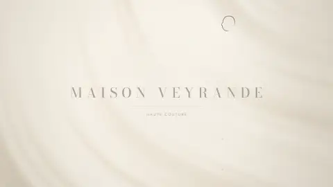 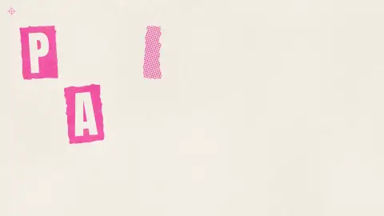
<br/><sub><b>1,240 hours</b> a pen draws the croquis, then the embroidery is sewn along it&emsp;·&emsp;<b>PAPER JAM #07</b> two riso drums print off register, a stamp slams</sub>
</p>
<p align="center">
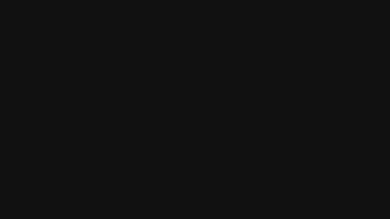 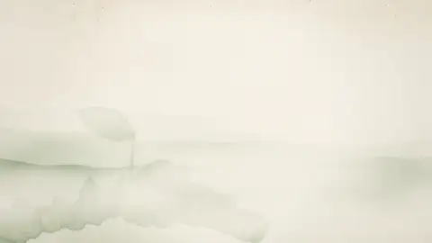
<br/><sub><b>24 · 2 · 1</b> one number per beat on a black page, the hall in the one red&emsp;·&emsp;<b>Grown slowly.</b> the mist parts and a tea flush grows: internodes stretch, leaves unfold</sub>
</p>
<p align="center">
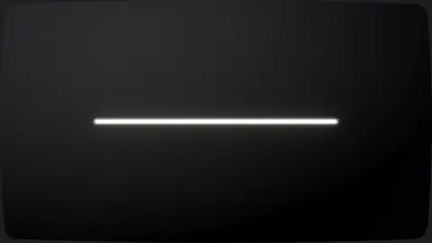 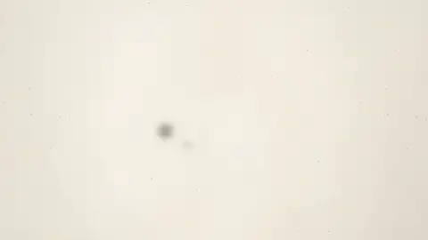
<br/><sub><b>INSERT COIN</b> the CRT powers on, a token drops into the slot&emsp;·&emsp;<b>一滴</b> one drop of sumi blooms on washi, the words soak in</sub>
</p>
<p align="center">
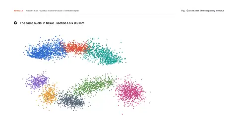 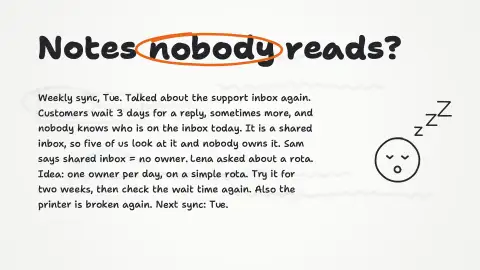
<br/><sub><b>UMAP → tissue</b> 4,900 nuclei leave the UMAP for their place in the section&emsp;·&emsp;<b>Box it. Arrow it.</b> the marker boxes three phrases in a wall of text and lifts them out</sub>
</p>
<p align="center">
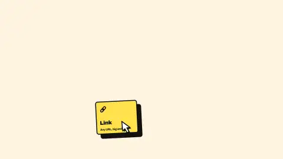 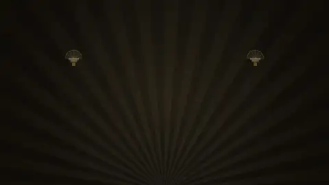
<br/><sub><b>Stack it.</b> blocks fall into the page one per beat and thunk&emsp;·&emsp;<b>KNOCK TWICE.</b> gold rules draw the door, two knocks on the beat</sub>
</p>
<p align="center">
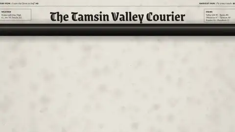 
<br/><sub><b>Page A1</b> an inked cylinder rolls the front page out, the headline casts in&emsp;·&emsp;<b>3, 2, 1, GO</b> a countdown slams, the gun fires, the race clock starts</sub>
</p>
<p align="center">
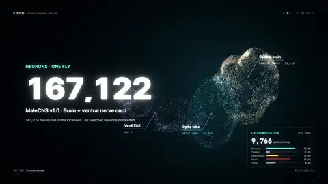 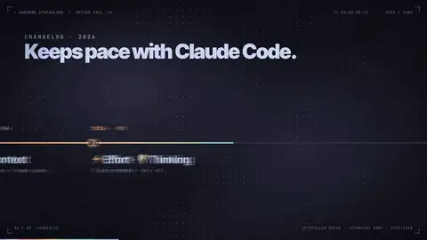
<br/><sub><b>FDDD</b> fly-brain point clouds and docking scores, nothing faked&emsp;·&emsp;<b>CC-statusline</b> real terminal captures in the tool's Catppuccin palette</sub>
</p>
<p align="center">
 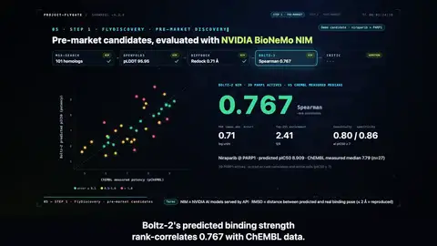
<br/><sub><b>K-BeautyGate</b> plush mascots and the real app UI in a phone&emsp;·&emsp;<b>FlyGate</b> narrated research reel, captions burned in</sub>
</p>

<details>
<summary><b>More moments from Mochi Notes and spark-bench</b></summary>

<p align="center">
 
<br/><sub><b>Meet Mochi</b> the code-drawn mascot springs up and blinks&emsp;·&emsp;<b>RUN</b> a real <code>spark-bench run</code> capture, tilted, zooming to the 4.1× row</sub>
</p>
<p align="center">
 
<br/><sub><b>Jot it down.</b> the real app UI types, then Mochi tidies it up&emsp;·&emsp;<b>4.1×</b> bars from the CLI's own JSON, then the number slams in (demo data)</sub>
</p>
<p align="center">
 
<br/><sub><b>Pick a flavor!</b> the camera dives into the phone, out on four real app themes&emsp;·&emsp;<b>Only in the 60-s cut</b> one pattern at four lengths; the gain grows</sub>
</p>

</details>

---

## Features

<p align="center"><b>Style from your source</b><br/>Palette, type, pace and music are read from your material, with the evidence written down. No presets.</p>
<p align="center"></p>

<p align="center"><b>Real material, not decoration</b><br/>Your app's UI, your CLI's output, your paper's figures, your data. Code-drawn motion around it.</p>
<p align="center"></p>

<p align="center"><b>Any length</b><br/>15, 30 or 60 s from one plan. Longer cuts add scenes; nothing is slowed down.</p>
<p align="center"></p>

<p align="center"><b>Music and sound effects included</b><br/>Synthesized to fit the style, from koto to drum and bass, and timed to the picture.</p>
<p align="center"></p>

<p align="center"><b>Optional narration</b><br/>Gemini TTS on your own key, checked by speech-to-text, with captions.</p>
<p align="center"></p>

<p align="center"><b>Ready to share</b><br/>An MP4 per cut and one HTML file with every cut that plays offline.</p>
<p align="center"></p>

---

## How it works

1. **Read the source.** Measure palette, fonts, tone and density; write `style.json` with the reasons.
2. **Storyboard.** One message per scene; exact wording and disclaimers fixed up front.
3. **Pick the proof.** Real UI, real terminal output, real figures, real numbers.
4. **Plan the cuts.** All lengths on one beat grid.
5. **Build and score.** Scenes are code; music and SFX are synthesized from the same cue list.
6. **Check and ship.** Stills, motion and audio checks, then MP4 and HTML.


---

## Install

The skill is a folder of instructions (`SKILL.md`) and command-line tools, so any coding agent can use it.

**Claude Code**

```
/plugin marketplace add AwesomeZun/Awesome-Showreels
/plugin install awesome-showreels@awesome-showreels
```

**Codex CLI (OpenAI)**

```bash
git clone https://github.com/AwesomeZun/Awesome-Showreels.git
mkdir -p ~/.codex/skills && cp -r Awesome-Showreels/skills/motion-showreel ~/.codex/skills/
```

**Gemini CLI**

```bash
gemini extensions install https://github.com/AwesomeZun/Awesome-Showreels
```

**Any other agent:** clone the repo and tell the agent to follow `skills/motion-showreel/SKILL.md` (the repo's `AGENTS.md` points there).

**One-time setup** (the agent runs it on first use):

```bash
cd <skill folder>/runtime && npm install
python3 -m pip install numpy scipy pillow opencv-python pymupdf fonttools brotli
```

---

## Prompts to try

| | Ask your agent |
|---|---|
| 📦 **Repo** | *Make a 30-second showreel from this repo, plus a 15-second cut.* |
| 📄 **Paper** | *Turn `paper.pdf` into a 45-second explainer using the paper's own figures.* |
| 🖼️ **Deck** | *Make a launch teaser from `pitch.pptx` in the deck's colors and fonts.* |
| ⌨️ **CLI** | *Make a 15-second reel with a real terminal capture of `mytool demo`.* |
| 🎤 **Narration** | *Narrate the 30-second cut with my Gemini key.* |
| ⏱️ **Longer** | *Make a 60-second version of the reel.* |

---

## FAQ

<details>
<summary><b>Do I need an API key?</b></summary>

No. Everything renders on your machine and the music is synthesized locally. Only the optional narration needs a key: your own Gemini key (see [Bring your own key](#bring-your-own-key)).

</details>

<details>
<summary><b>What does it cost?</b></summary>

The skill is free (MIT). Building a reel uses your agent's plan like any other task. Narration and extra mascot poses use your own accounts, and only when you agree.

</details>

<details>
<summary><b>Is anything in the examples faked?</b></summary>

The projects are fictional and say so on screen. What they show is real: captured app UI, real terminal recordings, data from the example's own files.

</details>

<details>
<summary><b>Vertical or square video?</b></summary>

Yes, as a re-layout of the same project (`"size": [1080, 1920]` or `[1080, 1080]`), not a crop.

</details>

<details>
<summary><b>Can it use my own mascot or logo?</b></summary>

Yes. Images become clean cutouts (macOS Vision or OpenCV) that blink, bounce and squash on the beat.

</details>

<details>
<summary><b>How do I use the HTML player?</b></summary>

Open it in any browser, offline. Space plays and pauses, ← → step, number keys switch cuts, F is fullscreen.

</details>

<details>
<summary><b>Under the hood</b></summary>

- **Runtime:** Canvas2D + WebGL2; every frame is a function of time, so stills, MP4 and the HTML player match exactly.
- **Planner:** `timing/plan_cut.py` lays every cut on one bar grid; longer cuts add scenes and holds.
- **Audio:** `audio/synth.py`, `arrange.py`, `verify_sync.py` (numpy/scipy, no samples): presets from ambient to chiptune, swing and drum and bass; every cue checked against the picture, -14 LUFS.
- **Captures:** `tools/capture_ui.mjs` (app UI), `capture_cli.py` (terminal), `pdf_figures.py` (paper figures), `prep_assets.py` + `lift.swift` (cutouts).
- **Narration:** `narration/tts_gemini.py` with speech-to-text checks, ducking and captions.
- **Big reels:** `templates/showreel-workflow.js` splits the work across many agents on Claude Code; other agents run the same steps in order.
- **This page:** every preview was rendered by the skill from [`docs/readme-reel/`](docs/readme-reel/).

</details>

---

## Requirements

| | Needed for |
|---|---|
| Node.js 20+ and Chrome/Chromium | rendering stills, MP4 and the HTML player |
| ffmpeg | MP4 and audio encoding |
| Python 3.9+ with numpy, scipy, Pillow, opencv-python | style pass, planner, music, cutouts |
| *Optional:* pymupdf, fonttools + brotli | PDFs, font subsets |
| *Optional:* macOS 14+ with `swiftc` | Vision cutouts (OpenCV elsewhere) |
| *Optional:* your Gemini API key | narration |

---

## Bring your own key

Narration is the only feature that needs a key, and it is off unless you ask for it. The skill ships no key and never searches for one.

- Save it once in your own terminal: `python3 <skill folder>/narration/tts_gemini.py key save` (macOS Keychain), or set `GEMINI_API_KEY` before starting your agent.
- `key status` shows which source is used; `key check` tests it for free.
- Never paste a key into a chat. Without a key, `--dry-run` tests the whole chain offline.

---

## Tests

```bash
python3 -B -m unittest discover -s tests
node --test tests/*.test.mjs
```

---

## License

[MIT](LICENSE). Example fonts are under the SIL Open Font License with their license files. All music and sound effects are synthesized; no samples are included.

<div align="center">

⭐ **Star it if it made your project look as good as it is.**

**Every animation on this page was made with this skill.**

</div>
