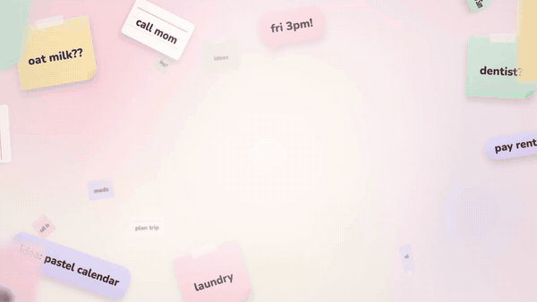
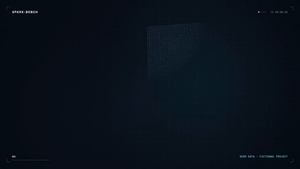
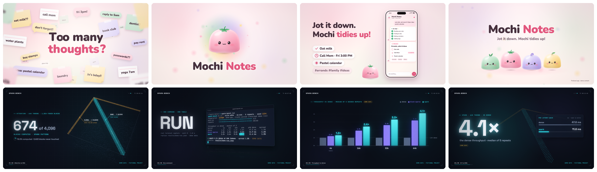

<div align="center">

# 🎬 Awesome Showreels

**A [Claude Code](https://claude.com/claude-code) skill that turns any repo, README, paper, deck or website into a premium 2D motion-graphics showreel: its look derived from the source, its proof captured for real, every hit on the beat. Ships an MP4 per cut and a single-file HTML player.**

[🇰🇷 한국어](README.ko.md) · [Quick Install](#-quick-install) · [Examples](#-try-the-examples) · [How it works](#-how-it-works) · [Case studies](#-case-studies)


<br/><br/>




<sub>Same skill, two sources, two reels: a cheerful app README → bouncy pastel mascot reel · a terse research CLI → dark data reel.<br/>▶ With sound: <a href="assets/demo-playful-app-v1.1.0.mp4">demo-playful-app-v1.1.0.mp4</a> · <a href="assets/demo-research-cli-v1.1.0.mp4">demo-research-cli-v1.1.0.mp4</a></sub>

</div>

---

## Highlights

- 🎨 **Style follows your source.** No presets. Palette, type, pace, transitions, music and voice are measured from the material and written to one spec with the evidence for every decision.
- 🧰 **Every visual tool, used where the story needs it.** Code-drawn 2D always; mascot cutouts (GPT-image-2 + macOS Vision + OpenCV), real app UI, real terminal and CLI recordings, PDF figures, web shots and real data when they prove a claim.
- 🥁 **Any length at the same BPM.** 15, 30 or 60 seconds on one bar grid: longer cuts add living holds and extra scenes, never slow motion.
- 🔊 **Music and SFX synthesized on the beat.** Every hit is a cue in the same plan the picture reads, then measured: each cue within one frame, -14 LUFS, true peak at or below -1 dBTP.
- 🎤 **Optional narration.** Gemini TTS with speech-to-text verification of every clip, ducked mix and burned-in captions.
- 📦 **Delivery, verified.** 1080p60 MP4 per cut with cover and share copy, plus one HTML file with every cut and its audio that plays offline from any folder.

---

## 🎨 Style follows your source (tone & manner)

`tools/extract_style.py` reads whatever you give it (READMEs, docs sites, CSS tokens, Tailwind configs, PDFs, pptx themes, terminal themes, logos, screenshots) and drafts `style.json`: palette roles with contrast checks, font stacks, type scale, motion vocabulary, post-processing, a sound palette and a narration recommendation. Every decision cites evidence from the source; Claude reviews the draft like a designer and overrules it where the material says otherwise. A one-page style board goes to you before any scene is built.

The two examples make the same kind of claim about software, but their sources speak differently, so the reels do too:

| | `playful-app` (Mochi Notes) | `research-cli` (spark-bench) |
|---|---|---|
| Source | emoji-rich README, pastel logo, a small web app | terse README with citations, dark docs page, a real CLI |
| Mood | playful, bouncy, friendly, energetic, warm | technical, data-driven, cool, precise, nocturnal |
| Stage and accents | light `#FFF7F2` · pink `#FF8FAF`, lilac `#B9A3F3`, mint `#92D2A6` | dark `#0A0E17` · cyan `#2FE4F0`, violet `#8B7CFF`, amber `#FFB547` |
| Type | Nunito (the app's rounded face) | Space Grotesk + JetBrains Mono (the docs' faces) |
| Motion | energetic, springy `outBack`, overshoot 1.8; blob wipe, zoom, whip | medium, damped `outExpo`; glitch, match, zoom, impact |
| Carriers | plush mascot drawn in code, real app UI in a phone | 4,096 GPU points, real terminal capture tilted in 3D, data viz |
| Sound | bright-pop, 120 BPM, C major, glassy SFX | dark-synth, 128 BPM, B minor, digital SFX |
| Voice | music-led | narration recommended (Charon): written and timed offline; ships music-led until a real voice is synthesized |

<p align="center"></p>

---

## 🧰 Every visual tool, when the story needs it

Code-drawn vector and kinetic type carry every reel. Each scene then gets one hero carrier: the thing a skeptic must see.

| Carrier | Tool in the skill | What it gives the motion |
|---|---|---|
| **Code-drawn 2D** (always) | `runtime/` Canvas2D engine + WebGL2 layer | kinetic type, springs, squash and jelly, 10 compositor transitions, HUD, point clouds and networks, all pure functions of time |
| **Mascot cutouts** | `tools/imagegen.md` (GPT-image-2 through the Codex CLI, opt-in) → `tools/lift.swift` (macOS Vision) → `tools/prep_assets.py` | extra poses of your own mascot, clean alpha, blink twins, foot anchors, QA sheets |
| **OpenCV** | `tools/prep_assets.py`, `tools/capture_ui.mjs --textfree` | GrabCut cutouts on any OS, matte refinement, sheet splitting, Telea inpainting for 2.5D photo parallax and text-free UI plates |
| **Real app UI** | `tools/capture_ui.mjs` (Playwright) | layers instead of screenshots, component states on static clones, per-character text rows for typing |
| **Terminal / CLI** | `tools/capture_cli.py` → `runtime/term.js` + `runtime/quad.js` | a real PTY recording with secrets masked, replayed in a 3D-tilted window with zoom to the key line |
| **PDF figures** | `tools/pdf_figures.py` | the paper's own figures and tables with captions, dark variants for dark stages |
| **Web shots, native apps** | `tools/capture_ui.mjs`, `tools/capture_native.md` | docs and landing pages in a browser frame; macOS windows, iOS Simulator, Android |
| **Real data** | your JSON, CSV or run logs | counters, bars, impact numbers and point clouds with a provenance note for every value |

Honesty rules come with the tools: real captures stay real, staged data is labelled on screen, and the credits separate what was computed from what was authored.

---

## 🎤 Narration (optional)

Narration uses **Gemini TTS** and is off unless the material calls for it (papers, docs, explainers, pitches) and you agree.

- Lines are synthesized in batches, split at long pauses and **verified by speech-to-text**; clips with leaked style tags or missing words are retried.
- Scene lengths grow in **whole bars** to fit the voice, so narration never changes the tempo or slows a frame.
- The mix ducks music and SFX under the voice; captions ship as SRT/VTT and are burned in from the same timeline.
- Needs `GEMINI_API_KEY` in your environment. `--dry-run` builds and tests the whole chain offline with placeholder clips, which the render and build tools refuse to ship.

---

## 🥁 Any length at the same BPM

Every reel runs on one bar grid (at 128 BPM a bar is 1.875 s, so 8 bars = 15 s, 16 bars = 30 s and 32 bars = 60 s). Scenes are elastic: a fixed in-phase, a hold that stretches and a fixed out-phase. `timing/plan_cut.py` spends extra bars on holds with secondary beats and on optional scenes, keeping every boundary on a bar line, and the music arranger builds the same song with more bars.

| Scene (research-cli) | 15-s cut | 30-s cut | 60-s cut | What fills the extra time |
|---|---|---|---|---|
| matrix | 2 bars | 2 bars | 2 bars | (the hook never grows) |
| problem | (left out) | 2 bars | 2 bars | an optional scene enters |
| cli | 3 bars | 3 bars | 5 bars | a camera tour of the run's own provenance lines |
| results | 1 bar | 3 bars | 5 bars | trend line, 64k focus with p50 values, spark's lead per length |
| scaling | (left out) | (left out) | 5 bars | optional: the same pattern at four lengths, the gain grows |
| repeats | (left out) | (left out) | 5 bars | optional: the five seeded repeats behind every number |
| impact | 1 bar | 3 bars | 4 bars | leaderboard with spread, a scan per bar |
| logo | 1 bar | 3 bars | 4 bars | install line and credits |

A scene renders the same in-phase in every cut (rendered alone, the frames match, GPU-blended scenes to within rounding; full frames differ only by film grain and the HUD's timecode); only its hold changes. Uniform or piecewise slow-down variants (`--scale`, `--warp`) exist only for audiences who must read dense material.

---

## 🚀 Quick install

**As a Claude Code plugin**

```
/plugin marketplace add AwesomeZun/Awesome-Showreels
/plugin install awesome-showreels@awesome-showreels
```

**Or as a personal skill**

```bash
git clone https://github.com/AwesomeZun/Awesome-Showreels.git
cp -r Awesome-Showreels/skills/motion-showreel ~/.claude/skills/
```

**One-time setup** of the render runtime and the Python tools (Claude runs it for you on first use; run it again after a plugin update, which replaces the skill folder):

```bash
cd ~/.claude/skills/motion-showreel/runtime && npm install     # personal skill
# plugin install: the same command in the plugin's copy of the folder, found with
#   find ~/.claude/plugins -type d -path '*motion-showreel/runtime' -not -path '*/node_modules/*'
python3 -m pip install numpy scipy pillow opencv-python pymupdf fonttools brotli   # in a venv if pip refuses
```

Then ask Claude, for example:

> Make a 30-second showreel from this repo, with a 15-second cut for social.<br/>
> Turn `paper.pdf` into a narrated 45-second explainer reel.<br/>
> Make a launch teaser for our app from `README.md` and the screenshots in `docs/`.

---

## 📦 What's inside

```
.claude-plugin/              plugin.json, marketplace.json
assets/                      README demos (GIF previews, MP4s with sound, stills)
skills/motion-showreel/
  SKILL.md                   the designer's procedure Claude follows
  references/                tone & manner, visual sources, storyboard, timing, engine API, 36 motion recipes,
                             capture, imagery, audio, narration, render pipeline, multi-agent production
  runtime/                   engine.js, gl.js, quad.js, term.js, compositor.js, template.html,
                             stills.mjs (stills, sheets, live player), render.mjs (MP4), build.mjs (single HTML)
  timing/plan_cut.py         bar-grid planner for any length at one BPM
  tools/                     extract_style.py, source_snapshot.mjs, capture_ui.mjs, capture_cli.py,
                             pdf_figures.py, prep_assets.py, motion_qa.py, lift.swift, imagegen.md, capture_native.md
  audio/                     synth.py, arrange.py, verify_sync.py (numpy/scipy, no samples)
  narration/                 tts_gemini.py, vo_timeline.py, mix_vo.py, captions.py
  templates/                 style.schema.json, STORYBOARD, reel.config, narration, showreel-workflow.js
  examples/                  playful-app, research-cli (source, style, storyboard, scenes, dist/ player)
tests/                       regression tests for the planner, audio sync, CLI capture, tools and the runtime
```

---

## 🧩 How it works

```
 source material      repo · README · docs · paper · deck · website · brand guide · screenshots
       │
       ▼
 1 tone pass          tools/extract_style.py  →  style.json  (+ evidence log, style board)
       │
       ▼
 2 storyboard         STORYBOARD.md (exact copy, rules)  +  reel.config.json (scenes in bars, cues in beats)
       │
       ▼
 3 plan               timing/plan_cut.py  →  build/cut-15.json · cut-30.json · cut-60.json  (one BPM)
       │
       ├──► carriers  capture_ui.mjs · capture_cli.py · pdf_figures.py · prep_assets.py (Vision + OpenCV)
       ├──► scenes    scenes/<id>.js on the Canvas2D/WebGL2 runtime, pure functions of time
       ├──► sound     audio/arrange.py: music + SFX on the planned cues  →  verify_sync.py
       └──► voice     optional: Gemini TTS → STT check → vo_timeline → mix_vo → captions
       │
       ▼
 4 look               runtime/stills.mjs: contact sheets, every transition, a live player
       │
       ▼
 5 deliver            render.mjs → MP4 per cut (+ covers, share copy) · build.mjs → one self-contained HTML
```

Because every frame is a pure function of time, a still, an MP4 frame and the HTML player show the same pixels, parallel render workers can take any frame range, and the picture and the soundtrack read one cue list. For large reels, `templates/showreel-workflow.js` runs the production as a team of agents (build, independent review and fix per scene), the pattern that built the K-BeautyGate reel below.

---

## 🧪 Try the examples

Prebuilt players with every cut (15/short, 30 and 60 s) and their music, one HTML file each (download and open in any browser):
[`mochi-notes-v1.1.0.html`](skills/motion-showreel/examples/playful-app/dist/mochi-notes-v1.1.0.html) ·
[`spark-bench-v1.1.0.html`](skills/motion-showreel/examples/research-cli/dist/spark-bench-v1.1.0.html)
(the v1.0.0 players with two cuts stay next to them).

Rebuild them yourself from a clone:

```bash
(cd skills/motion-showreel/runtime && npm install)      # once, and after every update
S=skills/motion-showreel; mkdir -p out                  # renders go to out/ (git-ignored)

# Mochi Notes: plan every cut, make the music, check the sync, render the short cut, build the player
P=$S/examples/playful-app
python3 $S/timing/plan_cut.py --project $P --cut short,30,60
for c in short 30 60; do python3 $S/audio/arrange.py --project $P --cut $c; done
python3 $S/audio/verify_sync.py --wav $P/build/music-short.wav --cut $P/build/cut-short.json
node $S/runtime/render.mjs --project $P --cut short --out out/mochi-notes-short.mp4 --poster 3
node $S/runtime/build.mjs --project $P --cuts short,30,60 --out out/mochi-notes.html --verify

# spark-bench: the same steps (each cut's music is picked up from build/), then a live player
P=$S/examples/research-cli
python3 $S/timing/plan_cut.py --project $P --cut 15,30,60
for c in 15 30 60; do python3 $S/audio/arrange.py --project $P --cut $c; done
node $S/runtime/render.mjs --project $P --cut 15 --out out/spark-bench-15.mp4 --poster 3.3
node $S/runtime/stills.mjs --project $P --serve        # live player: Space, arrows, 1/2/3 switch cuts
```

Narration in the research example is written and timed offline (`tts_gemini.py batch --dry-run`), but placeholder clips never ship: the tools skip a mix made from them and refuse captions timed from them. Its README shows both paths.

Each example's README walks through its source, the tone pass decisions, the captures and the full build:
[playful-app](skills/motion-showreel/examples/playful-app/README.md) · [research-cli](skills/motion-showreel/examples/research-cli/README.md).

---

## 📚 Case studies

The method comes from real productions. Their media is not part of this repo; they are described here as text only.

- **K-BeautyGate (hackathon pitch).** A 30-second cosmetics-ad × AI-agent product tour at 120 BPM: plush pastel mascot poses generated from the client's mascot and lifted with macOS Vision, springy character motion with blinks and jelly, the real app UI animated as layers inside a phone, a dark climax, a mascot lineup bouncing on the beat. 45-, 53- and 60-second comprehension variants re-synthesized their music rather than stretching it. Built by 24 agents (build, review, fix) in about 25 minutes.
- **[FlyGate](https://github.com/AwesomeZun/Project-FlyGate) (narrated reels).** A 1-minute intro, a 4.8-minute full reel, 15- and 30-second shorts and vertical versions, with Gemini narration verified by speech-to-text, scene lengths driven by the voice, captions burned in, and terminal scenes in the CC-statusline grammar.
- **[FDDD](https://github.com/AwesomeZun/FDDD) (research data reel).** 128 BPM, 16 bars for 30 s and an independently edited 8-bar 15-s cut: real point clouds, connectome lines, docking scores as impact numbers, a poster frame that breaks into slices, and credits that separate computed from authored ("Real docking scores. Real spikes. Nothing faked.").
- **CC-statusline (terminal tool reel).** The tool's Catppuccin palette, one giant word per command, real terminal captures tilted in 3D with a zoom to the key line, and glitch and typing transitions.

---

## ✅ Requirements

| Dependency | Why | Notes |
|---|---|---|
| Node.js 20+ | runtime: stills, MP4 render, HTML build, UI capture | `npm install` in `skills/motion-showreel/runtime` (playwright-core only) |
| Chromium or Chrome | headless rendering | auto-detected: `CHROME_PATH`, Playwright's Chromium, or a system Chrome/Chromium/Edge |
| ffmpeg with libx264 | MP4 encode, AAC, previews | on macOS the AudioToolbox AAC encoder is used when present |
| Python 3.9+ with numpy, scipy, Pillow, opencv-python | tone pass, planner, music, narration, cutouts, text-free UI plates | optional: `pymupdf` (PDFs), `fonttools` + `brotli` (font subsets in the HTML) |
| macOS 14+ and `swiftc` *(optional)* | Vision subject lifting | other systems use the OpenCV path |
| Codex CLI with a ChatGPT login *(optional)* | GPT-image-2 mascot poses | only with your consent; it spends your ChatGPT usage |
| `GEMINI_API_KEY` *(optional)* | narration | `--dry-run` works without a key |
| LibreOffice, poppler *(optional)* | slide decks, PDF fallbacks | |

---

## 🔬 Tests

```bash
python3 -B -m unittest discover -s tests        # planner, audio sync, CLI capture and masking, tools
node --test tests/*.test.mjs                    # runtime: audio pick order, placeholder guards
```

---

## 📄 License

[MIT](LICENSE). The example fonts (Nunito, Space Grotesk, JetBrains Mono) are under the SIL Open Font License 1.1 and ship with their licence files. All music and sound effects are synthesized by the skill; no samples are included.

## 🙏 Credits

Built with [Claude Code](https://claude.com/claude-code). The skill drives, and does not bundle: Playwright and Chromium, FFmpeg, OpenCV, Apple Vision, PyMuPDF, fontTools, Gemini TTS and GPT-image-2 through the Codex CLI. The example projects (Mochi Notes, spark-bench) and their data are fictional and were written for this repo.

<div align="center">

Built with 🎬 for the Claude Code community · MIT License

⭐ **Star it if it made your project look as good as it is.**

</div>
