<div align="center">

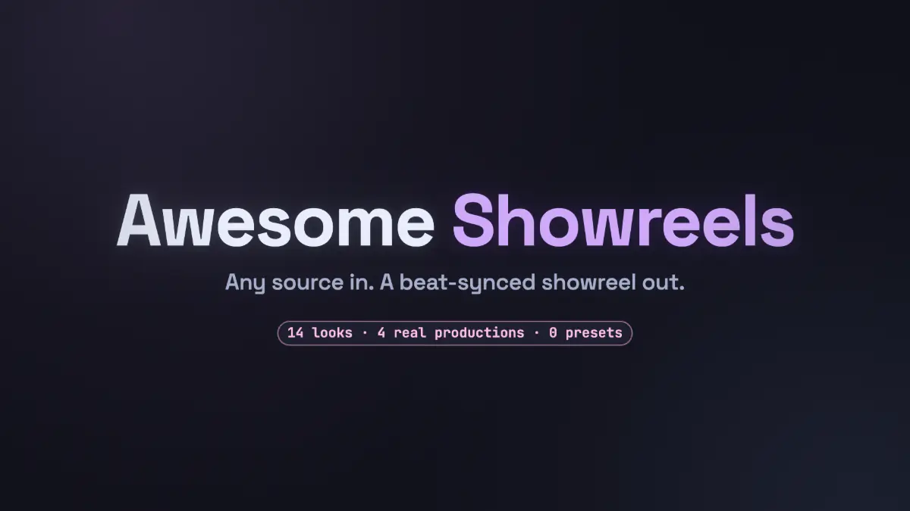

# Awesome Showreels

### Any repo in. A beat-synced showreel out.

A [Claude Code](https://claude.com/claude-code) skill that turns any repo, README, paper, deck or website into a 2D motion-graphics showreel.<br/>
**Look measured from your source. Proof captured for real. Every hit on the beat.**

**This page is its own demo:** every animation built for it was rendered by the skill, from [`docs/readme-reel/`](docs/readme-reel/).

<a href="LICENSE"></a>
<a href="#install"></a>


<a href="#bring-your-own-key"></a>

**[Install](#install) · [Examples](#same-skill-fourteen-sources-fourteen-reels) · [Moments](#best-moments) · [Features](#a-whole-motion-studio-in-one-skill) · [How it works](#watch-it-think) · [🇰🇷 한국어](README.ko.md)**

</div>

```
/plugin marketplace add AwesomeZun/Awesome-Showreels
/plugin install awesome-showreels@awesome-showreels
```

<p align="center">Then ask Claude: <b><i>"Make a 30-second showreel from this repo."</i></b></p>
<p align="center">The loops on this page are silent. <b>⬇ Sound on, 1080p60 MP4:</b> <a href="assets/demo-playful-app-v1.1.0.mp4">Mochi Notes · 14 s</a> · <a href="assets/demo-research-cli-v1.1.0.mp4">spark-bench · 15 s</a><br/>
<sub>GitHub can’t preview files this big: press “Download raw file”.</sub></p>

---

## Same skill. Fourteen sources. Fourteen reels.

One source packs 104 emoji per 1,000 words. Another packs 129 numbers and 7 citations per 1,000 words, and not a single emoji. The rest are a press release, a competition brief, a zine, a game jam, a tea garden, a single-cell paper, a workshop handout, a landing page, a ryokan, a jazz-age invitation, a small-town newspaper and a race-timing app. Nobody picked a theme from a menu: the skill measured each source, Claude reviewed the draft like a designer, and the evidence set the palette, the type, the motion and the music. No two share a look, and none of them is a template.

<table>
<tr>
<td align="center" valign="top" width="50%">
<a href="skills/motion-showreel/examples/playful-app">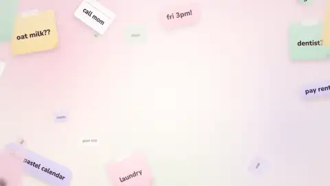</a>
<br/><b>Mochi Notes</b> · <code>playful-app</code>
<br/><sub>a cheerful app README, a pastel logo and a tiny web app<br/>→ plush mascot drawn in code, real app UI in a phone · 120 BPM bright-pop</sub>
</td>
<td align="center" valign="top" width="50%">
<a href="skills/motion-showreel/examples/research-cli">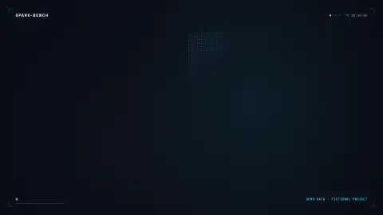</a>
<br/><b>spark-bench</b> · <code>research-cli</code>
<br/><sub>a terse research README, a dark docs page and a real CLI<br/>→ 4,096 GPU points, a real terminal tilted in 3D · 128 BPM dark-synth</sub>
</td>
</tr>
<tr>
<td align="center" valign="top" width="50%">
<a href="skills/motion-showreel/examples/editorial-luxe"></a>
<br/><b>Maison Veyrande</b> · <code>editorial-luxe</code>
<br/><sub>a fashion house press release and lookbook notes<br/>→ Bodoni hairlines, slow reveals, ivory and black · 80 BPM piano and strings</sub>
</td>
<td align="center" valign="top" width="50%">
<a href="skills/motion-showreel/examples/riso-zine"></a>
<br/><b>PAPER JAM #07</b> · <code>riso-zine</code>
<br/><sub>a zine README and house style<br/>→ misregistered riso inks, stamps, jumpy cuts · 160 BPM</sub>
</td>
</tr>
<tr>
<td align="center" valign="top" width="50%">
<a href="skills/motion-showreel/examples/swiss-grid">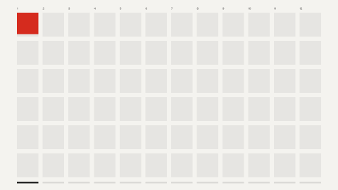</a>
<br/><b>Haus für Musik</b> · <code>swiss-grid</code>
<br/><sub>an architecture competition brief and CSS tokens<br/>→ 12-column grid, one red, numbers at poster size · 124 BPM</sub>
</td>
<td align="center" valign="top" width="50%">
<a href="skills/motion-showreel/examples/botanical-organic"></a>
<br/><b>Mistfold</b> · <code>botanical-organic</code>
<br/><sub>a tea-garden story and brand notes<br/>→ watercolour, a botanically real time-lapse of a tea flush · 96 BPM nylon guitar and marimba</sub>
</td>
</tr>
<tr>
<td align="center" valign="top" width="50%">
<a href="skills/motion-showreel/examples/pixel-arcade">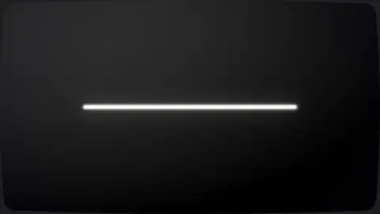</a>
<br/><b>ONE CREDIT JAM</b> · <code>pixel-arcade</code>
<br/><sub>a game-jam README and a 16-colour palette<br/>→ pixel art, CRT glow, a high-score end card · 144 BPM chiptune</sub>
</td>
<td align="center" valign="top" width="50%">
<a href="skills/motion-showreel/examples/sumi-wabi"></a>
<br/><b>余白庵</b> · <code>sumi-wabi</code>
<br/><sub>a ryokan site and its shitsurae notes<br/>→ sumi bleeding into washi, vertical type, one vermilion seal · 72 BPM koto in hirajōshi</sub>
</td>
</tr>
<tr>
<td align="center" valign="top" width="50%">
<a href="skills/motion-showreel/examples/academic-paper"></a>
<br/><b>Alveolar repair atlas</b> · <code>academic-paper</code>
<br/><sub>a single-cell and spatial omics manuscript and its data<br/>→ 4,900 cells keep their identity: UMAP, tissue, dot plot · 100 BPM D dorian</sub>
</td>
<td align="center" valign="top" width="50%">
<a href="skills/motion-showreel/examples/sketchnote">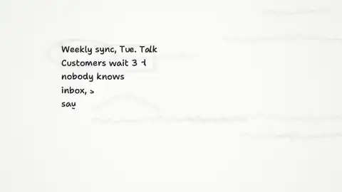</a>
<br/><b>Visual Notes Lab</b> · <code>sketchnote</code>
<br/><sub>facilitator notes and a handout<br/>→ markers write themselves on one whiteboard, one camera take · 104 BPM</sub>
</td>
</tr>
<tr>
<td align="center" valign="top" width="50%">
<a href="skills/motion-showreel/examples/neo-brutal">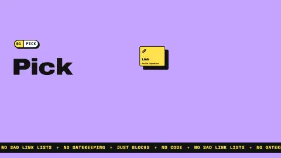</a>
<br/><b>kablok</b> · <code>neo-brutal</code>
<br/><sub>a landing page's CSS and BRAND.md<br/>→ hard shadows, slabs, a cursor that presses · 112 BPM funk</sub>
</td>
<td align="center" valign="top" width="50%">
<a href="skills/motion-showreel/examples/art-deco">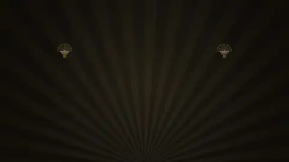</a>
<br/><b>THE EMERALD FAN</b> · <code>art-deco</code>
<br/><sub>an invitation, a menu and a house style<br/>→ gilded stepped frames, a fan, a sunburst · 112 BPM swing</sub>
</td>
</tr>
<tr>
<td align="center" valign="top" width="50%">
<a href="skills/motion-showreel/examples/newsprint"></a>
<br/><b>The Tamsin Valley Courier</b> · <code>newsprint</code>
<br/><sub>a front page and a stylebook<br/>→ a printing press, halftone, cast slugs, a red plate · 96 BPM</sub>
</td>
<td align="center" valign="top" width="50%">
<a href="skills/motion-showreel/examples/sports-kinetic">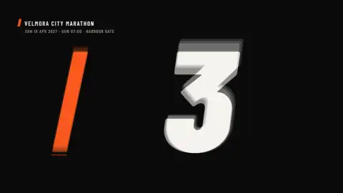</a>
<br/><b>VELMORA 42</b> · <code>sports-kinetic</code>
<br/><sub>a race-timing app README and BRAND.md<br/>→ broadcast type, real splits as bars, racing stripes · 176 BPM drum and bass</sub>
</td>
</tr>
</table>

<sub>Each loop is that example's short cut played at 2x, silent. Every project, brand and data set is fictional and was written for this repo; the reels say so on screen. Open any folder for its source, its <code>style.json</code> with the reasoning behind every decision, and its scenes. With sound, in 1080p60: <a href="assets/demo-playful-app-v1.1.0.mp4">Mochi Notes MP4</a> · <a href="assets/demo-research-cli-v1.1.0.mp4">spark-bench MP4</a>; single-file players with every cut: <a href="skills/motion-showreel/examples/playful-app/dist/mochi-notes-v1.1.0.html">Mochi Notes</a> · <a href="skills/motion-showreel/examples/research-cli/dist/spark-bench-v1.1.0.html">spark-bench</a> (GitHub shows them as source: “Download raw file”, then open offline).</sub>

<details>
<summary><b>Every style decision, side by side: Mochi Notes and spark-bench</b></summary>

`tools/extract_style.py` reads whatever you give it (READMEs, docs sites, CSS tokens, Tailwind configs, PDFs, pptx themes, terminal themes, logos, screenshots) and drafts `style.json`: palette roles with contrast checks, font stacks, type scale, motion vocabulary, post-processing, a sound palette and a narration recommendation. Every decision cites evidence from the source; Claude reviews the draft like a designer and overrules it where the material says otherwise. A one-page style board goes to you before any scene is built.

| | `playful-app` (Mochi Notes) | `research-cli` (spark-bench) |
|---|---|---|
| Source | emoji-rich README, pastel logo, a small web app | terse README with citations, dark docs page, a real CLI |
| Measured | 39 '!' and 104 emoji per 1,000 words, 6 words per sentence, second person | no '!', no emoji, no marketing words; 129 numbers and 7 citations per 1,000 words |
| Mood | playful, bouncy, friendly, energetic, warm | technical, data-driven, cool, precise, nocturnal |
| Stage and accents | light `#FFF7F2` · pink `#FF8FAF`, lilac `#B9A3F3`, mint `#92D2A6` | dark `#0A0E17` · cyan `#2FE4F0`, violet `#8B7CFF`, amber `#FFB547` |
| Type | Nunito (the app's rounded face) | Space Grotesk + JetBrains Mono (the docs' faces) |
| Motion | energetic, springy `outBack`, overshoot 1.8; blob wipe, zoom, whip | medium, damped `outExpo`; glitch, match, zoom, impact |
| Carriers | plush mascot drawn in code, real app UI in a phone | 4,096 GPU points, real terminal capture tilted in 3D, data viz |
| Sound | bright-pop, 120 BPM, C major, glassy SFX | dark-synth, 128 BPM, B minor, digital SFX |
| Voice | music-led | narration recommended (Charon): written and timed offline; ships music-led until a real voice is synthesized |

Each example's README walks through its source, the tone pass decisions, the captures and the full build: [playful-app](skills/motion-showreel/examples/playful-app/README.md) · [research-cli](skills/motion-showreel/examples/research-cli/README.md).

</details>

---

## Best moments

Eight beats from the two example reels. Left: Mochi Notes. Right: spark-bench.

<p align="center">
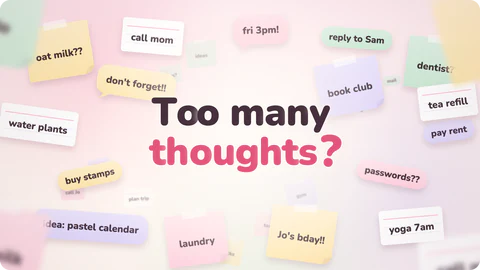 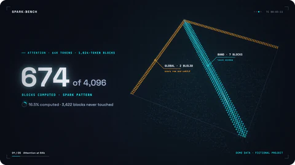
<br/><sub><b>Too many thoughts?</b> kinetic type in a storm of paper scraps&emsp;·&emsp;<b>4,096 → 674</b> an attention matrix as GPU points; every skipped block sinks</sub>
</p>
<p align="center">
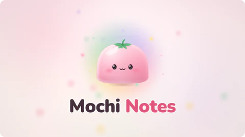 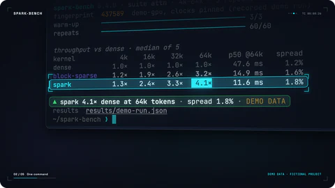
<br/><sub><b>Meet Mochi</b> the code-drawn mascot springs up and blinks&emsp;·&emsp;<b>RUN</b> a real <code>spark-bench run</code> capture, tilted, zooming to the 4.1× row</sub>
</p>
<p align="center">
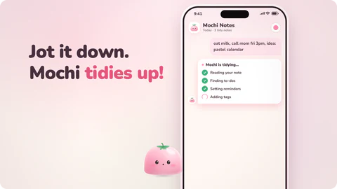 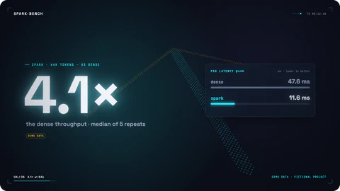
<br/><sub><b>Jot it down.</b> the real app UI types, then Mochi tidies it up&emsp;·&emsp;<b>4.1×</b> bars from the CLI's own JSON, then the number slams in (demo data)</sub>
</p>
<p align="center">
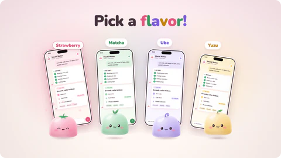 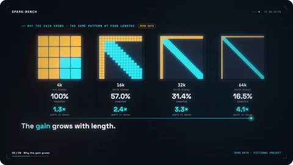
<br/><sub><b>Pick a flavor!</b> the camera dives into the phone, out on four real app themes&emsp;·&emsp;<b>Only in the 60-s cut</b> one pattern at four lengths; the gain grows</sub>
</p>

<p align="center"><sub>Mochi Notes and spark-bench are fictional projects written for this repo, and their reels say so on screen. The moments, the two example loops and the sizzle at the top are ranges of the examples' real cut plans, rendered frame by frame (<a href="docs/readme-reel/sizzle/"><code>docs/readme-reel/sizzle/</code></a>) with film grain off to keep the files light.</sub></p>

---

## A whole motion studio in one skill

Six things the skill does, each shown in a loop the skill rendered itself.

<p align="center"><b>Styled by your source</b><br/>Palette, type, pace and music come from your material, every call backed by evidence. No theme presets: even the music genre is scored from the source.</p>
<p align="center">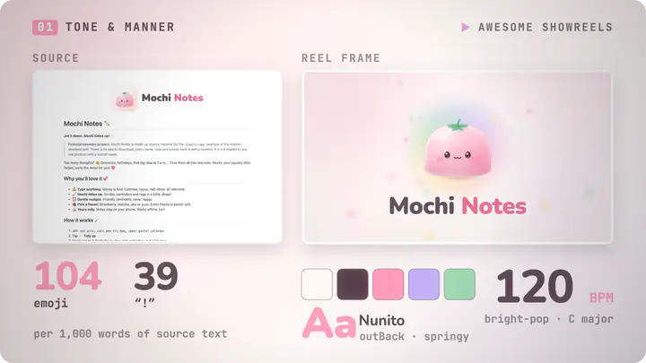</p>

<p align="center"><b>Every visual tool, when the story needs it</b><br/>Code-drawn 2D, mascot cutouts, real app UI, real terminal casts, PDF figures and GPU particles. Proof, not decoration.</p>
<p align="center">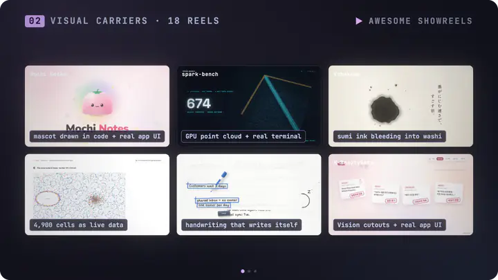</p>

<p align="center"><b>Any length, same BPM</b><br/>15, 30 or 60 s on one bar grid. Longer cuts add scenes and longer holds that keep moving, never slow motion.</p>
<p align="center">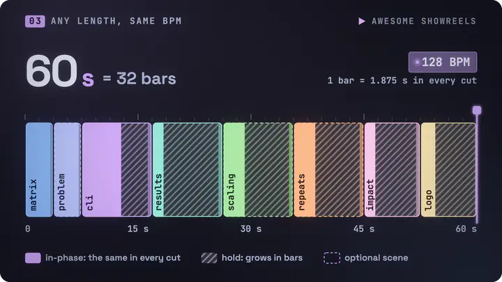</p>

<p align="center"><b>Scored on the beat</b><br/>Music and SFX synthesized from the picture's own cue list. Every cue within one frame, at -14 LUFS.</p>
<p align="center">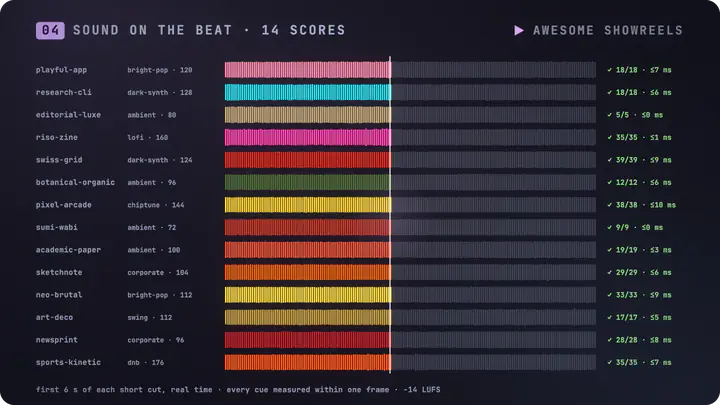</p>

<p align="center"><b>Narration on your own key (BYOK)</b><br/>Optional Gemini TTS: every clip checked by speech-to-text, music ducked under each line, captions burned in.</p>
<p align="center">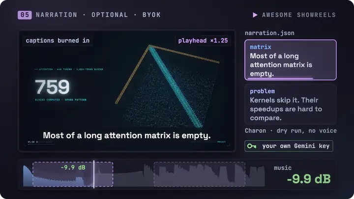</p>

<p align="center"><b>Ships verified</b><br/>A 1080p60 MP4 per cut, plus one HTML player with every cut that plays offline from any folder.</p>
<p align="center">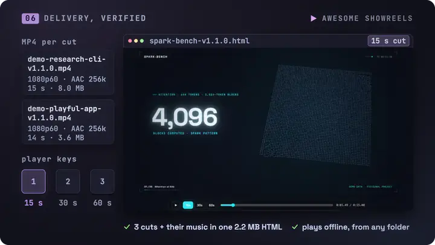</p>

<p align="center"><sub>The mascot tile is a macOS Vision cutout of the Mochi Notes logo; the PDF tile is a demo note generated from spark-bench's README and demo data, with its figure extracted by <code>pdf_figures.py</code>. The player window shows the example's real player, screenshotted as its own keys switch cuts. The narration loop shows dry-run timing: no voice was synthesized for this page.</sub></p>

---

## Watch it think

Give Claude a source and a length. Here is what happens next, beat by beat.

1. **Reads the room.** Runs the tone pass over your material (palette, fonts, density, register, pace), drafts `style.json` with the evidence for every decision, overrules the draft where the material says otherwise, and shows you a one-page style board before a single scene exists.
2. **Writes one sentence, one scene, one message.** Exact copy, banned wording and disclaimers go into `STORYBOARD.md`; scenes in bars and cues in beats go into `reel.config.json`.
3. **Picks the proof.** One hero carrier per scene, the thing a skeptic must see: your app's real UI, your command's real output, your paper's own figure, your run's own numbers.
4. **Locks the grid.** One BPM per project. `plan_cut.py` lays every cut on the same bar grid; longer cuts get longer holds that keep moving, and optional scenes, never slow motion.
5. **Builds and scores.** Scenes are pure functions of time on a Canvas2D + WebGL2 runtime. Music and SFX are synthesized from the same cue list, and `verify_sync.py` proves every cue lands within one frame.
6. **Checks, then ships.** Full-resolution stills at every boundary, motion QA for frozen holds and pops, loudness at -14 LUFS. Then an MP4 per cut and one HTML player, verified from an empty folder.

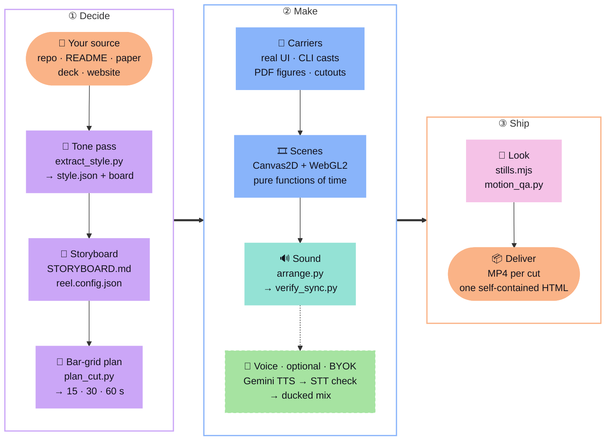

Because every frame is a pure function of time, a still, an MP4 frame and the HTML player show the same pixels, parallel render workers can take any frame range, and the picture and the soundtrack read one cue list.

---

## Install

**As a Claude Code plugin**

```
/plugin marketplace add AwesomeZun/Awesome-Showreels
/plugin install awesome-showreels@awesome-showreels
```

**Or as a personal skill**

```bash
git clone https://github.com/AwesomeZun/Awesome-Showreels.git
cp -r Awesome-Showreels/skills/motion-showreel ~/.claude/skills/
```

**One-time setup** of the render runtime and the Python tools (Claude runs it for you on first use; run it again after a plugin update, which replaces the skill folder):

```bash
cd ~/.claude/skills/motion-showreel/runtime && npm install     # personal skill
# plugin install: the same command in the plugin's copy of the folder, found with
#   find ~/.claude/plugins -type d -path '*motion-showreel/runtime' -not -path '*/node_modules/*'
python3 -m pip install numpy scipy pillow opencv-python pymupdf fonttools brotli   # in a venv if pip refuses
```

---

## Prompts to try

| | Say this to Claude |
|---|---|
| 📦 **Repo** | *Make a 30-second showreel from this repo, with a 15-second cut for social.* |
| 📄 **Paper** | *Turn `paper.pdf` into a 45-second explainer reel built on the paper's own figures.* |
| 🖼️ **Deck** | *Make a launch teaser from `pitch.pptx` in the deck's own colors and fonts.* |
| ⌨️ **CLI** | *Make a 15-second reel for this CLI with a real terminal capture of `mytool demo`.* |
| 🎤 **Narration (BYOK)** | *Narrate the 30-second cut. I saved my own Gemini key with `key save`.* |
| 🥁 **60 s, same BPM** | *Extend the reel to 60 seconds at the same BPM, without slowing anything down.* |

---

## Case studies

The method was not invented for this repo. It was distilled from four real productions that came before it, and all four of their reels play right here.

<table>
<tr>
<td align="center" valign="top" width="50%">
<a href="https://github.com/AwesomeZun/FDDD"></a>
<br/><b><a href="https://github.com/AwesomeZun/FDDD">FDDD</a></b> · research data reel
<br/><sub>128 BPM: a 16-bar 30-s cut and an 8-bar 15-s cut edited on its own. Real point clouds and connectome lines, docking scores that slam in as impact numbers, a poster frame that breaks into slices, and credits that separate computed from authored, closing on <i>“Real docking scores. Real spikes. Nothing faked.”</i></sub>
</td>
<td align="center" valign="top" width="50%">
<a href="https://github.com/AwesomeZun/CC-statusline"></a>
<br/><b><a href="https://github.com/AwesomeZun/CC-statusline">CC-statusline</a></b> · terminal tool reel
<br/><sub>The tool's Catppuccin palette, one giant word per command, real terminal captures tilted in 3D with a zoom to the key line, and glitch and typing transitions.</sub>
</td>
</tr>
<tr>
<td align="center" valign="top" width="50%">

<br/><b>K-BeautyGate</b> · hackathon pitch reel
<br/><sub>120 BPM, 30 s: a cosmetics-ad × AI-agent product tour. Mascot poses lifted with macOS Vision, springy character motion with blinks and jelly, the real app UI animated as layers inside a phone, and a mascot lineup bouncing on the beat.</sub>
</td>
<td align="center" valign="top" width="50%">
<a href="https://github.com/AwesomeZun/Project-FlyGate">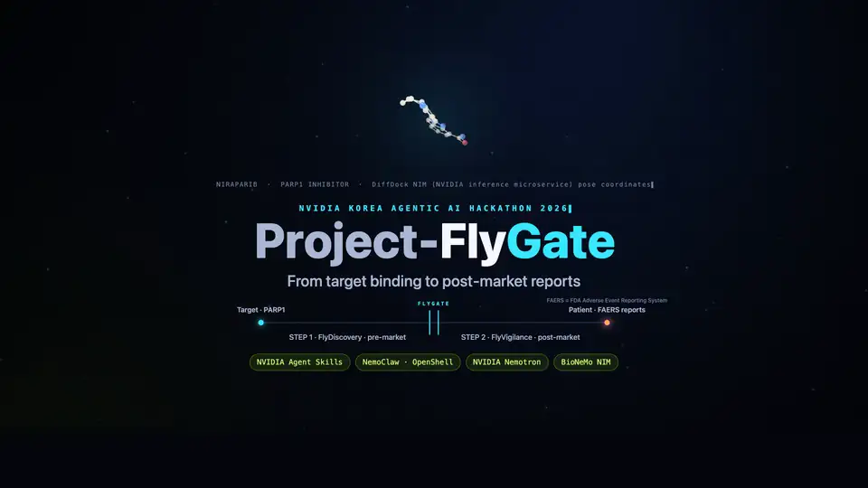</a>
<br/><b><a href="https://github.com/AwesomeZun/Project-FlyGate">FlyGate</a></b> · narrated research reels
<br/><sub>An intro, a full narrated reel (28 scenes over 250 s), 15- and 30-second shorts and vertical versions. Scene lengths follow the voice, captions are burned in, and the Gemini narration is checked by speech-to-text.</sub>
</td>
</tr>
</table>

<details>
<summary><b>More about K-BeautyGate and FlyGate</b></summary>

- **K-BeautyGate (hackathon pitch).** A cosmetics-ad × AI-agent tour: plush pastel mascot poses generated from the client's mascot and lifted with macOS Vision, springy character motion with blinks and jelly, the real app UI animated as layers inside a phone, a dark climax and a mascot lineup bouncing on the beat. Its slowed comprehension variants (today's `--scale` and `--warp`), at 45, 53 and 60 s, re-synthesized their music rather than stretching it. On a hand-built harness, 24 agents (build, review, fix) reached the first full render in about 25 minutes.
- **[FlyGate](https://github.com/AwesomeZun/Project-FlyGate) (narrated reels).** Scene lengths driven by the voice, captions burned in, and terminal scenes in the CC-statusline grammar.

</details>

---

## Under the hood

<details>
<summary><b>Every visual tool, when the story needs it</b></summary>

Code-drawn vector and kinetic type carry every reel. Each scene then gets one hero carrier: the thing a skeptic must see.

| Carrier | Tool in the skill | What it gives the motion |
|---|---|---|
| **Code-drawn 2D** (always) | `runtime/` Canvas2D engine + WebGL2 layer | kinetic type, springs, squash and jelly, 12 compositor transitions, HUD, point clouds and networks, all pure functions of time |
| **Mascot cutouts** | `tools/imagegen.md` (GPT-image-2 through the Codex CLI, opt-in) → `tools/lift.swift` (macOS Vision) → `tools/prep_assets.py` | extra poses of your own mascot, clean alpha, blink twins, foot anchors, QA sheets |
| **OpenCV** | `tools/prep_assets.py`, `tools/capture_ui.mjs --textfree` | GrabCut cutouts on any OS, matte refinement, sheet splitting, Telea inpainting for 2.5D photo parallax and text-free UI plates |
| **Real app UI** | `tools/capture_ui.mjs` (Playwright) | layers instead of screenshots, component states on static clones, per-character text rows for typing |
| **Terminal / CLI** | `tools/capture_cli.py` → `runtime/term.js` + `runtime/quad.js` | a real PTY recording with secrets masked, replayed in a 3D-tilted window with zoom to the key line |
| **PDF figures** | `tools/pdf_figures.py` | the paper's own figures and tables with captions, dark variants for dark stages |
| **Web shots, native apps** | `tools/capture_ui.mjs`, `tools/capture_native.md` | docs and landing pages in a browser frame; macOS windows, iOS Simulator, Android |
| **Real data** | your JSON, CSV or run logs | counters, bars, impact numbers and point clouds with a provenance note for every value |

Honesty rules come with the tools: real captures stay real, staged data is labelled on screen, and the credits separate what was computed from what was authored.

</details>

<details>
<summary><b>Any length at the same BPM: the bar math</b></summary>

Every reel runs on one bar grid (at 128 BPM a bar is 1.875 s, so 8 bars = 15 s, 16 bars = 30 s and 32 bars = 60 s). Scenes are elastic: a fixed in-phase, a hold that stretches and a fixed out-phase. `timing/plan_cut.py` spends extra bars on holds with secondary beats and on optional scenes, keeping every boundary on a bar line, and the music arranger builds the same song with more bars.

| Scene (research-cli) | 15-s cut | 30-s cut | 60-s cut | What fills the extra time |
|---|---|---|---|---|
| matrix | 2 bars | 2 bars | 2 bars | (the hook never grows) |
| problem | (left out) | 2 bars | 2 bars | an optional scene enters |
| cli | 3 bars | 3 bars | 5 bars | a camera tour of the run's own provenance lines |
| results | 1 bar | 3 bars | 5 bars | trend line, 64k focus with p50 values, spark's lead per length |
| scaling | (left out) | (left out) | 5 bars | optional: the same pattern at four lengths, the gain grows |
| repeats | (left out) | (left out) | 5 bars | optional: the five seeded repeats behind every number |
| impact | 1 bar | 3 bars | 4 bars | leaderboard with spread, a scan per bar |
| logo | 1 bar | 3 bars | 4 bars | install line and credits |

A scene renders the same in-phase in every cut (rendered alone, the frames match, GPU-blended scenes to within rounding; full frames differ only by film grain and the HUD's timecode); only its hold changes. Uniform or piecewise slow-down variants (`--scale`, `--warp`) exist only for audiences who must read dense material.

</details>

<details>
<summary><b>Music and SFX: synthesized, then measured</b></summary>

`audio/synth.py`, `arrange.py` and `verify_sync.py` run on numpy and scipy, with no samples. Every hit is a cue in the same plan the picture reads, then measured: each cue within one frame, -14 LUFS, true peak at or below -1 dBTP. A longer cut gets the same song with more bars, never a time-stretch: in the Mochi Notes example the music measures 120.0 BPM in both the short and the 30-s cut, and every cue lands within one frame (18/18 and 28/28).

</details>

<details>
<summary><b>Narration: Gemini TTS, verified</b></summary>

Narration uses **Gemini TTS** and is off unless the material calls for it (papers, docs, explainers, pitches) and you agree.

- Lines are synthesized in batches, split at long pauses and **verified by speech-to-text**; clips with leaked style tags or missing words are retried.
- Scene lengths grow in **whole bars** to fit the voice, so narration never changes the tempo or slows a frame.
- The mix ducks music and SFX under the voice; captions ship as SRT/VTT and are burned in from the same timeline.
- `--dry-run` builds and tests the whole chain offline with placeholder clips, which the render and build tools refuse to ship.

Narration in the research example is written and timed offline (`tts_gemini.py batch --dry-run`), but placeholder clips never ship: the tools skip a mix made from them and refuse captions timed from them. Its README shows both paths. Keys: see [Bring your own key](#bring-your-own-key).

</details>

<details>
<summary><b>A team of agents for big reels</b></summary>

For large reels, `templates/showreel-workflow.js` runs the production as a team of agents in a Claude Code Workflow: tone, storyboard, assets and narration, then build, independent review and fix per scene, with integrator checks (about 25-40 agents). It runs only with your go-ahead and can pause for approval after the tone pass or the storyboard. It is the pattern that built the K-BeautyGate reel.

</details>

<details>
<summary><b>Rebuild the examples yourself</b></summary>

From a clone:

```bash
(cd skills/motion-showreel/runtime && npm install)      # once, and after every update
S=skills/motion-showreel; mkdir -p out                  # renders go to out/ (git-ignored)

# Mochi Notes: plan every cut, make the music, check the sync, render the short cut, build the player
P=$S/examples/playful-app
python3 $S/timing/plan_cut.py --project $P --cut short,30,60
for c in short 30 60; do python3 $S/audio/arrange.py --project $P --cut $c; done
python3 $S/audio/verify_sync.py --wav $P/build/music-short.wav --cut $P/build/cut-short.json
node $S/runtime/render.mjs --project $P --cut short --out out/mochi-notes-short.mp4 --poster 3
node $S/runtime/build.mjs --project $P --cuts short,30,60 --out out/mochi-notes.html --verify

# spark-bench: the same steps (each cut's music is picked up from build/), then a live player
P=$S/examples/research-cli
python3 $S/timing/plan_cut.py --project $P --cut 15,30,60
for c in 15 30 60; do python3 $S/audio/arrange.py --project $P --cut $c; done
node $S/runtime/render.mjs --project $P --cut 15 --out out/spark-bench-15.mp4 --poster 3.3
node $S/runtime/stills.mjs --project $P --serve        # live player: Space plays/pauses, ←/→ step, 1/2/3 switch cuts

# this page's previews (also needs libwebp's cwebp and webpmux)
node docs/readme-reel/tools/make_webp.mjs --out out/previews       # the six feature loops and the social card
python3 docs/readme-reel/sizzle/build.py --out out/previews        # the sizzle, the two example loops and the moments
```

</details>

<details>
<summary><b>What's inside</b></summary>

```
.claude-plugin/              plugin.json, marketplace.json
assets/                      demo MP4s with sound; readme/: this page's animated WebP previews and social card
docs/readme-reel/            the motion-showreel project that rendered this page's previews and social card
skills/motion-showreel/
  SKILL.md                   the designer's procedure Claude follows
  references/                tone & manner, visual sources, storyboard, timing, engine API, 36 motion recipes,
                             capture, imagery, audio, narration, render pipeline, multi-agent production
  runtime/                   engine.js, gl.js, quad.js, term.js, compositor.js, template.html,
                             stills.mjs (stills, sheets, live player), render.mjs (MP4), build.mjs (single HTML)
  timing/plan_cut.py         bar-grid planner for any length at one BPM
  tools/                     extract_style.py, source_snapshot.mjs, capture_ui.mjs, capture_cli.py,
                             pdf_figures.py, prep_assets.py, motion_qa.py, lift.swift, imagegen.md, capture_native.md
  audio/                     synth.py, arrange.py, verify_sync.py (numpy/scipy, no samples)
  narration/                 tts_gemini.py, vo_timeline.py, mix_vo.py, captions.py
  templates/                 style.schema.json, STORYBOARD, reel.config, narration, showreel-workflow.js
  examples/                  playful-app, research-cli (source, style, storyboard, scenes, dist/ player)
tests/                       regression tests for the planner, audio sync, CLI capture, tools, BYOK key handling and the runtime
```

</details>

---

## FAQ

<details>
<summary><b>Do I need an API key?</b></summary>

Not to make a reel. The music is synthesized on your machine, and the captures and renders run there too. Narration is the one feature that needs a key, and it is optional and BYOK: your own Gemini API key, billed to your own Google account. See [Bring your own key](#bring-your-own-key).

</details>

<details>
<summary><b>Does anything cost money?</b></summary>

The skill is MIT-licensed and renders locally. Building a reel is a Claude Code task, so it uses your Claude plan like any other session (the multi-agent workflow for big reels runs about 25–40 agents and uses more). Two extras use your own accounts, and only with your go-ahead: narration (Gemini TTS, billed to your Google account) and extra mascot poses (GPT-image-2 through the Codex CLI, which spends your ChatGPT usage).

</details>

<details>
<summary><b>Is anything in the examples faked?</b></summary>

The projects themselves are fictional, and the reels say so on screen ("Fictional app · demo content", "DEMO DATA · FICTIONAL PROJECT"). What the reels show of them is real: the phone shows the demo app's own captured UI, the terminal is a real recording of `spark-bench run` (exit 0, 1.8 s), the benchmark numbers come from the CLI's own JSON output of its demo run, and the block counts are computed from the README's pattern. Real captures stay real, staged data is labelled on screen, and the credits separate computed from authored.

</details>

<details>
<summary><b>Can I make a longer cut later?</b></summary>

Yes, at the same BPM. Add the cut to `reel.config.json`, write optional scenes and hold beats for it, and `plan_cut.py` spends the extra bars while the arranger rebuilds the same song with more bars. Keep the project folder: an MP4 on its own cannot be lengthened at the same pace, and the skill never time-stretches video or music.

</details>

<details>
<summary><b>Vertical or square?</b></summary>

Yes, as a re-layout rather than a crop: a sibling project with `"size": [1080, 1920]` (or `[1080, 1080]`) shares the style, assets and narration. The planner, music, compositor, HUD, captions and HTML player follow the frame size; scenes need their layouts written in `W`, `H` and `UNIT`.

</details>

<details>
<summary><b>Can it use my own mascot?</b></summary>

Yes. Your mascot images become clean cutouts with macOS Vision (or OpenCV's GrabCut on any OS), with blink twins and foot anchors, then spring, squash, jelly and blink on the beat. Extra poses come from GPT-image-2 only from your own mascot and only with your consent. Or draw the cast in code, as the Mochi Notes example does.

</details>

<details>
<summary><b>How fast is it?</b></summary>

Measured on Apple Silicon for the Mochi Notes example: the style pass takes about 12 s, the UI capture 14 s, a stills sheet of 57 frames 7 s, the short MP4 about 55 s, and the HTML build with `--verify` a few seconds. Big reel on a deadline? See "A team of agents for big reels" under [Under the hood](#under-the-hood).

</details>

<details>
<summary><b>What does the HTML player do?</b></summary>

It holds every cut and its music in one file that plays offline from any folder. Space plays and pauses, ← and → step one frame (with Shift, one second), Home and End jump to the ends, the number keys switch cuts and F goes fullscreen.

</details>

---

## Requirements

| Dependency | Why | Notes |
|---|---|---|
| Node.js 20+ | runtime: stills, MP4 render, HTML build, UI capture | `npm install` in `skills/motion-showreel/runtime` (playwright-core only) |
| Chromium or Chrome | headless rendering | auto-detected: `CHROME_PATH`, Playwright's Chromium, or a system Chrome/Chromium/Edge |
| ffmpeg with libx264 | MP4 encode, AAC, previews | on macOS the AudioToolbox AAC encoder is used when present |
| Python 3.9+ with numpy, scipy, Pillow, opencv-python | tone pass, planner, music, narration, cutouts, text-free UI plates | optional: `pymupdf` (PDFs), `fonttools` + `brotli` (font subsets in the HTML) |
| macOS 14+ and `swiftc` *(optional)* | Vision subject lifting | other systems use the OpenCV path |
| Codex CLI with a ChatGPT login *(optional)* | GPT-image-2 mascot poses | only with your consent; it spends your ChatGPT usage |
| Your own Gemini API key *(optional, BYOK)* | narration | env var, macOS Keychain (`key save`) or `--env-file`; `--dry-run` works without a key |
| LibreOffice, poppler *(optional)* | slide decks, PDF fallbacks | |

---

## Bring your own key

Narration is the only feature that needs an API key, and it stays off unless you agree to it. The skill ships no key and never looks for one; requests are billed to your own Google account.

- **macOS Keychain.** Save your Gemini API key once from your own terminal window (not with Claude Code's `!`, which has no terminal for hidden input):<br/>`python3 ~/.claude/skills/motion-showreel/narration/tts_gemini.py key save`<br/>That path is for a personal skill. For a plugin install, use the same file inside the plugin's `motion-showreel` folder that the setup section's `find` shows; from a clone, `skills/motion-showreel/narration/tts_gemini.py`.
- **Or an environment variable.** `export GEMINI_API_KEY=...` (or `GOOGLE_API_KEY`) in the terminal you start Claude Code from, before starting it, or point `--env-file` / `--api-key-env NAME` at a file or variable you choose.
- **Check it.** `key status` shows which source is used (never the key), and `key check` validates it for free.
- **Never paste a key into the chat.**
- **No key yet?** `--dry-run` builds and tests the whole chain offline with placeholder clips, which the render and build tools refuse to ship.

---

## Tests

```bash
python3 -B -m unittest discover -s tests        # planner, audio sync, CLI capture and masking, tools, BYOK key handling
node --test tests/*.test.mjs                    # runtime: audio pick order, placeholder guards
```

---

## License

[MIT](LICENSE). The example fonts (Nunito, Space Grotesk, JetBrains Mono) are under the SIL Open Font License 1.1 and ship with their license files. All music and sound effects are synthesized by the skill; no samples are included.

## Credits

Built with [Claude Code](https://claude.com/claude-code). The skill calls these tools but does not bundle them: Playwright and Chromium, FFmpeg, OpenCV, Apple Vision, PyMuPDF, fontTools, Gemini TTS and GPT-image-2 through the Codex CLI. The example projects (Mochi Notes, spark-bench) and their data are fictional and were written for this repo. The case-study previews are hotlinked from [FDDD](https://github.com/AwesomeZun/FDDD) and [CC-statusline](https://github.com/AwesomeZun/CC-statusline).

<div align="center">

⭐ **Star it if it made your project look as good as it is.**

Built with 🎬 for the Claude Code community · MIT License

**Every preview built for this page was made with motion-showreel.**

</div>
