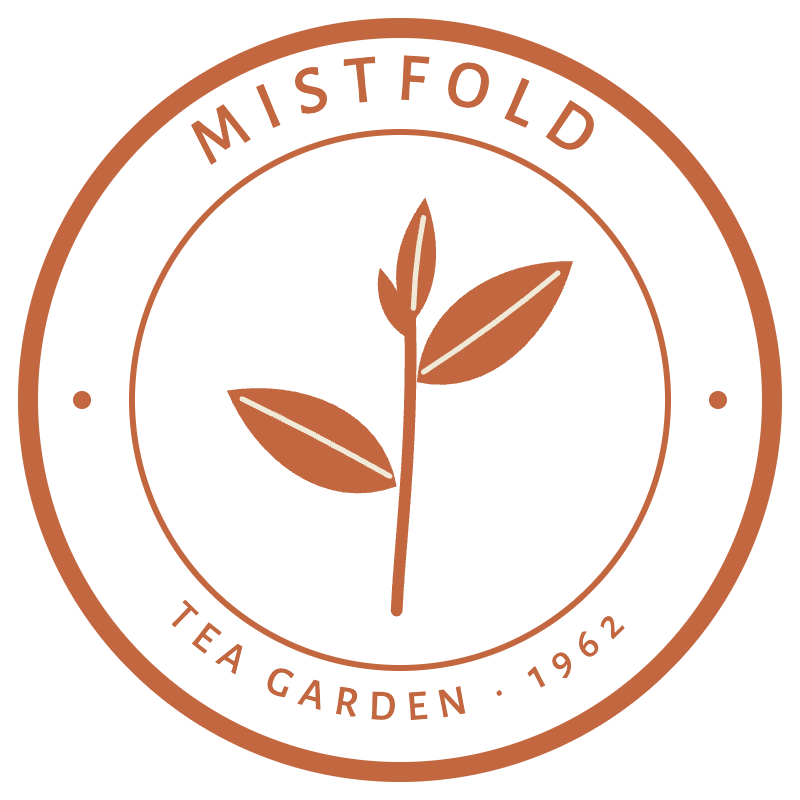

# Mistfold press kit

Everything a designer, a film-maker or a printer needs to tell the Mistfold story the way we tell it.

| File | What it is |
|---|---|
| `story.md` | the story of the garden, in our own words |
| `brand-notes.md` | colour, type, illustration, motion, sound, wording and the seal |
| `site/index.html`, `site/tokens.css` | our one-page website and its design tokens (light, and an evening scheme) |
| `label/harvest-card.pdf` | the card that goes into every tin: First Light on the front, Dusk Balm on the back |
| `images/seal.svg`, `images/seal.png` | the seal, our only mark |
| `fonts/` | Fraunces and Alegreya Sans, each with its SIL Open Font License (`OFL.txt`) |

The harvest card was set in HTML with the same tokens and fonts and printed to PDF.

> Fictional brand. Mistfold, its garden, its family and its products were invented as source material for the
> `botanical-organic` example of the motion-showreel skill. No real company, place or product is meant.
