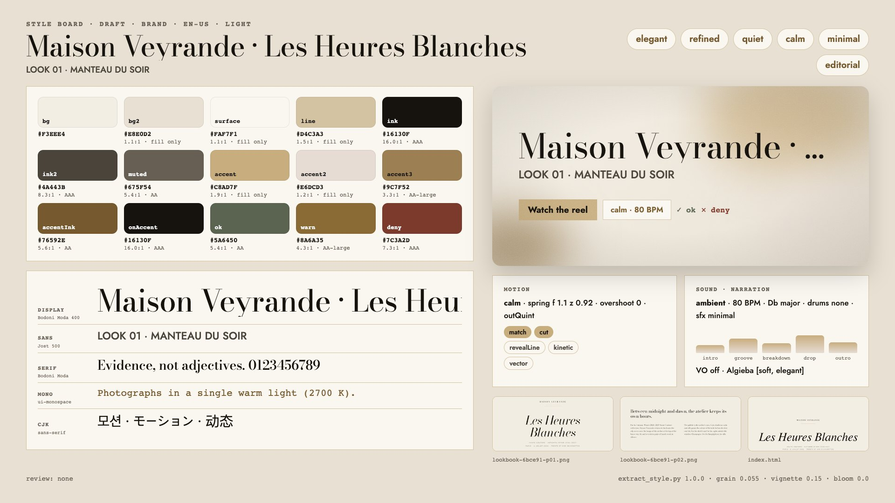

# Example: editorial-luxe (Maison Veyrande · Les Heures Blanches)

A couture house's press release, its identity notes, lookbook captions, a digital and printed lookbook and the
atelier's croquis go in. Out comes a quiet ivory-and-ink reel: Bodoni Moda at its hairline optical size, tracked
Jost capitals, champagne hairlines, satin lit by one lamp, an ink pen drawing the house's own sketches, slow
cross-dissolves, film grain, and piano and strings at 80 BPM. Nothing here comes from a preset. Every decision
traces back to a line in `source/`. The two older examples (pastel mascot, dark neon data) share none of it: this
reel uses a light paper ground, a serif display, no characters, no data viz, no overshoot and no drums.

- Cuts: `short` (5 bars = 15 s) and `30` (10 bars = 30 s) at 80 BPM, where one bar is exactly 3.0 s (180 frames).
- Carriers: kinetic type revealed from behind masks, a WebGL satin shader, the croquis drawn from `source/sketches/*.svg`.
- Stage 1 (this pass): source, style, storyboard, scenes and stills. Music and previews come in stage 2.

> Maison Veyrande is fictional. Every name, look, date and figure was invented for this example.



- Demo (short cut, with its music): [`assets/demo-editorial-luxe-v1.0.0.mp4`](../../../../assets/demo-editorial-luxe-v1.0.0.mp4)
- Web version with every cut: [`dist/maison-veyrande-v1.0.0.html`](dist/maison-veyrande-v1.0.0.html) ([play in the browser](https://raw.githack.com/AwesomeZun/Awesome-Showreels/main/skills/motion-showreel/examples/editorial-luxe/dist/maison-veyrande-v1.0.0.html))
- Cuts: `short` (5 bars = 15.0 s), `30` (10 bars = 30.0 s), all at 80 BPM.

## Folder

```
editorial-luxe/
  source/
    press-release.md        the collection's story in the house voice (31 looks, look 31 at 1,240 hours, the show music)
    identity-notes.md       palette roles, faces, margins, motion and sound rules, banned words
    lookbook-notes.md       captions for five selected looks, colour story, the walk at about 80 BPM
    lookbook/index.html     the digital lookbook + tokens.css (--vy-* colours, @font-face)
    lookbook.pdf            the same lookbook printed to PDF (6 pages, fonts embedded)
    sketches/look-*.svg     the atelier's croquis for looks 01, 07, 12, 19, 31
    fonts/                  Bodoni Moda (roman + italic, variable) and Jost (variable), SIL OFL 1.1 + OFL texts,
                            from github.com/google/fonts
  style.json                the reviewed tone & manner spec (rationale cites evidence ids in style-extract.md)
  style-extract.md          the extraction log (copy of build/style-extract.md)
  style-board.jpg           the board (from build/style-board.png)
  reel.config.json          scenes, bars, transitions, cues, cuts
  STORYBOARD.md             brief, exact copy, banned wording, provenance, beat tables
  modules/
    veyrande-silk.js        ivory duchesse satin (WebGL2 shader), one drifting lamp, dust in the light
    veyrande-croquis.js     SVG croquis paths drawn with a pressure-varying ink pen; embroidery sewn along look 31
    veyrande-type.js        masked line reveals, tracked caps, hairline rules with a travelling glint
  scenes/                   soie.js atelier.js regard.js finale.js
  build/                    generated (git-ignored): extract json, draft style, cut plans, board, snapshots
```

## Run it

From this folder, with `S=../..` (the skill). One-time setup: `(cd $S/runtime && npm install)`.

```bash
S=../..
python3 $S/tools/extract_style.py --source source --project . --board      # draft -> build/style.draft.json
python3 $S/tools/extract_style.py --validate style.json
python3 $S/timing/plan_cut.py --project . --cut short,30 --strict
node $S/runtime/stills.mjs --project . --cut 30 --range 0:30:1 --out /tmp/veyrande-30 --sheet --workers 2
node $S/runtime/stills.mjs --project . --cut short --transitions --out /tmp/veyrande-short-tr --sheet --workers 2
node $S/runtime/render.mjs --project . --cut 30 --out /tmp/veyrande-30.mp4 --no-audio --preset ultrafast
python3 $S/tools/motion_qa.py --video /tmp/veyrande-30.mp4 --cut build/cut-30.json
```

## The story

| Scene | Says | short | 30 |
|---|---|---|---|
| `soie` | MAISON VEYRANDE on satin; the tracking closes like a breath | 1 bar (compact schedule) | 2 bars |
| `atelier` | an ink pen draws look 31; "1,240 hours of hand embroidery"; the beads are sewn on | 2 bars | 3 bars (+ credit line) |
| `regard` | match cut: the gown steps back into a lineup of five croquis, "Thirty-one looks" | excluded | 3 bars |
| `finale` | monogram in champagne foil, *Les Heures Blanches*, the line, season, date, disclaimer | 2 bars | 2 bars |

Scene changes are 2-beat cross-dissolves (the identity: "a dissolve lasts at least one beat") and one match cut.
The in-phases are identical in both cuts. A longer cut adds hold bars, which carry a credit line, a lamp walking the
lineup one plate per beat, or a light crossing the foil. Nothing is slowed down. Poster frame: cut 30, t = 13.5 s
(the drawn gown beside "1,240").

## What the extractor got right and wrong

`extract_style.py` was run on `source/` without hints. The draft is kept in `build/style.draft.json` and the evidence in
`style-extract.md`. Overall it recognised the world: a light theme, the material's measured ivory, ink and champagne, and
Bodoni Moda as the display face. Mood (elegant, refined, calm, minimal), calm pace, outQuint, no characters, ambient
preset, minimal SFX and no narration were all right. It did **not** fall back to either of the two old looks:
it chose no pastel, no neon, no dark theme and no mascot. Its errors lean toward generic product/UI defaults, not toward those
two reels:

| Field | Draft | Final | Why |
|---|---|---|---|
| `palette.muted` | derived grey `#706C67` | Huitre `#675F54` | the identity names a caption colour; "captions" is not a role word the extractor knows |
| `palette.accent2/3`, `accentInk` | text gold in accent2, derived accent3 and accentInk | Nacre `#E6DCD3`, deep champagne `#9C7F52`, Vieil or `#76592E` | the authored roles; one champagne family |
| `ok/warn/deny` | green, coral, pink | dark in-family inks | "No other colour appears in house communication" |
| `paletteAlt.bg` | derived brown `#1C160A` | Encre `#16130F` | the house's own night |
| `fonts.sans` | Inter first | Jost | Chromium printed Jost into the PDF as unnamed Type3 faces, and these outranked the CSS label token |
| `fonts.mono/cjk` | JetBrains Mono, Pretendard | generic | defaults carried over from other material; this source has no code or CJK text |
| display stack fallbacks | Didot, Bodoni 72 | `serif` only | system faces must never stand in for the shipped files |
| `fonts.files` italic | registered as normal | `style: italic` | otherwise the italic replaces the roman |
| `type` | 12-228 px, display 500 | 16-232 px, display 400, caps tracking 0.3 em | "Regular weight only"; 12 px is too small for video |
| `layout.margin`, `radius` | 120, 7 | 160, 0 | "margins of one twelfth"; square plates |
| `motion.spring`, `overshoot` | f 2.04 z 0.79, 0.29 | f 1.1 z 0.92, 0 | "Nothing bounces" |
| `motion.typeReveal` | kinetic first | revealLine first | "revealed from behind a mask, never typed out letter by letter" |
| `motion.transitions` | match, zoomInto, cut | match, cut (+ runtime dissolve) | zoomInto scored on the "ui" signal of a web page; the extractor has no dissolve |
| `motion.dataViz` | true (0.53) | false | the score came from hex codes, dates and look numbers |
| `motion.visualSources` | vector, app-ui, pdf-figures, web-shots | vector | the lookbook is where colours come from, not the story |
| `post.grain` | 0.035 | 0.055 | "fine film grain" is in the identity |
| `sound.bpm` | 89 | 80 | the text says "about eighty beats per minute" in words; the extractor does not read spelled-out tempi, and the ambient range starts at 84 |
| `sound.instruments`, `drums` | pad, glass, bell, sub, rim, shaker; light | piano, strings; none | "Piano, strings and silence ... No drums" |
| `sound.key` | A major | D-flat major | the nocturne key (a free choice either way) |

Extractor issues worth fixing upstream (not changed here, because shared tools are out of scope for this example):
it does not parse tempo written as words, it has no `dissolve` among the transitions, it scores any HTML as
"ui" (for zoomInto and app-ui), it counts hex codes and dates as data, it registers italic font files as normal, and it
lets unnamed Type3 faces in a Chromium-printed PDF outrank CSS font tokens.

## Motion QA

`tools/motion_qa.py` on draft renders without audio: both cuts **PASS**, with no frozen runs and no pops.
The short cut has 63% of frames alive. The 30 cut has 62%, and its holds change 1.2% (soie), 4.9% (atelier), 2.1% (regard) and
4.6% (finale) of the picture per second. The slowest is the soie hold, on purpose: the satin drifts and the tracking breathes, as the
identity's "hold the frame longer than feels necessary" asks.
