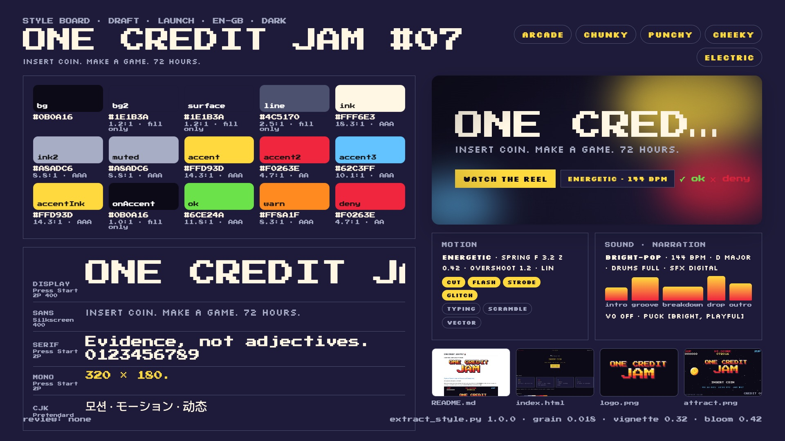

# Example: pixel-arcade (ONE CREDIT JAM #07)

A game-jam README with a 16-colour palette file goes in; an 8-bit attract-mode reel comes out. Nothing here picks a
preset: the 320 x 180 indexed canvas, the two pixel faces, the 12-fps stepped motion, the CRT and the chip-music brief
all come from the material in `source/`, reviewed by hand and written to `style.json` with the evidence for each
decision.

- Cuts: `short` (9 bars = 15 s) and `30` (18 bars = 30 s), both at 144 BPM (the jam's house tempo: a beat is
  exactly 5 steps of the 12-fps sprite clock and a bar is 100 frames).
- Carriers: code-drawn pixel art only, snapped to CREDIT-16 every frame and shown x6 through a code-drawn CRT.
- Music and previews: stage 2 (the chip voices are specified in `style.json` `sound.chip`).

> ONE CREDIT JAM, the Phosphor Club and every name, date and score are fictional, made up for this example.



- Demo (short cut, with its music): [`assets/demo-pixel-arcade-v1.0.0.mp4`](../../../../assets/demo-pixel-arcade-v1.0.0.mp4)
- Web version with every cut: [`dist/one-credit-jam-v1.0.0.html`](dist/one-credit-jam-v1.0.0.html) ([play in the browser](https://raw.githack.com/AwesomeZun/Awesome-Showreels/main/skills/motion-showreel/examples/pixel-arcade/dist/one-credit-jam-v1.0.0.html))
- Cuts: `short` (10 bars = 16.7 s), `30` (18 bars = 30.0 s), all at 144 BPM.

## Folder

```
pixel-arcade/
  source/                 the material (written for this example)
    README.md             the jam README: tagline, dates, five rules, WORDS WE USE, disclaimer
    palette/              CREDIT-16 as .hex, .gpl, .pal and a swatch strip
    site/                 the jam page (indexed tokens, pixel faces, scanlines, steps() blink)
    jam-kit/SOUND.md      4 chip channels, 60-Hz tick, 144 BPM, D mixolydian
    media/                pixel mock-ups (attract, logo, level)
    fonts/                Press Start 2P, Silkscreen (SIL OFL 1.1, OFL.txt beside each)
  style.json              the reviewed tone & manner spec (rationale cites evidence ids)
  style-extract.md        the extraction log those ids point to (copy of build/style-extract.md)
  style-board.jpg         the board
  reel.config.json        scenes, bars, cues, cuts
  STORYBOARD.md           brief, exact copy, banned wording, provenance, beat tables
  modules/                px-core.js (console), px-sprites.js (sprites), px-crt.js (WebGL CRT)
  scenes/                 attract.js rules.js play.js hiscore.js
  build/                  generated (git-ignored): cut plans, extractor draft, snapshots
```

## Run it

From this folder, with `S=../..` (the skill). One-time setup: `(cd $S/runtime && npm install)`.

```bash
python3 $S/tools/extract_style.py --project .                      # the draft (kept in build/draft/)
python3 $S/timing/plan_cut.py --project . --cut short,30 --strict
node $S/runtime/stills.mjs --project . --cut short --range 0:15:0.4 --out build/review/short --sheet
node $S/runtime/stills.mjs --project . --cut 30 --range 0:30:0.8 --out build/review/30 --sheet
node $S/runtime/stills.mjs --project . --serve                      # live player
```

## What the extractor drafted, and what changed

The draft got the dark VOID ground, every palette role from the CSS tokens, the two pixel faces and radius 0 right.
It got the rest wrong in the direction of the existing dark neon example: mood "nocturnal, data-driven", dataViz on
(from the palette table and dates), smooth springs with zoomInto / whip transitions, app-ui and web-shot carriers,
Helvetica / JetBrains Mono fallbacks (it has no pixel-font category) and the dark-synth preset at 125 BPM in A minor,
although SOUND.md states 144 BPM chip channels. The review replaced those with the console rules the README states
(whole-pixel, 16 colours, stepped motion, hard cuts painted by the scenes) and the stated tempo. Details in
`style.json` `rationale` and `meta.reviewed`.
