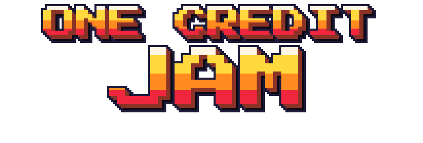
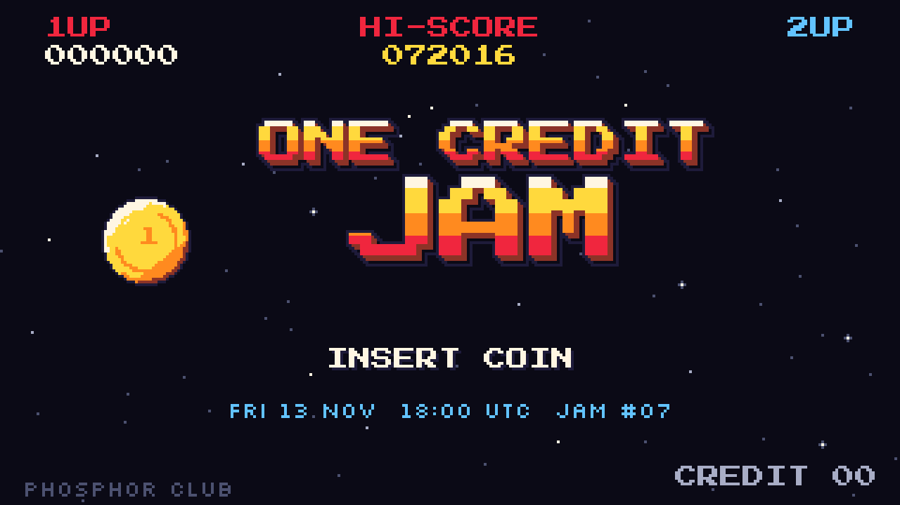
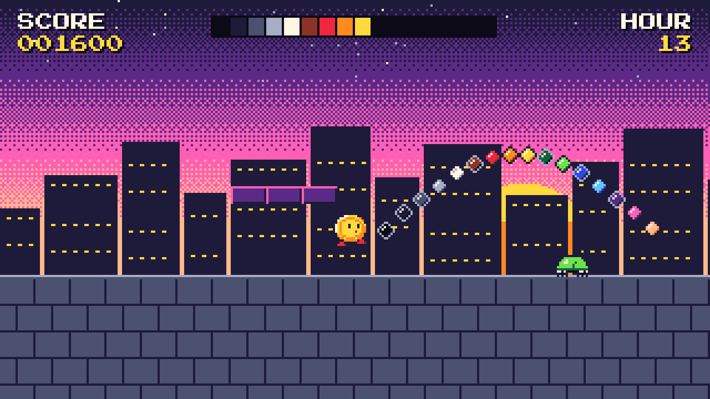

# ONE CREDIT JAM #07 🕹️

**INSERT COIN. MAKE A GAME. 72 HOURS.**

One weekend. One palette. One credit.

Make a tiny arcade game that a stranger can walk up to, play and finish on **ONE CREDIT**: one life, one run,
no saves, no continues, no tutorial screens. If it's over, it's GAME OVER. Make it worth the coin! 🪙

## NEXT JAM: #07

| | |
|---|---|
| START | **FRI 13 NOV · 18:00 UTC** (the theme drops on the attract screen) |
| END | **MON 16 NOV · 18:00 UTC** (72 hours, not one second more) |
| PLAYING WEEK | MON 16 NOV → MON 23 NOV |
| WHERE | online, everywhere, in your pyjamas |

## THE RULES

Read them, PLAYER 1. There are five, and they all fit on one screen.

1. **72 HOURS.** Friday 18:00 UTC to Monday 18:00 UTC. Late uploads get a polite GAME OVER.
2. **16 COLOURS.** Use the CREDIT-16 palette. No other colours, no alpha blending. Need a gradient? Dither it.
3. **320 × 180.** Native canvas of 320 × 180 pixels, scaled by whole numbers only (×4 on a 1280 screen, ×6 on 1920).
   Square pixels. No smoothing. No sub-pixel anything.
4. **4 CHANNELS.** Two pulse waves, one triangle, one noise. That is the whole band. (See `jam-kit/SOUND.md`.)
5. **1 CREDIT.** One life, one run, under five minutes from PRESS START to GAME OVER. No saves. No continues.

Original work only, made during the jam. Fonts, code and tools you did not make must be free to use (OFL, MIT,
CC0, ...) and credited in your README.

## THE PALETTE: CREDIT-16

Sixteen colours, four ramps, one black. The files are in `palette/`: `credit16.hex`, `credit16.gpl` (GIMP and most
pixel editors), `credit16.pal` (JASC) and `credit16.png` (a swatch strip to eyedrop from).

| # | name | hex | good for |
|---|---|---|---|
| 00 | VOID | `#0B0A16` | the screen. Every game starts here |
| 01 | NIGHT | `#1E1B3A` | night sky, outlines on light tiles |
| 02 | SLATE | `#4C5170` | stone, metal, shadows |
| 03 | FOG | `#A8ADC6` | dim text, steel, smoke |
| 04 | BONE | `#FFF6E3` | text, stars, the flash when you get hit |
| 05 | RUST | `#8C3327` | bricks, shading for reds |
| 06 | CHERRY | `#F0263E` | 1UP, hearts, danger |
| 07 | EMBER | `#FF8A1F` | fire, the middle of every logo |
| 08 | GOLD | `#FFD93D` | coins, credits, the player |
| 09 | PINE | `#17603F` | leaves in shadow |
| 10 | LIME | `#6CE24A` | GO, grass, extra lives |
| 11 | COBALT | `#2B49E8` | deep sky, water |
| 12 | SKY | `#62C3FF` | sky, ice, the second player |
| 13 | GRAPE | `#5B2A86` | far mountains, night shadows |
| 14 | BUBBLE | `#FF5FB5` | bonus stages, sparkles |
| 15 | PEACH | `#FFB98A` | skin, warm light |

Ramps that work: VOID → NIGHT → SLATE → FOG → BONE, RUST → CHERRY → EMBER → GOLD → BONE,
NIGHT → COBALT → SKY → BONE, VOID → PINE → LIME, NIGHT → GRAPE → BUBBLE → PEACH.

## HOW IT WORKS

1. **FRI 18:00 UTC: INSERT COIN.** The theme appears on the jam page's attract screen. Start building.
2. **BUILD.** Sleep a little. Squash bugs. Build. Post progress GIFs in the jam channel with `#onecredit`.
3. **MON 18:00 UTC: UPLOAD.** One zip: a web build that runs in a browser tab, your source, and a README that
   credits every font, sound and tool.
4. **PLAYING WEEK.** Everybody plays everybody. Every entry gets its own HIGH SCORE table, so players chase each
   other's scores all week.

5. **HALL OF FAME.** Players vote on FUN, FEEL and FIT (how well a game uses 16 colours and 4 channels). The top
   three get the GOLDEN TOKEN. It is a sticker. It is a very nice sticker.

## SOUND IN ONE PARAGRAPH

Four channels, mixed in mono: PULSE 1 and PULSE 2 (duty 12.5 %, 25 % or 50 %), TRIANGLE for bass, NOISE for drums.
The sound engine ticks at 60 Hz. The jam's attract tune, INSERT COIN, runs at 144 BPM: 25 ticks per beat, a bar
every 100 ticks. Full spec: [`jam-kit/SOUND.md`](jam-kit/SOUND.md).

## WORDS WE USE

The jam page, the announcer and this README talk like an arcade, so:

- **Players**, never "users". **Entries**, never "submissions" or "content".
- **Colours** with a U, and the palette is always **CREDIT-16** (never "Credit16" or "credit 16").
- Do not say "retro-inspired", "pixel-perfect" or "AAA". It is not inspired by anything. It is the real thing, small.
- Say **GAME OVER**, not "you lose". Nobody loses at a jam.

## FAQ

**Can I use an engine?** Yes. Any engine, framework or fantasy console, as long as the build obeys the rules.

**Two players?** 2UP is allowed if both players share the one credit.

**Can I use a font I like?** If its licence lets you ship it (OFL is perfect) and you credit it. The jam page uses
Press Start 2P for titles and Silkscreen for everything small.

**My game is longer than five minutes.** Then it has two credits' worth of game in it. Cut one.

## BE EXCELLENT

Be kind in the jam channel. Play the games you rate. Give feedback you would like to receive. Cheating on the HIGH
SCORE tables is the only way to get banned, and we will find out, because the tables are very small.

## CREDITS

Hosted by the Phosphor Club. Jam page set in Press Start 2P (CodeMan38) and Silkscreen (Jason Kottke), both under the
SIL Open Font License 1.1 (`fonts/`).

> ONE CREDIT JAM and the Phosphor Club are fictional, made up for this example. There is no real event, no real
> date and no real sticker. The screens in `media/` are mock-ups drawn for this README.
