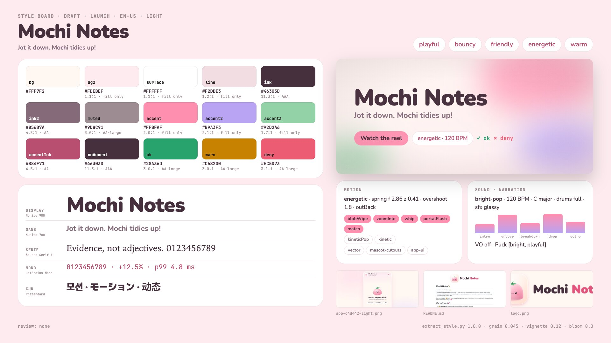

# Example: playful-app (Mochi Notes)

A cheerful product README, a soft pastel logo and a tiny web app go in; a bouncy pastel showreel comes out. Nothing
in this reel picks a preset: the palette, the rounded type, the springy motion and the bright-pop music are derived
from the material in `source/`, reviewed by hand, and written to `style.json` with the evidence for each decision.

- Demo (short cut, 14 s, with its music): [`assets/demo-playful-app-v1.1.0.mp4`](../../../../assets/demo-playful-app-v1.1.0.mp4)
- Cuts: `short` (7 bars = 14 s), `30` (15 bars = 30 s) and `60` (30 bars = 60 s), all at 120 BPM.
- Carriers: kinetic type, a plush mascot drawn in code, real app UI captured from `source/app.html`, vector chips.

> Mochi Notes is fictional. Every name, note and screen is demo content made for this example.



## Folder

```
playful-app/
  source/                 the material (written for this example)
    README.md             product README: emoji, '!', short lines, the example note, flavors, disclaimer
    logo.png              app-icon tile with the plush mochi + two-tone wordmark
    app.html              the demo app (CSS tokens, flavor themes, an on-device tidier)
    fonts/Nunito.ttf      the app's face (SIL OFL 1.1, fonts/OFL.txt)
  style.json              the reviewed tone & manner spec (rationale cites evidence ids)
  style-extract.md        the extraction log those ids point to (copy of build/style-extract.md)
  style-board.jpg         the board (copy of build/style-board.png)
  capture/app.json        capture spec for tools/capture_ui.mjs
  assets/captures/ui/app/ real UI layers + sidecars (layers.json, rows, text-free bubble, states, flavors)
  reel.config.json        scenes, bars, transitions, cues, cuts
  STORYBOARD.md           brief, exact copy, banned wording, provenance, beat tables
  modules/mochi-cast.js   the code-drawn cast (a project module: loaded before every scene)
  scenes/                 hook.js brand.js app.js flavors.js nudge.js private.js finale.js
  narration.json          optional voice-over lines (narration is off by default)
  build/                  generated: cut plans, music, style board, snapshots
```

## Run it

From this folder, with `S=../..` (the skill). One-time setup: `(cd $S/runtime && npm install)`.

```bash
S=../..
# 1. source -> style (draft), then review by hand (see "What the tone pass decided")
python3 $S/tools/extract_style.py --source source --project . --board
python3 $S/tools/extract_style.py --validate style.json
python3 $S/tools/extract_style.py --project . --board-only

# 2. real app UI as layers (serves source/ locally; writes assets/captures/ui/app/)
node $S/tools/capture_ui.mjs --spec capture/app.json

# 3. plan every cut on the same bar grid
python3 $S/timing/plan_cut.py --project . --cut short,30,60 --strict

# 4. preview: stills, transition boundaries, a live player
node $S/runtime/stills.mjs --project . --cut short --range 0:14:0.25 --out /tmp/mochi-short --sheet
node $S/runtime/stills.mjs --project . --cut 30 --transitions --out /tmp/mochi-30-tr --sheet
node $S/runtime/stills.mjs --project . --serve

# 5. music + SFX from the same plan for every cut, then check every cue against the picture's timeline
python3 $S/audio/arrange.py --project . --cut short
python3 $S/audio/arrange.py --project . --cut 30
python3 $S/audio/verify_sync.py --wav build/music-short.wav --cut build/cut-short.json
python3 $S/audio/verify_sync.py --wav build/music-30.wav --cut build/cut-30.json

# 6. render and build the single-file player: each cut's audio is picked up from build/ (music-<cut>.m4a for the
#    MP4, music-<cut>-embed.m4a for the HTML), then check the render for frozen holds and pops
mkdir -p out
node $S/runtime/render.mjs --project . --cut short --out out/mochi-notes-short-v1.0.0.mp4 --poster 3 --share
python3 $S/tools/motion_qa.py --video out/mochi-notes-short-v1.0.0.mp4 --cut build/cut-short.json
node $S/runtime/build.mjs --project . --cuts short,30 --out out/mochi-notes-v1.0.0.html \
     --exclude 'captures/ui/app/(sheet|tidying_|note\.(mask|rows))' --verify
```

The 60-s cut follows the same steps (`arrange.py --cut 60`, `render.mjs --cut 60`, `build.mjs --cuts short,30,60`).

Measured on Apple Silicon: the style pass takes about 12 s, the capture 14 s, a stills sheet of 57 frames 7 s, the
short MP4 about 55 s, the HTML build with `--verify` a few seconds (`dist/mochi-notes-v1.1.0.html`: 4.9 MB with all three
cuts and their 96k music). `--exclude` drops capture work files that no scene draws (the sheet, the tidying frames,
the note's mask and rows images); the `final` screen stays because the 60-s `private` scene shows it.

## What the tone pass decided

`extract_style.py` read the README (38 '!' and 104 emoji per 1,000 words, 6 words per sentence, second person), the
logo and the app's CSS tokens, and drafted: light theme, the app's own palette, Nunito, energetic springy motion,
blob-wipe/zoom/whip transitions, bright-pop at 123 BPM, no narration. The review kept most of it and changed:

| Field | Draft | Final | Why |
|---|---|---|---|
| `fonts.display` | "Nunito ExtraLight" | "Nunito" | the variable font's default instance was read as the family |
| `fonts.files` | the same file twice | one entry, weight `200 1000` | one variable face for display and body |
| `type` | 18-76 px, 800/500 | 18-144 px, 900/700 | the app and logo set Nunito Black; motion type needs headline sizes |
| `motion.characters` | false | true | the logo's mochi is the brand's named helper ("Mochi, your squishy little helper") |
| `motion.dataViz` | true | false | the data score came from a flavors table and "3pm", not from data |
| `motion.visualSources` | vector, app-ui, web-shots | vector, mascot-cutouts, app-ui | the cast is drawn like cutouts; the README page adds nothing the app capture lacks |
| `sound.bpm` | 123 | 120 | same preset range; 30 s = 15 whole bars, a bar = 120 frames at 60 fps |
| `post.grain` | 0.053 | 0.045 | pastel gradients stay clean |
| palette extras | - | `accentStrong`, four flavor swatches + inks | the logo's "Notes" pink and the app's `.app[data-flavor]` tokens |
| `layout.captions.y` | 960 | 1040, 36 px | a band every scene keeps free (narration on only) |

## Same BPM, same pace: only the holds grow

Every cut runs at 120 BPM with the same in-phase and out-phase for every scene. A longer cut adds bars to holds and
optional scenes (`flavors` from 30 s; `nudge` and `private` in 60 s, excluded from the shorter cuts); nothing is
slowed down.

| Scene | in / out (beats) | short | 30 | 60 | Hold (short / 30; the 60-s scenes in words) |
|---|---|---|---|---|---|
| hook | 3 / 1 | 1 bar | 2 bars | 2 bars | 0 / 2.0 s (one extra scrap slaps on, the "?" wiggles) |
| brand | 3 / 1 | 1 bar | 2 bars | 3 bars | 0 / 2.0 s (happy hop on the bar line) |
| app | 10 / 1 | 3 bars | 5 bars | 6 bars | 0.5 s / 4.5 s (the real tick, the reminder rings, a highlight walks the chips) |
| flavors | 6 / 1 | - | 3 bars | 5 bars | - / 2.5 s (the spotlight walks the flavors) |
| nudge | 6 / 1 | - | - | 5 bars | the real "Call Mom · Fri 3:00 PM" row grows into a reminder card; its bell rings on every bar line |
| private | 6 / 1 | - | - | 5 bars | the final screen in a bubble; a cloud bounces off it on every beat, the lock pulses per bar |
| finale | 6 / 0 | 2 bars | 3 bars | 4 bars | 1.0 s / 3.0 s (bounce, logo shine, a wave through the lineup and the hero's cheer on each bar line) |

The 60-s cut raises four caps for that cut only (`"60": {"scenes": {"brand": {"maxBars": 3}, "app": {"maxBars": 6},
"flavors": {"maxBars": 5}, "finale": {"maxBars": 4}}}`); the short and 30-s plans are unchanged by it.

Proof, reproducible with the stills tool: every scene rendered alone at its short and its 30-s length gives
pixel-identical in-phase frames (132 frames every 1/12 s across hook, brand, app and finale; at most 2 pixels off by
1/255 in one frame, the same GPU blur rounding that appears when one length is rendered twice). Through the full
compositor, the 44 matching in-phase frames of the two cuts differ only by film grain (mean 0.48/255, max 12/255);
two frames 1/60 s apart differ by up to 161/255. The music measures 120.0 BPM in both cuts, and every cue lands within
one frame (18/18 and 28/28).

```bash
node $S/runtime/stills.mjs --project . --cut 30 --scene app --dur 6 --range 0:5:0.0833 --out /tmp/app-6
node $S/runtime/stills.mjs --project . --cut 30 --scene app --dur 10 --range 0:5:0.0833 --out /tmp/app-10
python3 -c "import numpy as n,glob;from PIL import Image as I;a=sorted(glob.glob('/tmp/app-6/*.png'));b=sorted(glob.glob('/tmp/app-10/*.png'));print(sum(int((n.asarray(I.open(x),int)!=n.asarray(I.open(y),int)).any()) for x,y in zip(a,b)),'frames differ')"
```

## The mascot is drawn in code

The project module `modules/mochi-cast.js` registers a `window.REEL_MODULES` entry (`mochi-mascot`) that runs once
at load time, after the
assets and fonts: it paints plush sprites into 760x720 canvases (sagging dome silhouette, translucent rim, key light,
fabric noise, rice-flour dust, glossy bead eyes, blush, a flavor topper) and registers them in `IMG` and `META`
exactly like `tools/prep_assets.py` cutouts, so the engine's `drawChar`/`popChar` spring, squash, jelly, breathe,
blink and cast contact shadows unchanged:

- `mochi`, `mochi_blink`, `mochi_happy`, `mochi_think`, `mochi_think_blink` (strawberry, the hero)
- `mochi_matcha`, `mochi_ube`, `mochi_yuzu` (+ `_blink`, `_happy`)
- `mochi_icon`, `mochi_icon_bg` (the app icon that `brand` ends on and `app` morphs into the phone)

Body colours come from `style.json` (`palette.strawberry`, `matcha`, `ube`, `yuzu`), so a palette change recolours
the cast. To use real character art instead, prepare cutouts with `tools/prep_assets.py` under the same names and
drop the module: no scene changes.

## Narration on or off

Off by default: the material is a playful consumer launch with short exclamatory copy, so the reel is music-led and
every idea is on screen as type (`style.narration.recommended: false`). The `short` cut stays music-only in any case
(`"narration": false` in its cut spec).

To narrate the 30-s cut (Gemini TTS, `../../references/narration.md`):

```bash
# in reel.config.json set "captions": {"enabled": true}
python3 $S/narration/tts_gemini.py batch --project . --dry-run     # placeholder clips, no network: check the plan first
python3 $S/narration/tts_gemini.py batch --project .               # real voice (needs GEMINI_API_KEY)
python3 $S/narration/vo_timeline.py --project .
python3 $S/timing/plan_cut.py --project . --cut short,30
python3 $S/narration/captions.py --project . --cut 30
python3 $S/audio/arrange.py --project . --cut 30 --stem
python3 $S/narration/mix_vo.py --project . --cut 30
node $S/runtime/render.mjs --project . --cut 30 --out mochi-notes-30-vo-v1.0.0.mp4          # picks up build/mix-30
```

Every line fits the bars the plan already gives (hook 1, brand 1, app 3, flavors 1, finale 2), so the 30-s edit is
identical with and without narration; captions sit in the one-line band at y 1040 that every scene keeps free. To
go back to music-only, delete `build/vo-*`, `build/mix-*` and `build/vo/` (or plan with `--no-vo`) and set
`"captions": {"enabled": false}` again. `--stem` writes a separate unmastered bed (`build/music-30-stem.wav`), so the
mastered `build/music-30.*` stays as it was; the render and build tools never pick a stem, and they skip a mix made
from dry-run clips.

## Provenance and credits

- Real app UI: `source/app.html` captured with `tools/capture_ui.mjs` (`capture/app.json`): the bubble is typed from
  its own raster at 36 characters/s; the tidy card's five states were set on a static clone and play at one step per
  3/4 beat (the app itself steps every 600 ms, see `tidying.json`); the ticked to-do comes from the app's own click
  handler; the flavor screens are what the app's flavor button sets.
- The chips repeat the app's real output for the README's example note.
- Mochi and the app icon are drawn in code after `source/logo.png`.
- Type: Nunito (SIL Open Font License 1.1). Music and SFX: synthesized by `audio/arrange.py`.
