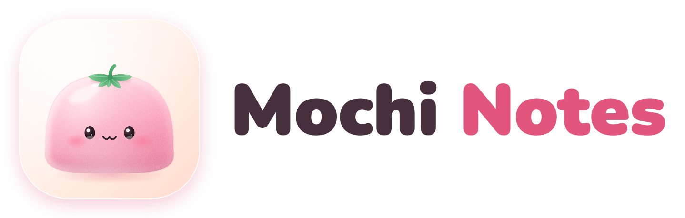

# Mochi Notes 🍡

**Jot it down. Mochi tidies up!** ✨

> **Fictional example project.** Mochi Notes is made-up source material for the `playful-app` example of the
> motion-showreel skill. There is no app to download; every name, note and screen here is demo content. It is not
> related to any real product with a similar name.

Too many thoughts? 🤯 Groceries, birthdays, that big idea at 2 a.m.… Toss them all into one note.
Mochi, your squishy little helper, sorts the mess for you! 💖

## Why you'll love it 💕

- ✍️ **Type anything.** Messy is fine! Commas, typos, half-ideas: all welcome.
- 🧹 **Mochi tidies up.** To-dos, reminders and tags in a blink. *Boop!*
- ⏰ **Gentle nudges.** Friendly reminders, never naggy.
- 🍓 **Pick a flavor!** Strawberry, matcha, ube or yuzu. Every theme is pastel-soft.
- 🔒 **Yours only.** Notes stay on your phone. Works offline, too!

## How it works 🪄

1. Jot: `oat milk, call mom fri 3pm, idea: pastel calendar`
2. Tap **✨ Tidy up**
3. Mochi reads it, finds the to-dos, sets reminders and adds tags:
   - ☐ Oat milk
   - ⏰ Call Mom · Fri 3:00 PM
   - 💡 Pastel calendar
   - `#errands` `#family` `#ideas`

That's it! No folders. No fuss. Just squishy, tidy notes. 🌸

## Try the demo 🎈

Open [`app.html`](app.html) in any browser. It runs right on your device, no sign-up! (Demo notes only.)

## Flavors 🍡

| Flavor | Vibe |
|---|---|
| 🍓 Strawberry | sweet and bright (the default!) |
| 🍵 Matcha | calm and fresh |
| 🍠 Ube | dreamy and cozy |
| 🍋 Yuzu | zesty and sunny |

## Made with love 💗

Round, friendly letters by [Nunito](fonts/OFL.txt) (SIL Open Font License 1.1).
