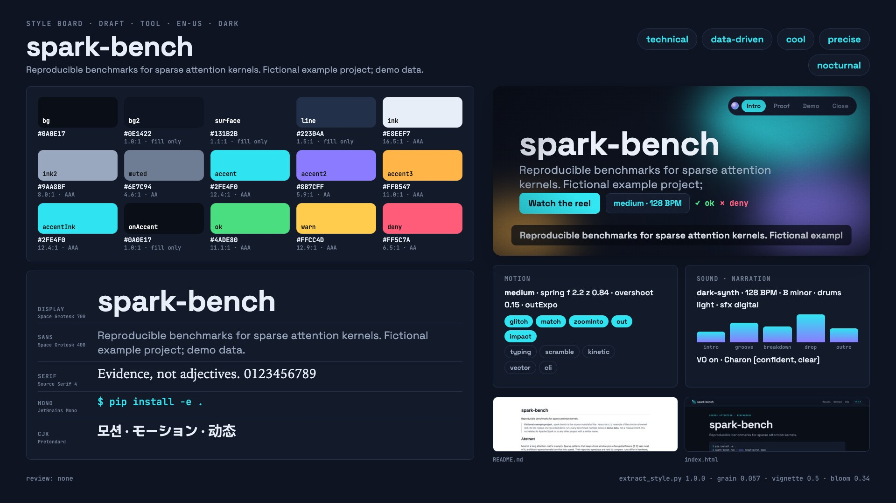

# Example: research-cli

A terse README for a research CLI goes in; a dark, technical, data-first reel comes out. Nothing here was picked
from a preset: the palette, type, pace, sound and voice come from the source material in `source/`, and the reel
shows that material's own evidence: the block pattern its README defines, the numbers its demo run produces and
the output of its CLI, captured for real.

`spark-bench` is fictional and every benchmark number is demo data. The project exists so the example has
material to work from: a README, a dark docs page with CSS tokens, a CLI that really runs, and a demo run.



| Cut | Bars @ 128 BPM | Scenes | Preview |
|---|---|---|---|
| `15` | 8 = 15.0 s | matrix · cli · results · impact · logo | [`assets/demo-research-cli-v1.1.0.mp4`](../../../../assets/demo-research-cli-v1.1.0.mp4) (with its music) |
| `30` | 16 = 30.0 s | matrix · problem · cli · results · impact · logo | in the HTML player (`dist/spark-bench-v1.1.0.html`), or render it below |
| `60` | 32 = 60.0 s | matrix · problem · cli · results · scaling · repeats · impact · logo | in the same player, or render it below |

## From the source to the style

`tools/extract_style.py` read `source/` and drafted `style.json`; the log is in `style-extract.md`. What it found,
and what that became:

| Evidence in the material | Decision in `style.json` |
|---|---|
| `docs/theme.css`: `color-scheme: dark`, 12 `--sb-*` tokens, `theme-color #0A0E17` | dark theme; every palette role is an authored token (bg `#0A0E17`, accent `#2FE4F0`, accent2 `#8B7CFF`, accent3 `#FFB547`) |
| the docs' results table colours spark cyan, block-sparse violet; Figure 1 colours global blocks amber | the reel uses the same kernel colours in every chart and the same amber for global blocks |
| `--sb-font-display/sans: "Space Grotesk"`, `--sb-font-mono: "JetBrains Mono"`, OFL files in `docs/fonts/` | the same faces, embedded from `fonts.files`; mono kickers tracked like the docs' kicker |
| no `!`, no emoji, no marketing words; 129 numbers and 7 citations per 1,000 words; formal register | medium pace that opens calm and builds to one impact; heavily damped springs (z 0.84), outExpo, scramble and typing reveals |
| technical 0.89, dark 1, data 0.78 | dark-synth, minor (B), SFX family digital; transitions glitch, match, zoomInto, cut, impact |
| a paper-style abstract with claims that need their qualifier ("in the demo run") | narration recommended (Charon, `[confident, clear]`): written and timed, shipped music-led until a real voice is synthesized |
| shell commands in the README and the docs | a real terminal capture of the CLI (`tools/capture_cli.py`) |

The draft was reviewed by hand (`meta.draft: false`, every change explained in `rationale`):

| Field | Draft | Reviewed | Why |
|---|---|---|---|
| `fonts.display` | `"Space Grotesk Light", …` | `"Space Grotesk", …` | the variable font's default instance name leaked in; the family is Space Grotesk |
| `palette.muted` | `#6C7079` (neutral, derived) | `#6E7C94` | the same blue-grey hue as ink2, 4.6:1 on bg |
| `sound.bpm` | 123 | 128 | 8 bars = 15.0 s and 16 bars = 30.0 s exactly; still inside dark-synth's 118–130 |
| `sound.instruments`, `energy` | kick + hats; drop 0.77 | + clap, snare; drop 1.0 | the grooves stay light, the drop switches to the full kit: the reel builds to the impact |
| `layout.captions.y` | 960 | 930 | clear of the HUD's bottom line |
| `motion.visualSources` | vector, cli, web-shots | vector, cli | the reel does not show the docs page |
| `terminal` | derived from the palette | the docs' code-block colours, ANSI slots = brand tokens | the captured CLI prints in the brand's own colours |

## What is on screen

| Scene | Carrier | Computed or authored |
|---|---|---|
| `matrix` | 4,096 GPU points, one per 1,024-token block of a 64k attention matrix; 674 light up, 3,422 sink | the mask is computed from the README's pattern (band 7, 2 global); the count follows the sinking blocks exactly; camera and pulses are authored |
| `problem` (30 and 60 s) | hardware, clocks, warm-up and repeats flicker as noise, then lock | the four variables and their fixed values come from the README and the CLI's output (the fingerprint hash); the noise is authored (no invented numbers) |
| `cli` | the real `spark-bench run` recording, tilted in 3D, zoom to the result table | real output bytes (`assets/captures/term/run.cast`, exit 0, 1.8 s); the prompt line, tilt, zoom and highlights are authored |
| `results` | grouped bars, trend line, p50 labels | `assets/data/results.json`, written by `spark-bench run --json` from the demo run (DEMO DATA) |
| `scaling` (60 s only) | the README's pattern at 4k, 16k, 32k and 64k: four matrices, the computed share counting down, spark's gain under each | shares computed from the pattern (100, 57.0, 31.4, 16.5 %); gains from `results.json` |
| `repeats` (60 s only) | the five seeded p50 timings per kernel drop onto lanes scaled to their median; the median locks, the spread bracket reads the CLI's value | `assets/data/demo-run.json`, a byte-identical copy of `source/results/demo-run.json` (DEMO DATA) |
| `impact` | `4.1×` slam, p50 count-down, leaderboard with spread | same file |
| `logo` | the 674 computed blocks swirl into the docs' block mark and the wordmark | particles from the pattern; the morph is authored |

## Make it yourself

Run everything from the skill folder (`skills/motion-showreel`), once `(cd runtime && npm install)` is done. Outputs
go to `out/` (git-ignored).

```bash
S=.; P=examples/research-cli; mkdir -p out

# 1. style from the source (writes style.json as a draft unless a reviewed one exists, the log and the board)
python3 $S/tools/extract_style.py --source $P/source --project $P --board
python3 $S/tools/extract_style.py --validate $P/style.json
python3 $S/tools/extract_style.py --project $P --board-only

# 2. the real terminal capture and the chart data, both from the source CLI (scan checks what ships)
python3 $S/tools/capture_cli.py --cmd "spark-bench run" --cwd $P/source --env PATH="$PWD/$P/source/bin:$PATH" \
  --out $P/assets/captures/term/run.cast --cols 68 --rows 15 --title 'spark-bench run' \
  --prompt '\e[38;5;245m~/spark-bench\e[0m \e[36m❯\e[0m ' --key 'spark +1\.3×' --key '▲ spark' \
  --redact "$(cd $P/source && pwd | sed "s|^$HOME|~|")=~/spark-bench"
python3 $S/tools/capture_cli.py scan $P/assets/captures/term/run.cast
$P/source/bin/spark-bench run --no-replay-delay --no-color --json $P/assets/data/results.json

# 3. plan every cut on the bar grid
python3 $S/timing/plan_cut.py --project $P --cut 15,30,60 --strict

# 4. preview
node $S/runtime/stills.mjs --project $P --cut 15 --range 0:15:0.25 --out out/rc15 --sheet
node $S/runtime/stills.mjs --project $P --cut 60 --transitions --out out/rc60 --sheet
node $S/runtime/stills.mjs --project $P --serve            # live player, keys 1/2/3 switch cuts

# 5. music (same song, same BPM, every length) and its sync check
python3 $S/audio/arrange.py --project $P --cut 15
python3 $S/audio/arrange.py --project $P --cut 30
python3 $S/audio/verify_sync.py --wav $P/build/music-30.wav --cut $P/build/cut-30.json

# 6. MP4 and the single-file HTML player: each cut's music is picked up from $P/build/
node $S/runtime/render.mjs --project $P --cut 30 --out out/research-cli-30.mp4 --poster 3.3 --share
python3 $S/tools/motion_qa.py --video out/research-cli-30.mp4 --cut $P/build/cut-30.json
node $S/runtime/build.mjs --project $P --cuts 15,30 --out out/research-cli.html --verify
```

The 60-s cut takes the same steps (`arrange.py --cut 60`, `render.mjs --cut 60`, `build.mjs --cuts 15,30,60`). The
README demo (`assets/demo-research-cli-v1.1.0.mp4`) is the `15` cut with its music, rendered with `--crf 20`.

The capture sidecar (`run.json`) records the command, exit code, duration, terminal size, the anonymized working
directory and the variables the run was given; variables dropped as secret-looking are never written by name (the
tool prints their names to the terminal only). The `--redact` rule replaces this checkout's path with
`~/spark-bench` everywhere it appears.

### Narration on or off

The reel ships **music-led**: `reel.config.json` has `"captions": {"enabled": false}` and no voice is mixed. The
narration is written (`narration.json`) and can be timed offline, but dry-run clips and the captions timed from them
are placeholders: the render and build tools skip a placeholder mix and refuse placeholder captions (unless
`--allow-placeholder`, for a test only).

```bash
# timing only (no network): placeholder clips of the estimated length
python3 $S/narration/vo_timeline.py --project $P --estimate
python3 $S/narration/tts_gemini.py batch --project $P --dry-run
python3 $S/narration/vo_timeline.py --project $P
python3 $S/timing/plan_cut.py --project $P --cut 15,30,60      # narration minimums; the edit stays the same here
```

To narrate for real (BYOK: your own Gemini key from an environment variable, the `key save` Keychain item or an
`--env-file` you name; see `../../references/narration.md` section 9 and confirm with `tts_gemini.py key status` and
`key check`): synthesize (`tts_gemini.py batch --project $P`), listen, `tts_gemini.py audit --project $P`, set
`"captions": {"enabled": true}`, then:

```bash
python3 $S/narration/vo_timeline.py --project $P
python3 $S/timing/plan_cut.py --project $P --cut 15,30,60
python3 $S/narration/captions.py --project $P --cut 30
python3 $S/audio/arrange.py --project $P --cut 30 --stem      # unmastered bed: build/music-30-stem.wav
python3 $S/narration/mix_vo.py --project $P --cut 30          # build/mix-30.wav, .m4a, -embed.m4a (+ mix-30.json)
python3 $S/audio/verify_sync.py --wav $P/build/mix-30.wav --cut $P/build/cut-30.json
node $S/runtime/render.mjs --project $P --cut 30 --out out/research-cli-30-vo.mp4   # picks build/mix-30.m4a
```

The 15-s cut narrates `matrix` and `cli` only (the other lines are tagged `"cuts": ["30", "60"]`); the 30-s cut
narrates every scene it plays; the 60-s cut adds lines for `scaling` and `repeats` (`"cuts": ["60"]`).

## Same BPM, same motion, longer cut

Every cut runs at 128 BPM. Every scene animates from its local time only, so an in-phase is the same in every cut
and a longer cut only adds hold and optional scenes (the 30-s cut adds `problem` and 2 bars each to `results`,
`impact` and `logo`; the 60-s cut adds `scaling` and `repeats` and raises four caps for itself only):

| Scene | 15 s | 30 s | 60 s | In-phase (fixed) | Hold in the 30-s / 60-s cut |
|---|---|---|---|---|---|
| matrix | 2 bars | 2 bars | 2 bars | 7 beats | none |
| problem | – | 2 bars | 2 bars | 7 beats | none |
| cli | 3 bars | 3 bars | 5 bars | 11 beats | none / a tour of the run's fingerprint and repeats lines |
| results | 1 bar | 3 bars | 5 bars | 3 beats | trend line, 64k focus with p50 / + spark's lead per length, 64k focus again |
| scaling | – | – | 5 bars | 6 beats | – / a focus walks the four lengths, a query band reads each matrix, the gain rule grows |
| repeats | – | – | 5 bars | 6 beats | – / one lane per bar types its five raw timings; one repeat re-runs per beat |
| impact | 1 bar | 3 bars | 4 bars | 3 beats | leaderboard, spread with a scan of the winner / + the scan repeats per bar |
| logo | 1 bar | 3 bars | 4 bars | 4 beats | install line, credits |

Check it: render a scene alone at its 15-s and its 30-s length and compare the in-phase frames byte for byte.

```bash
for d in 1.875 5.625; do
  node $S/runtime/stills.mjs --project $P --cut 30 --scene impact --dur $d --range 0:1.4:0.2 --out out/proof/d$d
done
for f in out/proof/d1.875/*.png; do lt=${f##*_lt}; cmp -s "$f" out/proof/d5.625/*_lt$lt && echo "same $lt" || echo "DIFF $lt"; done
```

The scenes drawn with additive GPU blending (`matrix`, `cli`'s 3D panel) can differ by one level in a few pixels
between two renders of the same frame; that is rounding, not timing.

## Credits and licences

- Source material, scenes, demo data and narration script: written for this example (MIT, like the skill).
- Fonts: Space Grotesk (The Space Grotesk Project Authors) and JetBrains Mono (The JetBrains Mono Project Authors),
  SIL Open Font License 1.1, unmodified files with their licences in `source/docs/fonts/`.
- Music and sound effects: synthesized by `audio/arrange.py`; no samples.
- References in the source README are real papers (Child et al. 2019; Beltagy et al. 2020); spark-bench is not
  related to them, to Apache Spark, or to any other project with a similar name.
