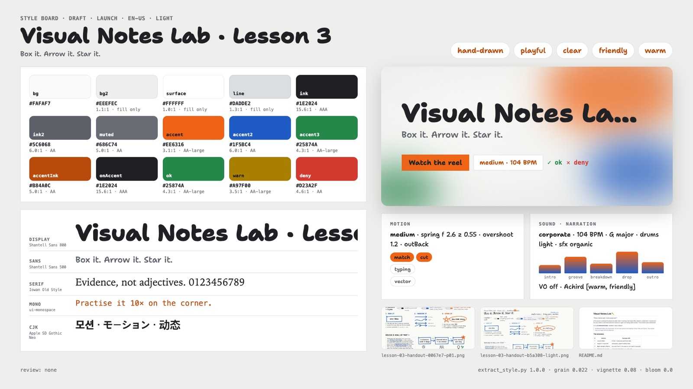

# Example: sketchnote (Visual Notes Lab · Lesson 3)

A facilitator's lesson notes (markdown full of arrows, lists and ALL-CAPS), a workshop README and a printed handout go
in; a whiteboard reel that draws itself comes out. Nothing here picks a preset: the off-white board, the three marker
colours and their jobs, the two handwriting voices, the overshooting strokes and the 104 BPM plucked feel are derived
from `source/`, reviewed by hand and written to `style.json` with the evidence for each decision.

- Cuts: `short` (6 bars = 13.85 s, no kit panel) and `30` (13 bars = 30.0 s), at 104 BPM.
- Carriers: stroke-by-stroke handwriting, hand-drawn boxes, arrows, circles and stars, marker and eraser props, one
  big board the camera travels across. No captures, no images, no generated assets.

> Scribblewell Studio, the Visual Notes Lab and every person and meeting here are fictional.



- Demo (short cut, with its music): [`assets/demo-sketchnote-v1.0.0.mp4`](../../../../assets/demo-sketchnote-v1.0.0.mp4)
- Web version with every cut: [`dist/visual-notes-lab-v1.0.0.html`](dist/visual-notes-lab-v1.0.0.html) ([play in the browser](https://raw.githack.com/AwesomeZun/Awesome-Showreels/main/skills/motion-showreel/examples/sketchnote/dist/visual-notes-lab-v1.0.0.html))
- Cuts: `short` (8 bars = 18.5 s), `30` (13 bars = 30.0 s), all at 104 BPM.

## Folder

```
sketchnote/
  source/                       the material (written for this example)
    lesson-03-notes.md          facilitator notes: plan, board plan, the three moves, the exercise wall
    README.md                   workshop page: sessions, kit (black words / blue structure / orange ONE thing)
    handout/                    lesson-03-handout.html + handout.css (tokens) + .pdf
    fonts/shantell-sans/        Shantell Sans variable (SIL OFL 1.1, OFL.txt): the marker voice
    fonts/caveat/               Caveat variable (SIL OFL 1.1, OFL.txt): the pen voice
  style.json                    reviewed tone & manner spec (rationale cites evidence ids)
  style-extract.md              extraction log those ids point to (copy of build/style-extract.md)
  style-board.jpg               the board (from build/style-board.png)
  reel.config.json              scenes, bars, cues, cuts
  STORYBOARD.md                 brief, exact copy, grammar, beats
  modules/ink.js                marker toolkit: glyph skeletons written in stroke order, wobbly boxes/arrows/loops,
                                boil, felt eraser (destination-out with ghost), marker/eraser/sticker props
  modules/lesson-board.js       the one board: per-cut panel layout, copy, cameras, arrow-following flights
  modules/panel-*.js            the notes, kit and title panels (each draws from its own scene clock)
  scenes/                       wall.js rescue.js kit.js endcard.js (cameras only)
  build/                        generated (git-ignored): cut plans, style extraction, style board
```

## Run it

From this folder, with `S=../..` (the skill). One-time setup: `(cd $S/runtime && npm install)`.

```bash
python3 $S/tools/extract_style.py --source source --project . --board   # draft -> build/style-extract.json
python3 $S/tools/extract_style.py --validate style.json                  # the refined spec
python3 $S/timing/plan_cut.py --project . --cut short,30 --strict        # build/cut-short.json, build/cut-30.json
node $S/runtime/stills.mjs --project . --cut short --range 0:13.8:0.25 --out build/review/short --sheet --workers 2
node $S/runtime/stills.mjs --project . --cut 30 --range 0:30:0.5 --out build/review/30 --sheet --workers 2
```

Music and previews are made in stage 2 (the audio library gains pizzicato, ukulele-like plucks and marker squeaks);
until then `style.json` `sound` names the nearest existing family.

## What the extractor got right and wrong

See `style.json` `rationale` for the full list. In short: light theme, paper `#FAFAF7`, ink, blue and orange tokens
and the Shantell Sans face were measured correctly. It ranked blue above orange by area (the notes assign orange the
ONE-thing role), filed Shantell Sans as a grotesk with Helvetica fallbacks, read clock times and table cells as data
(dataViz on, HUD, impact/whip transitions), and proposed the pastel grammar's bright-pop at 119 BPM with glassy SFX.
