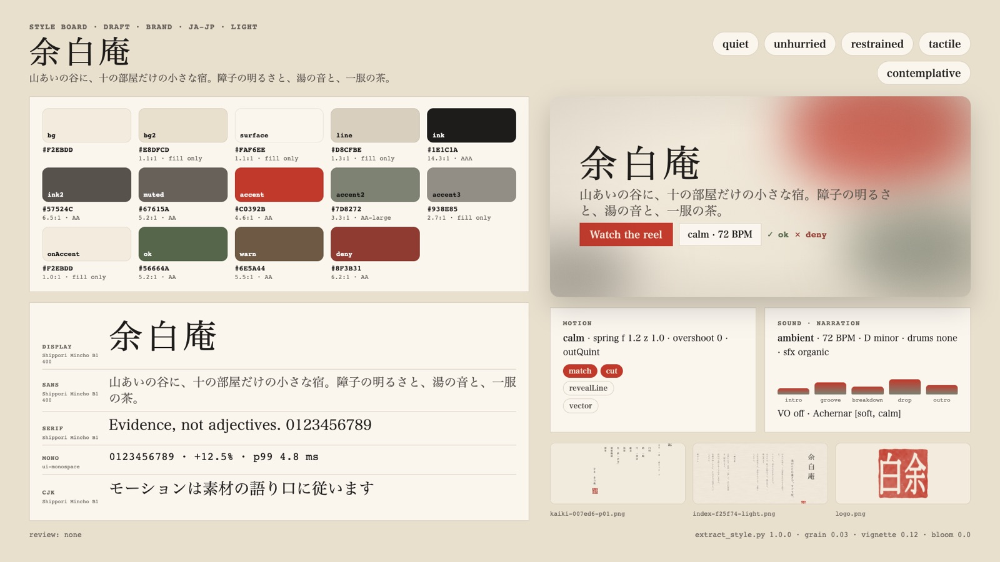

# Example: sumi-wabi (余白庵, a fictional ryokan)

The source is a Japanese ryokan and tea-room site, its house rules and a printed 懐紙 card. The reel that comes out is
quiet sumi-e: washi paper, one ink in many dilutions, vertical Mincho, brush strokes that dry as they go, mist, a lot
of empty paper, and one small vermilion seal at the end. None of it comes from a preset. Palette, face, pace and
sound brief all come from `source/`, and `style.json` cites the evidence for each choice.

- Cuts: `short` (4 bars = 13.3 s) and `30` (9 bars = 30 s), at 72 BPM.
- Carriers: procedural brush strokes and ink washes (`modules/sumi.js`), vertical kinetic type, a seal.
- Music: not made yet. Stage 2 adds koto-like plucks and a breathy flute-like pad to the audio library first.

> 余白庵 is fictional. Every name, address and line is demo content made for this example.



- Demo (short cut, with its music): [`assets/demo-sumi-wabi-v1.0.0.mp4`](../../../../assets/demo-sumi-wabi-v1.0.0.mp4)
- Web version with every cut: [`dist/yohakuan-v1.0.0.html`](dist/yohakuan-v1.0.0.html) ([play in the browser](https://raw.githack.com/AwesomeZun/Awesome-Showreels/main/skills/motion-showreel/examples/sumi-wabi/dist/yohakuan-v1.0.0.html))
- Cuts: `short` (6 bars = 20.0 s), `30` (9 bars = 30.0 s), all at 72 BPM.

## Folder

```
sumi-wabi/
  source/
    site/index.md, chaseki.md   the inn's site and tea-room guide (Japanese copy, です・ます)
    site/index.html, style.css  the rendered site: colour tokens, vertical writing, the one face
    site/img/logo.png           the name with its seal
    brand/shitsurae.md          house rules: colour, type, motion and sound in the inn's own words
    print/kaiki.pdf             the printed 懐紙 card
    fonts/ShipporiMinchoB1-Regular.ttf + OFL.txt   (SIL OFL 1.1, google/fonts ofl/shipporiminchob1)
  style.json                    reviewed tone & manner (rationale cites evidence ids E1..)
  style-extract.md              extraction log (copy of build/style-extract.md)
  style-board.jpg               the board (from build/style-board.png)
  reel.config.json              scenes, bars, cues, cuts
  STORYBOARD.md                 brief, exact copy, rules, beat tables
  modules/sumi.js               brush/ink engine: strokes with pressure, drying (kasure) and bleed; ink drops;
                                washes; mist; washi ground; vertical text that soaks in; the seal; the scroll pan
  scenes/                       shizuku.js yama.js chaseki.js rakkan.js
  build/                        generated (git-ignored)
```

## Run it

From this folder, with `S=../..` (the skill):

```bash
python3 $S/tools/extract_style.py --source source --project . --purpose brand --audience travellers --board
python3 $S/tools/extract_style.py --validate style.json
python3 $S/timing/plan_cut.py --project . --cut short,30 --strict
node $S/runtime/stills.mjs --project . --cut short --range 0:13.3:0.5 --out /tmp/sumi-short --sheet
node $S/runtime/stills.mjs --project . --cut 30 --transitions --out /tmp/sumi-30-tr --sheet
```

## What the extractor got right and wrong

Recorded here because we are checking `extract_style.py` for bias toward the two original looks.

Right:
- The palette core: bg #F2EBDD, bg2, surface, ink #1E1C1A, ink2 and accent #C0392B (vermilion) were read
  correctly from the CSS tokens.
- The display face: Shippori Mincho B1.

Wrong, and fixed by hand:
- **Sound:** bright-pop, 117 BPM, G major, kick/hats/shaker (corporate 107 BPM without the purpose hint). The
  material asks for about 70 per minute and no drums. Final: 72 BPM, D minor (hirajōshi), ambient, drums none.
- **Motion:** pace medium, spring overshoot 0.48, transitions zoomInto/whip/match. That is the playful-app spring
  feel. Final: calm, critically damped (z = 1.0, overshoot 0), outQuint, dissolve with a scroll pan.
- **Visual sources:** app-ui and web-shots, because the PDF page was taken for a screenshot. Final: vector only.
- **Fonts:** sans = Inter / Hiragino Sans and mono = JetBrains Mono, the research-cli stacks. The brand uses one
  Mincho for everything. Final: every stack is Mincho.
- **accent2/accent3** #550000/#891C18 were read from the transparent pixels of the seal image in the PDF. Final:
  利休鼠 #7D8272 and 淡墨 #938E85.
- **Narration voice:** "clear, upbeat". Final: off, or soft and calm if it is ever turned on.
- The extractor cannot read rules written in Japanese prose (`shitsurae.md`), and those rules decided most of the
  look.

The unhinted draft is kept at `_scratch/styles/sumi-wabi/style.extractor-draft.json` (outside the repo).
